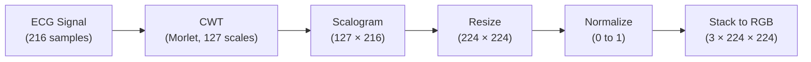
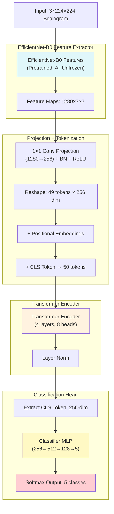
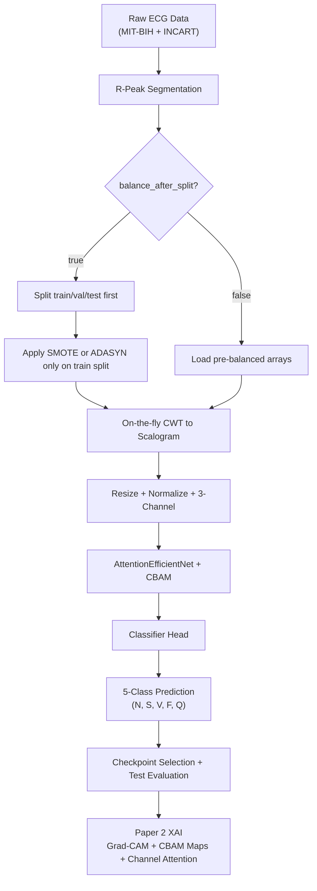

# EfficientNet-B0 + Transformer Hybrid for ECG Classification: In-Depth Study Guide

## 1. Introduction
This paper presents a **hybrid 2D vision approach** for ECG arrhythmia classification that combines a pretrained **EfficientNet-B0** CNN backbone with a **Transformer Encoder**, operating on Continuous Wavelet Transform (CWT) scalograms. By transforming 1D ECG signals into 2D time-frequency images, the model leverages powerful transfer learning from ImageNet while adding self-attention to capture long-range spatial relationships across the scalogram.

This guide provides a comprehensive overview including data flow, model structure, mathematical formulations, and flowcharts for Paper 2: "EfficientNet-B0 + Transformer Hybrid for ECG Scalogram Classification."

---

## 2. Data Pipeline Overview

**Step 1:** Raw ECG data (MIT-BIH, INCART) is preprocessed into R-peak-centered segments (216 samples each).

**Step 2:** Dataset balancing (SMOTE/ADASYN) is applied to the 1D segments.

**Step 3:** Each 1D segment is transformed into a 2D **CWT scalogram** on the fly during training.

**Step 4:** Scalograms are resized to 224×224 and stacked into 3-channel (pseudo-RGB) images.

**Step 5:** Data is split into train/val/test sets and batched for model training.

---

## 3. Scalogram Generation (CWT)

### 3.1. Continuous Wavelet Transform

The CWT converts a 1D ECG signal $x(t)$ into a 2D time-frequency representation using a Morlet mother wavelet:

$$W(a, b) = \frac{1}{\sqrt{a}} \int_{-\infty}^{\infty} x(t)\,\psi^*\!\left(\frac{t - b}{a}\right) dt$$

Where:
- $a$ = scale parameter (controls frequency resolution)
- $b$ = translation parameter (controls time position)
- $\psi$ = Morlet mother wavelet

The scalogram is the magnitude of the CWT coefficients:
$$S(a, b) = |W(a, b)|$$

### 3.2. Scalogram Processing Pipeline



### 3.3. Implementation Details

| Parameter | Value |
|-----------|-------|
| Wavelet | Morlet (`morl`) |
| Scales | `np.arange(1, 128)` → 127 frequency bands |
| Input Length | 216 samples |
| Output Size | 127 × 216 → resized to 224 × 224 |
| Interpolation | Bicubic (`INTER_CUBIC`) |
| Channels | 3 (same scalogram replicated to RGB) |

### 3.4. Data Augmentation (Training Only)

$$x'(t) = \begin{cases} x(t) + \mathcal{N}(0, 0.05) & \text{with probability } 0.3 \\ x(t) \times \mathcal{U}(0.9, 1.1) & \text{with probability } 0.3 \end{cases}$$

Augmentation is applied to the **1D signal before** CWT conversion, so the scalogram naturally reflects the augmented signal.

---

## 4. Model Architecture: EfficientNet-B0 + Transformer

### 4.1. Architecture Diagram



### 4.2. EfficientNet-B0 Feature Extractor (Part A)

EfficientNet-B0 uses **compound scaling** to jointly scale network depth, width, and resolution. It employs **MBConv** (Mobile Inverted Bottleneck Convolution) blocks with squeeze-and-excitation.

#### Key Properties:
| Property | Value |
|----------|-------|
| Input | 3 × 224 × 224 (pseudo-RGB scalogram) |
| Output | 1280 × 7 × 7 feature maps |
| Pretrained | ImageNet-1K weights |
| Fine-tuning | **All layers unfrozen** |

#### MBConv Block (Building Block of EfficientNet):
$$\text{MBConv}(x) = x + \text{SE}\!\left(\text{DWConv}\!\left(\text{Expand}(x)\right)\right)$$

Where:
- **Expand**: 1×1 conv that expands channels by factor $t$ (expansion ratio)
- **DWConv**: Depthwise separable convolution (reduces parameters)
- **SE**: Squeeze-and-Excitation attention (channel recalibration)

#### Squeeze-and-Excitation:
$$\text{SE}(x) = x \cdot \sigma\!\left(W_2 \cdot \text{ReLU}(W_1 \cdot \text{GAP}(x))\right)$$

Where $\text{GAP}$ is Global Average Pooling and $\sigma$ is sigmoid.

### 4.3. Projection Layer (Part B)

The 1280-channel EfficientNet output is projected to 256 dimensions for efficient Transformer processing:

$$\text{Proj}(x) = \text{ReLU}\!\left(\text{BN}\!\left(\text{Conv}_{1\times1}(x)\right)\right)$$

$$x \in \mathbb{R}^{B \times 1280 \times 7 \times 7} \xrightarrow{\text{Proj}} x' \in \mathbb{R}^{B \times 256 \times 7 \times 7}$$

### 4.4. Tokenization and Positional Embedding (Part C)

The 2D feature maps are flattened into a sequence of visual tokens:

$$x' \in \mathbb{R}^{B \times 256 \times 7 \times 7} \xrightarrow{\text{flatten}} x'' \in \mathbb{R}^{B \times 49 \times 256}$$

A **learnable CLS token** is prepended (like ViT):
$$\hat{x} = [\text{CLS};\, x''_1;\, x''_2;\, \ldots;\, x''_{49}] + E_{\text{pos}}$$

Where:
- $\text{CLS} \in \mathbb{R}^{1 \times 256}$ (learnable parameter)
- $E_{\text{pos}} \in \mathbb{R}^{49 \times 256}$ (learnable positional embeddings)
- Final sequence: $\hat{x} \in \mathbb{R}^{B \times 50 \times 256}$

### 4.5. Transformer Encoder (Part D)

Each Transformer Encoder layer consists of Multi-Head Self-Attention (MHSA) and a Feed-Forward Network (FFN):

#### Multi-Head Self-Attention:
$$\text{MHSA}(Q, K, V) = \text{Concat}(\text{head}_1, \ldots, \text{head}_h) W^O$$

$$\text{head}_i = \text{Attention}(Q W_i^Q,\, K W_i^K,\, V W_i^V)$$

$$\text{Attention}(Q, K, V) = \text{softmax}\!\left(\frac{QK^T}{\sqrt{d_k}}\right) V$$

Where:
- $h = 8$ attention heads
- $d_k = 256 / 8 = 32$ per-head dimension

#### Feed-Forward Network:
$$\text{FFN}(x) = \text{GELU}(x W_1 + b_1) W_2 + b_2$$

With FFN hidden dimension = 1024.

#### Full Encoder Layer (Pre-Norm):
$$x' = x + \text{MHSA}(\text{LN}(x))$$
$$x'' = x' + \text{FFN}(\text{LN}(x'))$$

| Parameter | Value |
|-----------|-------|
| Layers | 4 |
| Heads | 8 |
| Embed dim | 256 |
| FFN dim | 1024 |
| Dropout | 0.1 |
| Activation | GELU |

### 4.6. Classification Head (Part E)

The CLS token is extracted from the Transformer output and passed through an MLP:

$$\hat{y} = W_3\!\left(\text{GELU}\!\left(W_2\!\left(\text{GELU}(W_1 \cdot z_{\text{CLS}} + b_1)\right) + b_2\right)\right) + b_3$$

```
CLS Token (256)
    → Linear(256, 512) → GELU → Dropout(0.3)
    → Linear(512, 128) → GELU → Dropout(0.2)
    → Linear(128, 5)
    → Softmax
```

**Total Parameters: 7,706,241** (all trainable)

---

## 5. All Key Equations

### 5.1. Continuous Wavelet Transform
$$W(a, b) = \frac{1}{\sqrt{a}} \int_{-\infty}^{\infty} x(t)\,\psi^*\!\left(\frac{t - b}{a}\right) dt$$

### 5.2. Morlet Mother Wavelet
$$\psi(t) = \pi^{-1/4} e^{-t^2/2} e^{j\omega_0 t}$$

### 5.3. MBConv Squeeze-and-Excitation
$$\text{SE}(x) = x \cdot \sigma(W_2 \cdot \text{ReLU}(W_1 \cdot \text{GAP}(x)))$$

### 5.4. Scaled Dot-Product Attention
$$\text{Attention}(Q, K, V) = \text{softmax}\!\left(\frac{QK^T}{\sqrt{d_k}}\right) V$$

### 5.5. Layer Normalization
$$\text{LN}(x) = \gamma \cdot \frac{x - \mu}{\sqrt{\sigma^2 + \epsilon}} + \beta$$

### 5.6. GELU Activation
$$\text{GELU}(x) = x \cdot \Phi(x) = x \cdot \frac{1}{2}\left[1 + \text{erf}\!\left(\frac{x}{\sqrt{2}}\right)\right]$$

### 5.7. Cross-Entropy Loss with Label Smoothing
$$\mathcal{L} = -\sum_{c=1}^{C} \tilde{y}_c \log(\hat{y}_c)$$

Where smooth targets:
$$\tilde{y}_c = (1 - \alpha)\, y_c + \frac{\alpha}{C}, \quad \alpha = 0.1$$

### 5.8. Softmax Output
$$\hat{y}_c = \frac{\exp(z_c)}{\sum_{k=1}^C \exp(z_k)}$$

### 5.9. Cosine Annealing Learning Rate
$$\eta_t = \eta_{\min} + \frac{1}{2}(\eta_{\max} - \eta_{\min})\left(1 + \cos\!\left(\frac{t}{T}\pi\right)\right)$$

---

## 6. Training Configuration

### 6.0. Current Repository Implementation Note

This guide documents an earlier **EfficientNet + Transformer** design. The current repository implementation used for training and XAI is an **AttentionEfficientNet CNN with CBAM attention blocks**, not a Transformer encoder. The training/runtime notes below reflect the current codebase behavior.

| Parameter | Value |
|-----------|-------|
| Optimizer | AdamW |
| Learning Rate | $5 \times 10^{-4}$ |
| Weight Decay | $1 \times 10^{-4}$ |
| Scheduler | Early stopping + LR reduction |
| Batch Size | 256 |
| Epochs | 100 |
| Loss Function | CrossEntropyLoss |
| Mixed Precision | BF16 autocast |
| Train/Val/Test | 65% / 15% / 20% |
| Num Workers | 0 |

### 6.1. Why `num_workers = 0` for Paper 2

Paper 2 generates CWT scalograms with `pywt` and `cv2`, and the dataset path precomputes/holds these image tensors in memory. In this codebase, extra DataLoader workers for that pipeline are more likely to add overhead or process churn than to improve throughput. Keeping `num_workers = 0` is therefore intentional.

### 6.2. B200 Runtime Optimizations Applied

- **BF16 mixed precision** is now the default AMP mode.
- **TF32** is enabled for CUDA matmul and cuDNN.
- **Non-blocking device copies** are used in the training loop.
- **Container-safe process handling** reduces dead worker accumulation in repeated runs.

### 6.3. Expected Accuracy Impact

These optimizations are runtime-level changes only.

- They do **not** change the class definitions, data split, or optimization target.
- BF16/TF32 may cause small numerical variation between runs.
- The expected outcome is **higher throughput with similar validation/test accuracy**, not an architectural change in model behavior.

### 6.4. Operational Checklist for Stable Runs

Before training:
- Confirm your selected pipeline variant (legacy transformer write-up vs current AttentionEfficientNet runtime path).
- Ensure CWT dependencies (`pywt`, `cv2`) are installed in the active environment.
- Keep worker count conservative when running in containerized environments.
- Validate that config overrides and checkpoint naming are consistent for Paper 2.

During training:
- Monitor class-wise metrics, not only overall accuracy.
- Track dataloader throughput because CWT can dominate step time.

---

## 7. Flowchart: End-to-End Pipeline



---

## 8. Results Summary

### 8.1. Overall Performance

| Metric | Score |
|--------|-------|
| **Test Accuracy** | **98.12%** |
| Macro F1-Score | 98.12% |
| Total Parameters | 7.7M |
| Training Time | ~22 epochs (early stopped) |
| Hardware | RTX 3050 4GB VRAM |

### 8.2. Per-Class Performance

| Class | Description | Precision | Recall | F1-Score |
|-------|-------------|-----------|--------|----------|
| **N** | Normal | 96.90% | 96.25% | 96.57% |
| **S** | Supraventricular | 98.08% | 97.83% | 97.96% |
| **V** | Ventricular | 97.26% | 97.58% | 97.42% |
| **F** | Fusion | 98.51% | 99.25% | 98.88% |
| **Q** | Unknown/Paced | 99.83% | 99.67% | 99.75% |

### 8.3. Training Progression

| Epoch | Train Acc | Val Acc | LR |
|-------|-----------|---------|-----|
| 1 | 86.05% | 95.18% | 4.99e-05 |
| 5 | 97.58% | 97.80% | 4.67e-05 |
| 10 | 98.67% | 97.90% | 3.75e-05 |
| 14 | 99.20% | 98.53% | 2.76e-05 (best) |
| 22 | 99.57% | 98.38% | 8.27e-06 (early stop) |

---

## 9. Novelty and Strengths

### 9.1. Key Innovations

1. **CWT-to-Image Pipeline**: Converts 1D ECG signals into rich 2D time-frequency representations, unlocking the power of pretrained vision models.

2. **Transfer Learning from ImageNet**: EfficientNet-B0 pretrained on ImageNet provides powerful hierarchical feature extraction even for medical signals, with full fine-tuning adapting features to the ECG domain.

3. **Vision Transformer (ViT) -style Tokenization**: The 7×7 feature grid is treated as 49 visual tokens with a CLS token, enabling the Transformer to capture long-range spatial dependencies across the scalogram.

4. **Hybrid CNN-Transformer**: CNN excels at local texture/pattern extraction; Transformer excels at global relationship modeling. The hybrid captures both.

### 9.2. Strengths

| Strength | Explanation |
|----------|-------------|
| ImageNet pretraining | Leverages visual feature hierarchy even for non-natural images |
| Full fine-tuning | All EfficientNet layers adapt to ECG-specific patterns |
| On-the-fly CWT | No need to store scalogram images on disk |
| Mixed precision (FP16) | Fits in 4GB VRAM despite 7.7M parameters |
| Label smoothing | Prevents overconfidence, improves generalization |

### 9.3. Limitations

| Limitation | Impact |
|------------|--------|
| CWT is computationally expensive | Slower than direct 1D processing |
| Scalogram loses precise temporal resolution | 1D models outperform on timing-sensitive classes (e.g., N) |
| 7.7M parameters | 18× larger than InceptionTime (426K) |
| N class weakest (96.57% F1) | Scalogram blurs subtle timing differences |

---

## 10. Comparison with Other Approaches

| Model | Type | Accuracy | Parameters | Key Approach |
|-------|------|----------|------------|--------------|
| InceptionTime (Paper 1) | 1D CNN | 98.72% | 426K | Multi-scale 1D convolutions |
| **EfficientNet+Transformer (Paper 2)** | **2D Hybrid** | **98.12%** | **7.7M** | **CWT scalogram + CNN-Transformer** |
| NSHT (Paper 3) | Dual-Stream | 98.72% | 706K | Learnable wavelets + cross-modal |

### Key Insight
> **1D temporal models outperform 2D scalogram models for ECG classification** — the CWT conversion introduces blurring that obscures precise temporal features critical for discrimination. However, the 2D approach excels at capturing frequency-domain patterns and benefits from transfer learning.

---

## 11. Current XAI Workflow in This Repository

Paper 2 explainability uses `scripts/explain_paper2.py` for the current AttentionEfficientNet + CBAM runtime path.

### 11.1 Command

```bash
python scripts/explain_paper2.py \
    --model-path checkpoints/paper2_efficientnet/best_model.pt \
    --config configs/paper2_efficientnet.yaml \
    --num-samples-per-class 1
```

### 11.2 Leakage-Safe Override

To ensure split-first balancing behavior during data loading, append:

```bash
--data.balance_after_split
```

### 11.3 Artifacts

Outputs are written under `experiments/paper2_efficientnet/xai/` and include:
- `scalogram_gradcam.png` (2D Grad-CAM overlay)
- `cbam_spatial_maps.png` (spatial attention maps across CBAM stages)
- `cbam_channel_attention.png` (top channel attention scores)
- `arrays.npz` and per-sample `summary.json`
- top-level `summary.json`

### 11.4 Troubleshooting

Common issues and fixes:
- Missing scalogram artifacts: verify explain script uses Paper 2 config and checkpoint.
- Slow explanation: reduce explained samples per class.
- Inconsistent splits: pass `--data.balance_after_split` explicitly.

## Architecture Blocks Explained

Architecture diagram blocks:
1. Input Scalogram: 3-channel 2D time-frequency image input.
2. EfficientNet feature extractor: hierarchical convolutional representation learning.
3. Feature map projection: 1x1 projection to compact embedding width.
4. Tokenization stage: flattening spatial grid into sequence tokens.
5. Positional embeddings + CLS token: inject order/context for sequence modeling.
6. Transformer encoder or current CBAM runtime path: global relational modeling (legacy description) vs attention-augmented CNN path (current runtime).
7. Layer normalization and classifier head: stabilized classification pipeline.
8. Softmax output: final class probabilities.

## Flowchart Blocks Explained

Pipeline blocks:
1. Raw ECG Data: selected source mode (mitbih/incart/combined).
2. R-Peak Segmentation: beat windows extracted from records.
3. balance_after_split decision: split-first train-only balancing or pre-balanced data path.
4. Train-only balancing block: SMOTE/ADASYN on training split.
5. CWT generation block: transform 1D beats into 2D scalograms.
6. Resize/normalize/channel stack: tensor preparation for model input.
7. Model inference block: AttentionEfficientNet + CBAM path in current runtime.
8. Evaluation block: checkpoint selection and test metrics.
9. XAI block: Grad-CAM + CBAM spatial/channel attention outputs.

## Equation Rendering Compatibility

Use multiline KaTeX blocks for robust preview rendering:

$$
W(a,b)=\frac{1}{\sqrt{a}}\int_{-\infty}^{\infty}x(t)\,\psi^{*}\!\left(\frac{t-b}{a}\right)dt
$$

$$
\hat{y}_c=\frac{\exp(z_c)}{\sum_{k=1}^{C}\exp(z_k)}
$$

$$
\mathcal{L}=-\sum_{c=1}^{C}\tilde{y}_c\log(\hat{y}_c)
$$

Prefer `\times` in math mode and keep one equation per display block.

## 12. References

- Tan, M. & Le, Q. V., "EfficientNet: Rethinking Model Scaling for Convolutional Neural Networks." ICML 2019.
- Dosovitskiy, A. et al., "An Image is Worth 16x16 Words: Transformers for Image Recognition at Scale." ICLR 2021.
- Farge, M., "Wavelet Transforms and their Applications to Turbulence." Annual Review of Fluid Mechanics, 1992.
- Moody, G. B. & Mark, R. G., "The Impact of the MIT-BIH Arrhythmia Database." IEEE Engineering in Medicine and Biology Magazine, 2001.
- Paper 2 config: `configs/paper2_efficientnet.yaml`

---

This document is intended as a comprehensive study guide for writing and understanding Paper 2.
