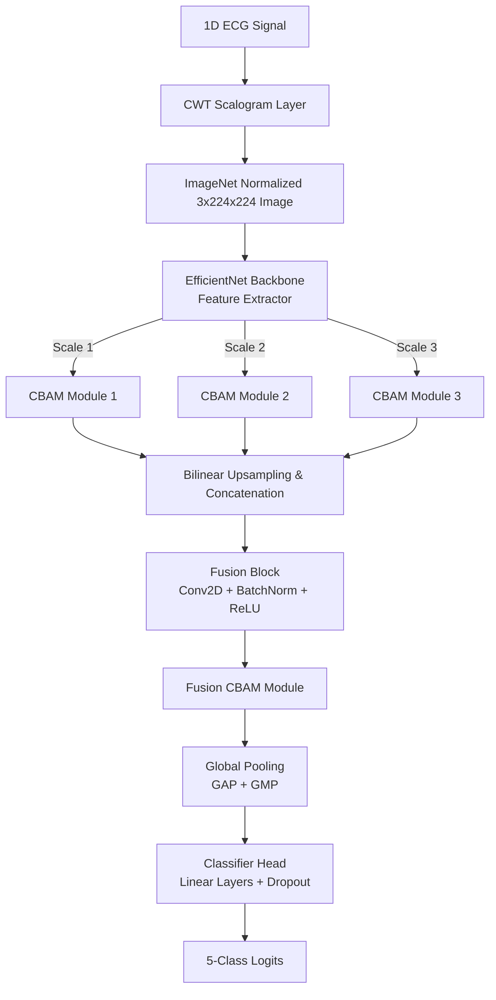
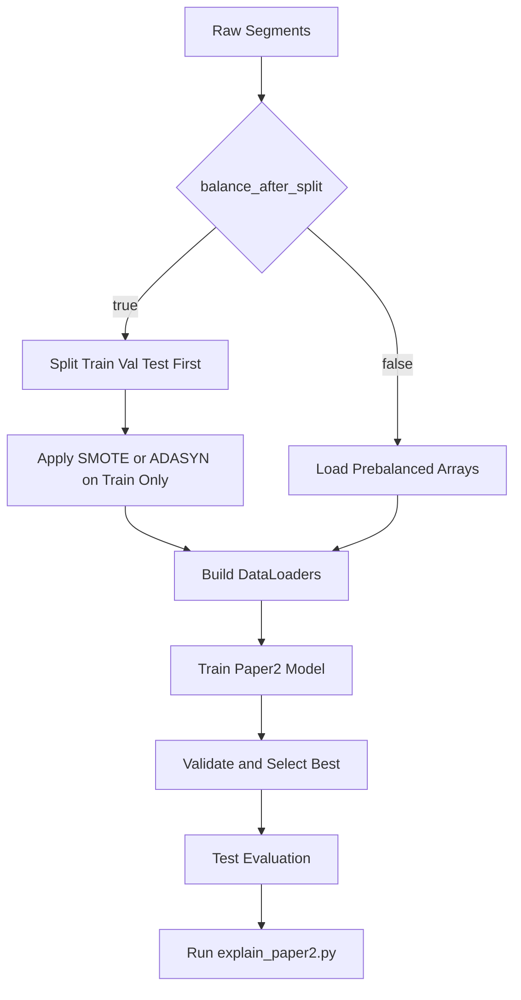

# Paper 2 Technical Monograph: EfficientNet Scalogram Pipeline (Legacy Hybrid Narrative vs Current AttentionEfficientNet Runtime)

## 1. Scope and Positioning

This document is a paper-grade technical specification for the Paper 2 branch of the repository. It explicitly separates:

1. The original research narrative: EfficientNet-B0 plus Transformer over CWT scalogram tokens.
2. The current repository runtime path: AttentionEfficientNet with CBAM-style attention and dedicated explainability outputs.

The goal is to preserve scientific clarity while keeping implementation truth exact and reproducible.

---

## 2. Problem Definition and Notation

Given ECG beat segments centered on R-peaks, define a dataset:

$$
\mathcal{D}=\{(x_i,y_i)\}_{i=1}^{N},\quad x_i\in\mathbb{R}^{L},\ y_i\in\{0,1,2,3,4\}
$$

where:

- $L=216$ samples per beat segment.
- Classes $\{0,1,2,3,4\}$ correspond to AAMI types $\{N,S,V,F,Q\}$.

The Paper 2 representation map converts 1D to 2D:

$$
\Phi_{\text{CWT}}: \mathbb{R}^{216}\rightarrow\mathbb{R}^{H\times W\times 3}
$$

with $(H,W)=(224,224)$ and 3-channel pseudo-RGB replication.

The classifier maps images to class probabilities:

$$
f_\theta\!:\mathbb{R}^{224\times224\times3}\rightarrow\Delta^{5}
$$

where $\Delta^{5}$ is the probability simplex over 5 classes.

---

## 3. Clinical and Signal-Processing Motivation

Paper 2 investigates whether converting ECG beats to time-frequency images enables transfer learning from vision backbones. The central hypothesis is:

1. CWT improves visibility of arrhythmia-specific frequency signatures.
2. Pretrained image models accelerate learning in low-data classes.
3. Attention modules improve context integration across spectral regions.

This path trades exact temporal localization for richer local frequency-texture cues.

---

## 4. End-to-End Data Path

### 4.1 Beat Preparation

1. Records are parsed from configured source mode (MIT-BIH, INCART, combined).
2. Beats are segmented around R-peak anchors.
3. Labels are normalized to the 5-class AAMI-style mapping used in repository training.

### 4.2 Leakage-Safe Balancing Policy

The repository supports a strict split-first balancing strategy:

1. If `balance_after_split=true`: Split train/val/test first, then apply SMOTE/ADASYN **only to training split**.
2. If `balance_after_split=false`: Load pre-balanced arrays (legacy pipeline).

Split-first is essential for unbiased validation and test metrics, avoiding synthetic data contamination.

### 4.3 Scalogram Conversion

For each beat $x(t)$:

$$
W(a,b)=\frac{1}{\sqrt{a}}\int_{-\infty}^{\infty}x(t)\,\psi^*\!\left(\frac{t-b}{a}\right)dt
$$

Scalogram magnitude:

$$
S(a,b)=|W(a,b)|
$$

Practical settings:

- Wavelet: Morlet (`morl`).
- Scales: `np.arange(1,65)`.
- Native shape $64\times216$, then interpolated to $224\times224$ (`img_size`).
- Channel format: 3-channel replication for vision backbones.

---

## 4.3 EfficientNet-B0 vs AttentionEfficientNet Comparison

| Dimension | Base EfficientNet-B0 | AttentionEfficientNet (Current Runtime) |
|-----------|---------------------|----------------------------------------|
| Backbone | MBConv only | MBConv with CBAM attention |
| Channel Attention | SE blocks only | SE + CBAM channel refinement |
| Spatial Attention | None | **CBAM spatial attention maps** |
| Input | 224×224 RGB images | 224×224 CWT scalogram (3-channel replication) |
| Head design | Global pooling → FC | **Global pooling + CBAM → FC** |
| Interpretability | Basic feature maps | **Grad-CAM + spatial/channel attention artifacts** |
| Training stability | Standard AMP | **BF16 mixed precision + TF32** |
| XAI Runtime | Not applicable | `scripts/explain_paper2.py` |
| Implementation | torchvision baseline | `src/models/efficientnet_scalogram.py` |
| Config reference | N/A | `configs/paper2_efficientnet.yaml` |

**Key Novelty:** CBAM attention augmentation replaces the legacy Transformer tokenization path, enabling efficient interpretability through explicit attention maps while maintaining transfer learning benefits.

**Codebase Reference:** See [MODULAR_CODEBASE_README.md](MODULAR_CODEBASE_README.md#project-structure) for runtime details.

---

## 5. Legacy Architecture Narrative (EfficientNet + Transformer)

> [!WARNING]
> This section captures the original conceptual architecture used in previous theoretical writeups limit testing. **The Vision Transformer (ViT) architecture is NO LONGER ACTIVE.** The current state-of-the-art runtime applies the multi-scale, purely convolutional `AttentionEfficientNet` mechanism defined below.

### 5.1 Backbone and Projection

EfficientNet-B0 feature map:

$$
F\in\mathbb{R}^{B\times1280\times7\times7}
$$

Projection:

$$
\tilde{F}=\mathrm{ReLU}(\mathrm{BN}(\mathrm{Conv}_{1\times1}(F)))\in\mathbb{R}^{B\times256\times7\times7}
$$

### 5.2 Tokenization and CLS Injection

Flatten spatial grid to tokens:

$$
T\in\mathbb{R}^{B\times49\times256}
$$

Add CLS token and positional embeddings:

$$
\hat{T}=[\mathrm{CLS};T_1;\dots;T_{49}] + E_{\mathrm{pos}}\in\mathbb{R}^{B\times50\times256}
$$

### 5.3 Transformer Encoder

Attention kernel:

$$
\mathrm{Attn}(Q,K,V)=\mathrm{softmax}\!\left(\frac{QK^\top}{\sqrt{d_k}}\right)V
$$

Encoder depth in prior guide: 4 layers, 8 heads, embedding 256.

### 5.4 Classification Head

Use CLS output with stacked MLP to logits in $\mathbb{R}^{5}$.

---

## 6. Current Runtime Architecture (AttentionEfficientNet + CBAM)

The repository now executes a multi-scale attention-augmented CNN path for Paper 2 training, evaluation, and XAI.

### 6.1 High-Level Computation

The backbone extracts pyramidal features by tapping hierarchical outputs at block indices (e.g., scales 2, 3, and 4 in EfficientNet-B0), generating synchronized multi-scale context mappings. 

$$
\hat{y}=g_\phi\!\left(\mathrm{FusionCBAM}\left( \text{Concat}\Big|_{i=2}^{4} \Big[ \mathrm{Upsample}\big( \mathrm{CBAM}_{i}\big(\mathrm{EffNet}_{i}(\Phi_{\mathrm{CWT}}(x))\big)\big) \Big] \right)\right)
$$

Where:

- $\mathrm{EffNet}_{i}$ represents the hierarchical CNN output at scale $i$.
- $\mathrm{CBAM}_{i}$ explicitly refines each scale output independently.
- $g_\phi$ is the final global-pooled dense classifier head.

### 6.2 Channel Attention

For feature tensor $U\in\mathbb{R}^{C\times H\times W}$:

$$
M_c(U)=\sigma\left(\mathrm{MLP}(\mathrm{GAP}(U))+\mathrm{MLP}(\mathrm{GMP}(U))\right)
$$

$$
U'=M_c(U)\odot U
$$

### 6.3 Spatial Attention

$$
M_s(U')=\sigma\left(f^{7\times7}([\mathrm{AvgPool}_c(U');\mathrm{MaxPool}_c(U')])\right)
$$

$$
U''=M_s(U')\odot U'
$$

This produces interpretable attention maps aligned with Paper 2 XAI artifacts.

---

## 7. Shape Trace and Interface Contracts

Representative tensor flow (batch size $B$):

1. Input scalogram: $B\times3\times224\times224$.
2. Backbone multi-scale blocks: 3 parallel downsampled feature maps $F_2, F_3, F_4$.
3. Per-scale attention: CBAM applied to each $F_i$ independently.
4. Scale fusion: $F_3, F_4$ bilinearly upsampled to matches dim of $F_2$, then concatenated.
5. Fused Attention: Processed through 512-channel Fusion CBAM.
6. Global pooling: $B\times 1024$ (GAP and GMP concatenated).
7. Classifier output: $B\times5$.

Contract guarantees:

- Input normalization policy must match training.
- Class index mapping must remain consistent across train/eval/XAI.
- Checkpoint architecture and config pairing must match exactly.

---

## 8. Objective Function and Optimization

### 8.1 Loss

Primary objective:

$$
\mathcal{L}_{\mathrm{CE}}=-\sum_{c=1}^{C}\tilde{y}_c\log\hat{y}_c
$$

Label smoothing form:

$$
\tilde{y}_c=(1-\alpha)y_c+\frac{\alpha}{C},\quad \alpha=0.1
$$

### 8.2 Softmax

$$
\hat{y}_c=\frac{e^{z_c}}{\sum_{k=1}^{C}e^{z_k}}
$$

### 8.3 Optimizer and Runtime

Typical Paper 2 path in this repository:
---

## 8A. Overfitting Prevention Strategy for Vision Models

Paper 2 applies specialized regularization suited to 2D image-based ECG representations (scalograms):

### 8A.1. Early Stopping by Validation Accuracy

Similar to Paper 1, early stopping monitors validation **accuracy** rather than loss alone:

```python
trainer.train(
    train_loader, val_loader,
    epochs=200,
    monitor='val_acc'  # Checkpoint at best val_acc epoch, not best val_loss
)
```

**Configuration:**
```yaml
training:
  monitor: val_acc  # Default for classification tasks
```

### 8A.2. Label Smoothing for Vision Models

Label smoothing is applied to the classification loss, softening one-hot targets:

$$
\tilde{y}_c=(1-\alpha)y_c+\frac{\alpha}{C}
$$

For Paper 2 (pretrained EfficientNet), label smoothing is typically **lower** ($\alpha=0.03$) than Paper 1, as the pretrained backbone already provides strong feature regularization:

**Configuration:**
```yaml
training:
  label_smoothing: 0.03  # Lower for vision, higher for 1D models
```

### 8A.3. Vision-Specific Augmentation Considerations

Paper 2 uses **CWT scalogram images** as input. Spatial augmentation (random crops, rotations) may distort time-frequency semantics, so **augmentation is typically disabled** for the 1D-derived 2D representation:

**Configuration:**
```yaml
training:
  augmentation_prob: 0.0  # Disabled for scalogram; frequency distortion harmful
```

If augmentation is desired, use conservative vision transforms (mild scale jitter only), not aggressive spatial transforms.

### 8A.4. Transfer Learning and Early Stopping

With a pretrained EfficientNet backbone, early stopping may trigger earlier (e.g., epoch 20–40 vs. Paper 1's 60–80), as the model quickly adapts learned visual features to ECG spectrograms:

**Recommendation:**
  - Use early stopping patience with LR reduction (reduce LR 3–4 times before stop).
  - Monitor validation accuracy peak to avoid stopping too early.
  - Allow at least 30–50 epochs for fine-tuning fine_tune phase stabilization.

### 8A.5. ADASYN + Class Weights Interaction

As in Paper 1, when using ADASYN oversampling, **disable class weights**:

```yaml
data:
  balancing_method: adasyn
training:
  use_class_weights: false  # ADASYN already boosts minorities
```

This prevents double-reweighting that can bias model toward minority classes.

### 8A.6. K-Fold Hyperparameter Passthrough

Ensure learning rate and weight decay are **explicitly passed** to K-fold trainer:

```python
kfold_trainer = KFoldTrainer(
    n_splits=10,
    lr=config.training.lr,  # Critical: explicitly pass configured LR
    weight_decay=config.training.weight_decay,
    label_smoothing=config.training.label_smoothing,
    use_class_weights=config.training.use_class_weights,
    early_stopping_monitor=config.training.monitor,
    # ... other parameters
)
```

**Historical Issue:** K-fold training ignored config hyperparameters, using hardcoded defaults. **Now fixed.**

### 8A.7. Attention Map Regularization via CBAM

CBAM (channel + spatial attention) modules in Paper 2 provide **implicit regularization**:

  - **Channel attention** suppresses noisy feature maps.
  - **Spatial attention** focuses on arrhythmia-relevant scalogram regions.

Together, attention mechanisms act as learned feature selectors, reducing overfitting risk without explicit regularization hyperparameters.

### 8A.8. Key Overfitting Signatures for Vision Models

| Signature | Cause | Remedy |
|-----------|-------|--------|
| Train loss → 0.002, Val loss → 0.5+ | Memorization | ↑ label_smoothing to 0.05, use dropout in classifier |
| Val acc peaks epoch 35, val loss best epoch 50 | Checkpoint metric mismatch | Set `monitor: val_acc` |
| Fold-to-fold variance > 3% | Hyperparameter leakage | Verify lr/wd passthrough in K-fold |
| Poor minority F1-scores | ADASYN + class weights | Set `use_class_weights: false` |
| Noisy attention maps | Insufficient CBAM regularization | OK; attention naturally focuses; not a failure mode |

---
- AdamW.
- AMP (BF16 preferred where supported).
- LR reduction and early stopping.
- Non-blocking transfer and container-safe execution settings.

---

## 9. Complexity and Resource Analysis

### 9.1 CWT Overhead

CWT dominates preprocessing cost compared to direct 1D pipelines. For beat count $N$ and scale count $S$:

$$
\text{Cost}_{\mathrm{CWT}}\propto N\cdot S\cdot L
$$

This is a major throughput driver.

### 9.2 Model-Side Cost

Attention-enhanced CNN remains cheaper than full token-level global self-attention over high-resolution patches, while retaining spatial interpretability.

### 9.3 Practical Memory Notes

- Large batch sizes are constrained by scalogram tensors.
- Worker count should be tuned conservatively in containerized workflows.
- AMP is important for throughput and stability on limited VRAM.

---

## 10. Novelty Map

Novel contributions and where they appear:

1. Time-frequency representation shift: CWT scalogram conversion from 1D ECG.
2. Attention-augmented vision backbone: CBAM refinements in runtime path.
3. Leakage-safe balancing policy: split-first train-only synthesis.
4. Structured explainability suite: Grad-CAM + attention diagnostics bundle.

These should be explicitly called out in any manuscript section discussing methods.

---

## 11. Baseline vs Current Runtime Table

| Dimension | Legacy Paper 2 Narrative | Current Repository Runtime |
|---|---|---|
| Core design | EfficientNet + Transformer | AttentionEfficientNet + CBAM |
| Global relation model | Transformer self-attention | Attention-enhanced CNN hierarchy |
| Tokenization | Explicit 49+CLS tokens | Not used in active path |
| Balancing policy | Generic narrative | Split-first supported and documented |
| Explainability focus | General hybrid explanations | Grad-CAM + CBAM spatial/channel maps |
| Deployment profile | More sequence-oriented | Practical CNN-attention inference path |

---

## 12. Training and Evaluation Protocol

### 12.1 Data Split Policy

Recommended default for paper-grade reproducibility:

1. Fix seed and split indices.
2. Apply balancing only to train split when enabled.
3. Keep validation/test untouched.

### 12.2 Checkpointing

Use validation objective for checkpoint selection, never test objective.

### 12.3 Metrics

Report:

- Accuracy.
- Macro precision/recall/F1.
- Per-class metrics and confusion matrix.
- Optional calibration diagnostics.

---

## 13. Explainability Protocol (Paper 2)

Active script:

- `scripts/explain_paper2.py`

Canonical command:

```bash
python scripts/explain_paper2.py \
  --model-path checkpoints/paper2_efficientnet/best_model.pt \
  --config configs/paper2_efficientnet.yaml \
  --num-samples-per-class 1
```

Leakage-safe override when required:

```bash
python scripts/explain_paper2.py \
  --model-path checkpoints/paper2_efficientnet/best_model.pt \
  --config configs/paper2_efficientnet.yaml \
  --num-samples-per-class 1 \
  --data.balance_after_split
```

Expected artifacts under `experiments/paper2_efficientnet/xai/` include:

- `scalogram_gradcam.png`.
- `cbam_spatial_maps.png`.
- `cbam_channel_attention.png`.
- `arrays.npz`.
- per-sample and global `summary.json`.

---

## 14. Failure Modes and Diagnostics

### 14.1 Known Error Modes

1. N/S confusion from subtle morphology overlap.
2. V/F confusion where ventricular morphology mixes.
3. Domain shift across acquisition conditions.

### 14.2 Debug Checklist

1. Verify config-checkpoint pair consistency.
2. Confirm class mapping identical across scripts.
3. Inspect attention maps for degenerate concentration.
4. Re-check split and balancing policy when metrics look suspiciously high.

---

## 15. Ablation Program for Publication

Minimum ablation matrix:

1. Remove CBAM.
2. Freeze vs unfreeze backbone blocks.
3. With/without split-first balancing.
4. CWT scale count sensitivity.
5. Augmentation policy sensitivity.

Report mean and variance across repeated seeds.

---

## 16. Reproducibility Checklist

1. Pin package versions and CUDA/cuDNN details.
2. Store split indices and random seeds.
3. Save exact config used for each run.
4. Archive checkpoint hashes.
5. Archive XAI outputs tied to checkpoint ID.

This ensures any metric can be traced to exact code and data state.

---

## 17. Architecture and Flow Diagrams

### 17.1 Runtime-Correct Architecture Flow



### 17.2 Data and Methodology Flow



---

## 18. Manuscript-Ready Claim Boundaries

To avoid over-claiming:

1. If reporting Transformer behavior, clarify it as legacy design narrative unless active code path is restored.
2. If reporting current results from repository checkpoints, attribute them to AttentionEfficientNet + CBAM runtime.
3. Distinguish architectural innovation from methodology innovation (split-first balancing).

---

## 19. Equation Rendering Compatibility

For robust markdown previews, keep one expression per display block and prefer explicit LaTeX operators:

$$
\mathrm{Attn}(Q,K,V)=\mathrm{softmax}\!\left(\frac{QK^\top}{\sqrt{d_k}}\right)V
$$

$$
\mathcal{L}_{\mathrm{CE}}=-\sum_{c=1}^{C}\tilde{y}_c\log\hat{y}_c
$$

$$
\hat{y}_c=\frac{e^{z_c}}{\sum_{k=1}^{C}e^{z_k}}
$$

---

## 20. Citation Pointers

Useful references for Paper 2 writeups:

- EfficientNet: Tan and Le, ICML 2019.
- CBAM: Woo et al., ECCV 2018.
- Vision Transformer tokenization concepts: Dosovitskiy et al., ICLR 2021.
- ECG benchmark framing: MIT-BIH and INCART literature.

This monograph should be treated as the authoritative deep guide for Paper 2 in this repository.
