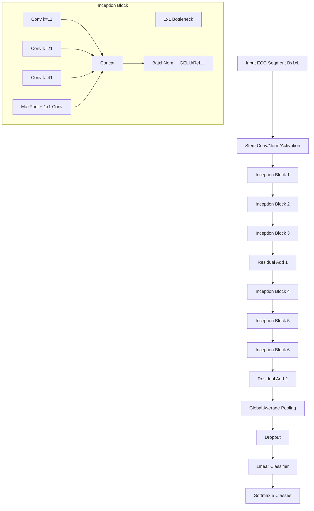
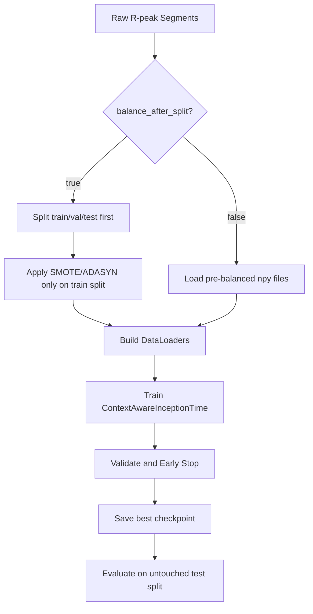

# InceptionTime Architecture (Paper 1)

## 1. Overview
This document describes the current Paper 1 architecture used in the repository, including model topology, tensor shapes, runtime training behavior, and explainability workflow.

The primary model family is ContextAwareInceptionTime, a 1D multi-branch convolutional architecture designed for ECG beat classification.

---

## 2. High-Level Architecture



---

## 3. Tensor Shape Trace (Typical)

| Stage | Shape |
|------|------|
| Input | B x 1 x 216 |
| Stem | B x C1 x 216 |
| Inception stack output | B x C2 x T |
| Global average pooling | B x C2 |
| Classifier logits | B x 5 |

Notes:
- Exact channel counts depend on config variant.
- Temporal length T is reduced by stride/pooling choices in the implementation.

---

## 4. Why InceptionTime Works for ECG

1. Multi-scale kernels capture morphology at different durations.
2. Residual links stabilize deeper 1D stacks.
3. Global pooling reduces overfitting to absolute beat position.
4. Lightweight 1D path enables high-throughput training.

---

## 5. Training Pipeline (Current Runtime)



Runtime behavior in this repository:
- BF16 mixed precision and TF32 are enabled on supported GPUs.
- Data loading is tuned for container-safe execution.
- Optional split-first balancing avoids train/test leakage.

---

## 6. Loss, Optimization, and Metrics

- Primary loss: cross-entropy.
- Optimizer: AdamW in current configs.
- Typical controls: scheduler, early stopping, gradient clipping (if enabled), and compile acceleration.
- Core report metrics: accuracy, macro precision/recall/F1, per-class metrics, confusion matrix.

---

## 7. Explainability Pipeline

Paper 1 XAI is generated with script-level explainability and does not require retraining.

Command:

```bash
python scripts/explain_paper1.py \
    --model-path checkpoints/paper1_inceptiontime/best_model.pt \
    --config configs/paper1_inceptiontime.yaml \
    --num-samples-per-class 1
```

Optional leakage-safe loading override:

```bash
--data.balance_after_split
```

Artifacts in experiments/paper1_inceptiontime/xai/:
- signal_attributions.png
- branch_summary.png
- attributions.npz
- branch_summary.json
- per-sample summary.json and global summary.json

---

## 8. Practical Failure Modes and Mitigations

| Failure Mode | Symptom | Mitigation |
|---|---|---|
| Dataset mismatch | missing balanced file errors | use split-first mode or generate required files |
| Overfitting | large train-test gap | increase regularization, monitor early stopping |
| Class instability | weak minority-class recall | tune balancing method and class-level diagnostics |
| Runtime stalls | workers hanging in containers | keep conservative num_workers and spawn-safe loader path |

---

## 9. Reference
- Fawaz et al., InceptionTime: Finding AlexNet for Time Series Classification.
- Repository config: configs/paper1_inceptiontime.yaml
