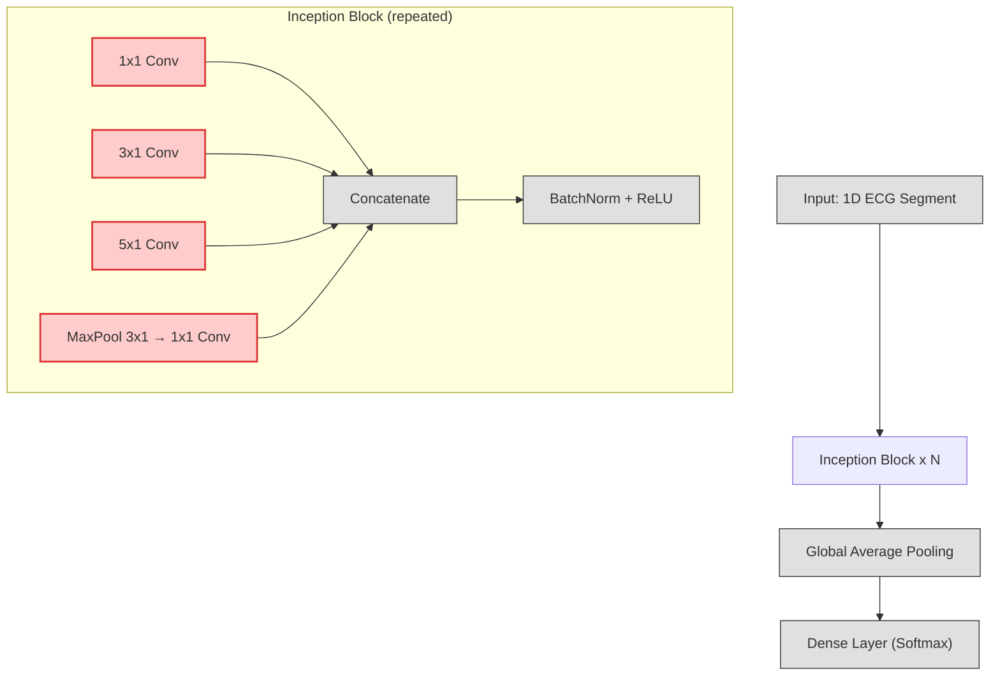

# InceptionTime Model Architecture (Paper 1)

## Overview
The InceptionTime model is a deep 1D convolutional neural network designed for time series classification, inspired by the Inception architecture from computer vision. It is particularly effective for ECG arrhythmia classification.

---

## Architecture Diagram



---

## Layer Descriptions
- **Input:** 1D ECG segment (e.g., 360 samples)
- **Inception Block (Novelty):**
    - Parallel convolutions with multiple kernel sizes (1x1, 3x1, 5x1) and a max-pooling branch
    - Outputs concatenated and passed through BatchNorm + ReLU
    - Enables multi-scale feature extraction (key novelty)
- **Stacked Inception Blocks:** Several blocks are stacked for deep feature learning
- **Global Average Pooling:** Reduces each feature map to a single value
- **Dense Layer (Softmax):** Outputs class probabilities

---

## Novelty Highlighted
- The **multi-scale convolutional branches** in each Inception Block (red highlight in diagram) are the main novelty, allowing the model to capture features at different temporal resolutions simultaneously.

---

## Current Repository XAI Workflow (March 2026)

The active Paper 1 explainability pipeline is implemented in `scripts/explain_paper1.py` and is designed for the current ContextAwareInceptionTime implementation.

Run:

```bash
python scripts/explain_paper1.py \
    --model-path checkpoints/paper1_inceptiontime/best_model.pt \
    --config configs/paper1_inceptiontime.yaml \
    --num-samples-per-class 1
```

Optional leakage-safe override (split first, then balance train only):

```bash
python scripts/explain_paper1.py \
    --model-path checkpoints/paper1_inceptiontime/best_model.pt \
    --config configs/paper1_inceptiontime.yaml \
    --data.balance_after_split
```

Artifacts are saved to `experiments/paper1_inceptiontime/xai/` and include:
- 1D Grad-CAM overlays for selected Inception block features
- Integrated Gradients attributions over the ECG segment
- Branch-scale activation summaries across inception branches
- Per-sample `summary.json` plus top-level `summary.json`

---

## Reference
- Fawaz, H. I., et al. "InceptionTime: Finding AlexNet for Time Series Classification." Data Mining and Knowledge Discovery, 2020.
