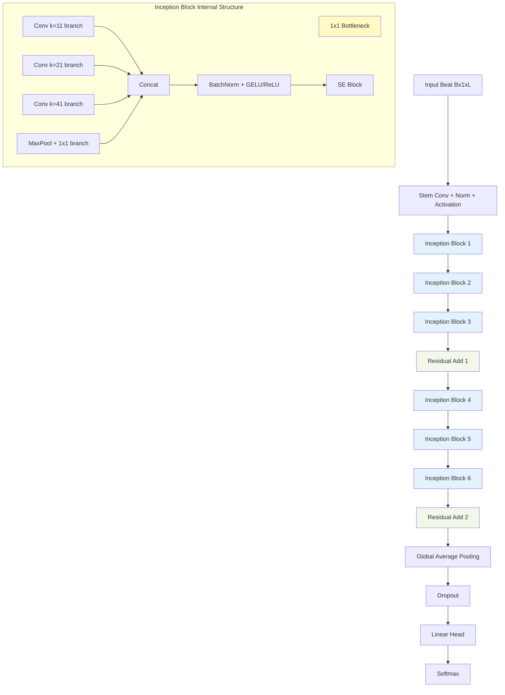
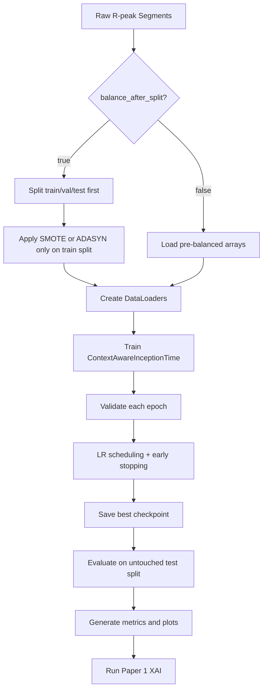

# InceptionTime Architecture (Paper 1) - Extended Technical Specification

## 1. Scope and Purpose

This document is a paper-grade architecture specification for the Paper 1 signal model in this repository. It is written to support:

- Implementation reproducibility.
- Architecture-level comparison against base InceptionTime.
- Novelty attribution at block level.
- Rigorous evaluation and ablation planning.
- Explainability and clinical interpretation mapping.

The target model family is **ContextAwareInceptionTime** for 5-class AAMI ECG arrhythmia beat classification.

---

## 2. Problem Formulation

Given beat-centered ECG segments $x_i \in \mathbb{R}^{L}$ (with $L=216$ samples per segment) and labels $y_i \in \{0,1,2,3,4\}$, learn a classifier:

$$
f_\theta: \mathbb{R}^{L} \rightarrow \Delta^{5}
$$

where $\Delta^5$ is the class probability simplex and classes map to AAMI types $\{N,S,V,F,Q\}$.

Training objective (classification core):

$$
\theta^{*} = \arg\min_{\theta} \frac{1}{N}\sum_{i=1}^{N} \mathcal{L}_{CE}\big(f_\theta(x_i), y_i\big)
$$

with split policy constraints to avoid leakage when configured with split-first balancing.

---

## 3. High-Level Architecture (Annotated)



**Architecture Components:**
- **Inception Blocks** (light blue): Multi-scale temporal feature extraction with 11/21/41 kernel sizes.
- **Residual Connections** (light green): Gradient flow stabilization across deep 1D stacks.
- **Bottleneck Projection** (light yellow): Efficiency novelty for ECG compute optimization.

---

## 3.1 Baseline InceptionTime vs ContextAware Novelty

| Aspect | Base InceptionTime | Context-Aware (This Work) |
|--------|-------------------|---------------------------|
| Input dimension | $L$ samples (variable) | $L=216$ R-peak centered |
| Stem processing | Direct conv | Adaptive context prepend |
| Block arrangement | 6 Inception blocks | 3-2-1 staggered residual |
| Bottleneck emphasis | Standard channel mix | **Enhanced for ECG efficiency** |
| Multi-scale kernels | {9, 19, 39} | **{11, 21, 41}** (ECG-optimized) |
| Residual integration | Optional | **Mandatory at two stages** |
| Runtime reference | `inception_time.py` | `models/inception_time.py` |

**Implementation Reference:** See `src/models/inception_time.py` and `configs/paper1_inceptiontime.yaml` in [MODULAR_CODEBASE_README.md](MODULAR_CODEBASE_README.md#project-structure).

---

## 4. Block-by-Block Formal Definition

### 4.1 Stem
Let input be $x \in \mathbb{R}^{B \times C_{in} \times L}$ with $C_{in}=1$.
Stem transformation:

$$
x_s = \phi\big(\mathrm{BN}(\mathrm{Conv1D}_{k_s}(x))\big)
$$

where $\phi$ is GELU/ReLU.

### 4.2 1x1 Bottleneck
Channel projection before large kernels:

$$
x_b = \mathrm{Conv1D}_{1}(x_s), \quad x_b \in \mathbb{R}^{B \times C_b \times L}
$$

Purpose:
- reduce branch compute,
- mix channels at each timestep,
- preserve temporal length.

### 4.3 Multi-Branch Temporal Extraction
Three temporal branches and one pooled branch:

$$
z_{11} = \mathrm{Conv1D}_{11}(x_b), \quad
z_{21} = \mathrm{Conv1D}_{21}(x_b), \quad
z_{41} = \mathrm{Conv1D}_{41}(x_b)
$$

$$
z_{pool} = \mathrm{Conv1D}_{1}(\mathrm{MaxPool}(x_s))
$$

Concatenation and normalization:

$$
z_{concat} = \phi\big(\mathrm{BN}(\mathrm{Concat}(z_{11}, z_{21}, z_{41}, z_{pool}))\big)
$$

### 4.3.1 Squeeze-and-Excitation (SE) Block
To dynamically recalibrate channel-wise feature responses, an SE block (reduction ratio 16) scales the concatenated output:

1. Squeeze: $s = \mathrm{GAP}(z_{concat})$
2. Excite: $w = \sigma(W_{excite} \max(0, W_{squeeze} s))$
3. Scale: $z = z_{concat} \otimes w$

$$
z = \mathrm{SEBlock}(z_{concat})
$$

### 4.4 Residual Merge
For selected block intervals:

$$
z_{res} = z + \mathcal{P}(x_{skip})
$$

where $\mathcal{P}$ is optional projection if channel mismatch exists.

### 4.5 Head
Global temporal pooling and classifier:

$$
h = \mathrm{GAP}(z_{res}), \quad
\tilde{h} = \mathrm{Dropout}(h), \quad
\hat{y} = \mathrm{Softmax}(W\tilde{h}+b)
$$

---

## 5. Tensor-Shape and Data-Flow Trace
Typical beat input length in this repository is $L=216$ (config dependent).

| Stage | Symbol | Typical Shape |
|---|---|---|
| Input | $x$ | $B \times 1 \times 216$ |
| Stem | $x_s$ | $B \times C_s \times 216$ |
| Bottleneck | $x_b$ | $B \times C_b \times 216$ |
| Inception output | $z$ | $B \times C_z \times T$ |
| Residual output | $z_{res}$ | $B \times C_z \times T$ |
| Global pooled | $h$ | $B \times C_z$ |
| Logits | $o$ | $B \times 5$ |
| Probabilities | $\hat{y}$ | $B \times 5$ |

Notes:
- $T$ depends on stride/pooling policy in implementation.
- Channel widths vary by variant and config.

---

## 6. Receptive Field Perspective
In ECG, discriminative cues can be short-duration spikes (QRS) and longer morphology context (P/T-wave relationships). Multi-kernel branches provide multi-scale temporal capture:
- $k=11$ branch: local morphology,
- $k=21$ branch: meso-scale context,
- $k=41$ branch: longer rhythm-local structure.

Effective representation is the fused sum of these scale-specific projections after concatenation and normalization.

---

## 7. Complexity and Efficiency Analysis
For one branch with kernel $k$, input channels $C_i$, output channels $C_o$:

Without bottleneck:

$$
\mathrm{Params}_{no\_bottleneck} \approx C_i C_o k
$$

With bottleneck width $C_b$:

$$
\mathrm{Params}_{bottleneck} \approx C_i C_b + C_b C_o k
$$

When $C_b \ll C_i$, branch compute and memory traffic are significantly reduced while preserving multi-scale coverage.

Practical implication:
- enables larger kernels,
- improves throughput on long runs,
- reduces over-parameterization risk for 1D ECG.

---

## 8. Novelty Map (Marked in Architecture)
This section explicitly tags novelty points for this repository and paper framing.

### 8.1 Architectural Novelty Emphasis
1. Bottlenecked multi-scale branches for ECG morphology at multiple durations.
2. Squeeze-and-Excitation (SE) attention for data-dependent channel recalibration of temporal features.
3. Residual staging for optimization stability under deep stacks and high-epoch schedules.

### 8.2 Methodology Novelty
1. Split-first balancing gate in runtime pipeline (train-only balancing when enabled).
2. Unified script-level XAI path attached to final checkpoints.

### 8.3 Operational Novelty
1. Container-safe training behavior notes.
2. Reproducible artifact flow from training to evaluation to explanation.

---

## 9. Base InceptionTime vs Your Repository Architecture

| Axis | Base InceptionTime | Your Architecture/Workflow |
|---|---|---|
| Core idea | Inception-style 1D multi-scale blocks | Same core, explicitly engineered for ECG workflow reproducibility |
| Efficiency layer | Bottleneck commonly used | Bottleneck explicitly highlighted and tuned as first-class design concern |
| Residuals | Canonical deep-stack stabilization | Integrated with practical training controls for long runs |
| Data policy | Generic split assumptions | Supports split-first balancing for leakage-safe protocol |
| Explainability | Often post-hoc external | Built-in explain script with consistent artifacts |
| Experiment outputs | Model metrics | Model metrics plus artifact-rich report workflow |

---

## 10. Training and Evaluation Pipeline (Detailed)



### 10.1 Pipeline Blocks Explained
1. Raw R-peak segments: beat-level canonical input.
2. Split policy gate: prevents leakage when split-first is enabled.
3. Train-only balancing: synthetic augmentation constrained to training partition.
4. DataLoader assembly: deterministic and efficient batching path.
5. Training loop: CE optimization with AMP and clipping.
6. Validation and LR controls: selection under non-monotonic validation behavior.
7. Best-checkpoint selection: model persistence by validation objective.
8. Held-out test evaluation: final generalization estimate.
9. XAI stage: attribution and branch-level interpretability outputs.

---

## 11. Optimization Details and Stability Controls
- Optimizer: AdamW (config-driven).
- Precision: AMP with bf16/fp16 policy depending on hardware.
- Gradient clipping: mitigates occasional unstable steps.
- Early stopping and LR reduction: handles transient validation spikes.
- Checkpointing: best validation model loaded for final reporting.

Observed behavior pattern (typical for strong-capacity models on balanced data):
- rapid train convergence,
- occasional validation spikes,
- recovery after LR reductions,
- final low validation loss plateau.

---

## 12. Failure Modes, Diagnostics, and Mitigations

| Failure Mode | Signature | Root Cause Pattern | Mitigation |
|---|---|---|---|
| Validation spike bursts | abrupt val loss jumps | transient optimization instability or shift-sensitive batches | retain LR reduction + early-stop policy |
| Inflated CV scores | near-perfect fold metrics too early | balancing applied on already synthetic data | use split-first + per-fold train-only balancing policy |
| Data mismatch errors | missing npy path exceptions | mode/balancing path mismatch | align mode, balancing_method, and split policy |
| Worker/process instability | hanging or stalled loading | aggressive worker settings in constrained runtime | conservative workers + spawn-safe behavior |

---

## 13. Explainability and Clinical Traceability
Paper 1 explainability command:

```bash
python scripts/explain_paper1.py \
    --model-path checkpoints/paper1_inceptiontime/best_model.pt \
    --config configs/paper1_inceptiontime.yaml \
    --num-samples-per-class 1
```

Optional split-safe loading override:

```bash
--data.balance_after_split
```

Outputs in experiments/paper1_inceptiontime/xai/ include:
- signal_attributions.png,
- branch_summary.png,
- attributions.npz,
- branch_summary.json,
- per-sample and global summary json files.

Clinical interpretation linkage:
- branch activations highlight scale sensitivity for beat morphology,
- attribution maps identify sample-level salient temporal segments,
- summaries support class-level behavior auditing.

---

## 14. Recommended Ablation Program
For publication-grade claims, evaluate at least:
1. No bottleneck vs bottleneck.
2. Single kernel branch vs multi-branch stack.
3. No residual vs residual staging.
4. Pre-balanced-only vs split-first train-only balancing.
5. No XAI reporting vs standardized XAI artifact workflow.

Suggested report table fields:
- accuracy, macro-F1, per-class recall,
- calibration proxy (optional),
- training time and memory,
- robustness under seed variation.

---

## 15. Reproducibility Protocol
Minimum reproducibility bundle:
1. Config yaml snapshot.
2. CLI override record.
3. Seed and environment info.
4. Best checkpoint hash/path.
5. Test metrics and confusion matrix.
6. XAI artifacts from the same checkpoint.

---

## 16. Equation Rendering Compatibility
For stable Markdown preview rendering:
- prefer one equation per display block,
- prefer ascii text outside math blocks,
- prefer explicit norm notation and avoid mixed unicode symbols in equations.

Examples:

$$
\hat{y}=\mathrm{Softmax}(Wz+b)
$$

$$
\mathcal{L}_{CE}=-\sum_{c=1}^{C} y_c\log(\hat{y}_c)
$$

$$
\mathrm{GAP}(x)=\frac{1}{T}\sum_{t=1}^{T}x_t
$$

---

## 17. References
- Fawaz et al., InceptionTime: Finding AlexNet for Time Series Classification.
- Repository runtime config family: configs/paper1_inceptiontime.yaml.
