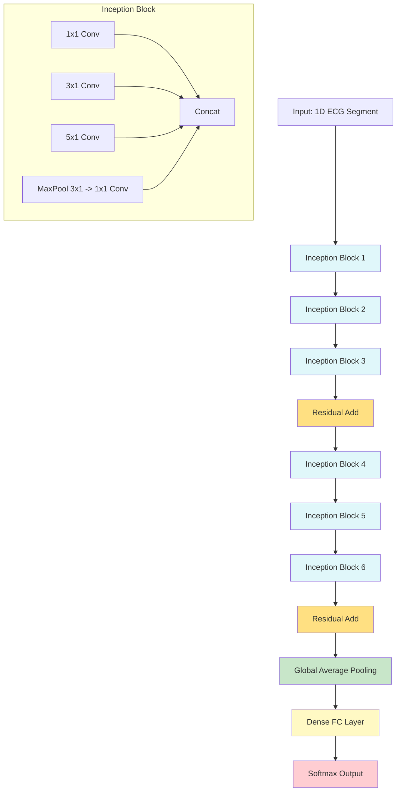
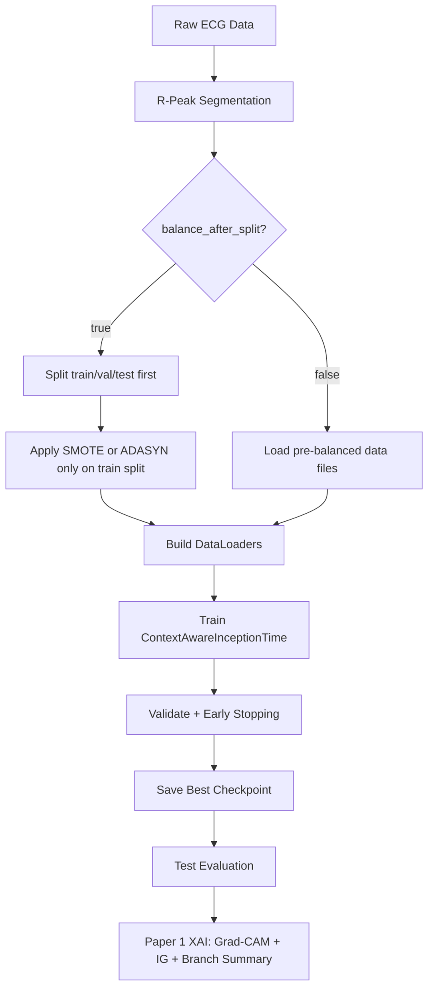

# InceptionTime for 1D ECG Signal Classification: In-Depth Study Guide

## 1. Introduction
InceptionTime is a deep learning architecture designed for time series classification, inspired by the Inception modules from computer vision. This guide provides a comprehensive overview, including data flow, model structure, mathematical formulations, and a flowchart for Paper 1: "Context-Aware InceptionTime with Multi-Scale Temporal Processing" applied to ECG arrhythmia classification.

---

## 2. Data Pipeline Overview

**Step 1:** Raw ECG data (MIT-BIH, INCART) is preprocessed into R-peak-centered segments.

**Step 2:** Dataset balancing (SMOTE/ADASYN) is applied either globally or per K-fold split.

**Step 3:** Data is split into train/val/test (or K-fold splits).

**Step 4:** Batches are fed to the InceptionTime model for training and evaluation.

---

## 3. Model Architecture: InceptionTime


### 3.1. InceptionTime Architecture Diagram



### 3.2. Inception Module (1D)
Each Inception module consists of multiple parallel 1D convolutions with different kernel sizes, capturing features at multiple temporal scales.

#### Formula:
Let $x \in \mathbb{R}^{B \times C_{in} \times L}$ be the input (batch, channels, length).

For each branch $i$:
$$
\mathrm{Branch}_i(x) = \mathrm{Conv1D}_{k_i}(x) \quad \text{for kernel size } k_i
$$

The outputs are concatenated:
$$
\mathrm{Inception}(x) = \mathrm{Concat}(\mathrm{Conv1D}_{k_1}(x), \mathrm{Conv1D}_{k_2}(x), \ldots, \mathrm{MaxPool}(x) \rightarrow \mathrm{Conv1D}_{1}(x))
$$

### 3.3. InceptionTime Block
- Stack of $N$ Inception modules (typically $N=6$)
- Residual connections every 3 modules
- BatchNorm and ReLU after each convolution

#### Block Output:
$$
\mathrm{Block}_j(x) = \mathrm{Inception}_j(\mathrm{Block}_{j-1}(x)) + x \quad \text{(if residual)}
$$

### 3.4. Full Model
- Input: $x \in \mathbb{R}^{B \times 1 \times L}$
- $N$ Inception blocks
- Global Average Pooling (GAP)
- Fully Connected (FC) layer for classification

#### Final Output:
$$
\hat{y} = \text{Softmax}(\text{FC}(\text{GAP}(\text{Block}_N(...\text{Block}_1(x)...))))
$$

### 3.5. All Key Equations

**1. 1D Convolution (per branch):**
$$
\mathrm{Conv1D}(x)[t] = \sum_{i=0}^{k-1} w_i \cdot x_{t+i} + b
$$

**2. Inception Module Output:**
$$
\mathrm{Inception}(x) = \mathrm{Concat}\left(\mathrm{Conv1D}_{k_1}(x),\ \mathrm{Conv1D}_{k_2}(x),\ \ldots,\ \mathrm{MaxPool}(x) \rightarrow \mathrm{Conv1D}_{1}(x)\right)
$$

**3. Residual Connection:**
$$
\mathrm{Block}_j(x) = \mathrm{Inception}_j\left(\mathrm{Block}_{j-1}(x)\right) + x
$$

**4. Global Average Pooling:**
$$
\mathrm{GAP}(x) = \frac{1}{L} \sum_{t=1}^L x_t
$$

**5. Fully Connected Layer:**
$$
z = Wx + b
$$

**6. Softmax Output:**
$$
\hat{y}_c = \frac{\exp(z_c)}{\sum_{k=1}^C \exp(z_k)}
$$

**7. Cross-Entropy Loss:**
$$
\mathcal{L} = -\sum_{c=1}^C y_c \log(\hat{y}_c)
$$

---

## 4. Training and K-Fold Balancing
- Loss: Cross-entropy
- Optimizer: Adam
- Learning rate scheduling, early stopping, mixed precision (AMP)
- K-fold: For each fold, apply SMOTE/ADASYN to training split if enabled

---

## 5. Flowchart

Below is a Mermaid flowchart describing the end-to-end pipeline:



---

## 6. Key Equations

### 6.1. 1D Convolution
$$
\text{Conv1D}(x)[t] = \sum_{i=0}^{k-1} w_i \cdot x_{t+i} + b
$$

### 6.2. Global Average Pooling
$$
\text{GAP}(x) = \frac{1}{L} \sum_{t=1}^L x_t
$$

### 6.3. Cross-Entropy Loss
$$
\mathcal{L} = -\sum_{c=1}^C y_c \log(\hat{y}_c)
$$

---

## 7. Novelty and Strengths
- Multi-scale temporal feature extraction via parallel convolutions
- Robust to class imbalance with per-fold balancing
- Efficient training with residuals, batch norm, and mixed precision

## 8. Current Runtime Implementation Notes (March 2026)

The current repository implementation for Paper 1 has been tuned for containerized B200-class GPU training.

### 8.1. Current Config Snapshot

From `configs/paper1_inceptiontime.yaml`:

| Parameter | Current Value |
|-----------|---------------|
| Batch Size | 2048 |
| Num Workers | 2 |
| Optimizer | AdamW |
| Learning Rate | $1 \times 10^{-3}$ |
| Weight Decay | $1 \times 10^{-4}$ |
| Mixed Precision | BF16 autocast |
| TF32 | Enabled for CUDA matmul/cuDNN |
| `torch.compile` | Enabled by config |

### 8.2. Throughput Optimizations Applied

- **Container-safe DataLoader behavior**: Linux worker start mode uses `spawn`, eval loaders avoid persistent workers, and worker count is reduced to limit dead/orphan processes.
- **Non-blocking host-to-device copies**: batches are transferred with `non_blocking=True` to overlap input transfer and execution.
- **BF16 mixed precision**: chosen as the default AMP mode for Hopper/B200-class GPUs because it is faster and more numerically stable than FP16 for most training workloads.
- **TF32 enabled**: CUDA matmul and cuDNN TF32 paths are enabled to accelerate eligible float32 operations on tensor cores.
- **Lower optimizer overhead**: `optimizer.zero_grad(set_to_none=True)` reduces memory writes each step.

### 8.3. Expected Accuracy Impact

These runtime changes do **not** alter the architecture, labels, loss definition, or train/validation/test splits.

- DataLoader/process lifecycle changes should have **no meaningful effect** on model accuracy.
- BF16 and TF32 can introduce small numerical differences relative to strict FP32, so repeated runs may not be bit-identical.
- In practice, the expected effect is **same accuracy range with faster training**, not a systematic accuracy drop.

### 8.4. Reproducibility and Data Integrity Checklist

Before long runs, verify:
- The same mode is used across training, evaluation, and XAI (`mitbih`, `incart`, or `combined`).
- `balance_after_split` is consistently enabled or disabled across scripts.
- Batch size and worker count are feasible for your container/host limits.
- Checkpoint path and config path correspond to the same experiment family.

Recommended logging for each run:
- Git commit hash
- Config snapshot
- Effective CLI overrides
- Final train/val/test sample counts per class

---

## 9. Current XAI Workflow in This Repository

Paper 1 explainability uses `scripts/explain_paper1.py` for the current ContextAwareInceptionTime runtime path.

### 9.1 Command

```bash
python scripts/explain_paper1.py \
    --model-path checkpoints/paper1_inceptiontime/best_model.pt \
    --config configs/paper1_inceptiontime.yaml \
    --num-samples-per-class 1
```

### 9.2 Leakage-Safe Override

To ensure split-first balancing behavior during data loading, append:

```bash
--data.balance_after_split
```

### 9.3 Artifacts

Outputs are written under `experiments/paper1_inceptiontime/xai/` and include:
- `signal_attributions.png` (signal + attribution overlays)
- `branch_summary.png` and `branch_summary.json`
- `attributions.npz`
- per-sample folders and global `summary.json`

### 9.4 Troubleshooting

Common issues and fixes:
- Empty XAI output folder: verify checkpoint path and class sample availability.
- Runtime mismatch: ensure Paper 1 checkpoint is used with Paper 1 config.
- Unexpected split behavior: pass `--data.balance_after_split` explicitly when needed.

## Architecture Blocks Explained

Core architecture blocks:
1. Input ECG Segment: one heartbeat-centered 1D sequence.
2. Inception Block(s): multi-branch temporal feature extraction.
3. 1x1 Bottleneck: channel compression before large temporal kernels.
4. Multi-kernel branches: parallel convolutions for different temporal receptive fields.
5. Residual Add: skip connection for stable deep training.
6. Global Average Pooling: temporal-to-vector reduction.
7. Dense FC Layer: final logits for AAMI classes.
8. Softmax Output: normalized class probabilities.

## Flowchart Blocks Explained

Pipeline flow blocks:
1. Raw ECG Data: source records from selected dataset mode.
2. R-Peak Segmentation: beat extraction centered on target peaks.
3. balance_after_split decision: selects split-first or pre-balanced mode.
4. Train-only balancing block: applies SMOTE/ADASYN only on train split when enabled.
5. DataLoaders: batched iterable tensors for training/evaluation.
6. Train + Validate + Early Stopping: optimization and model selection.
7. Checkpoint + Test Evaluation: final held-out metrics.
8. Paper 1 XAI block: Grad-CAM, Integrated Gradients, and branch summaries.

## Equation Rendering Compatibility

If equations fail in preview, keep display equations in multiline form:

$$
\mathrm{GAP}(x) = \frac{1}{L}\sum_{t=1}^{L} x_t
$$

$$
\mathcal{L} = -\sum_{c=1}^{C} y_c\log(\hat{y}_c)
$$

Prefer `\times` in math mode and avoid mixed Unicode symbols inside equations.

## 10. References
- Fawaz, H. I., et al. "InceptionTime: Finding AlexNet for Time Series Classification." Data Mining and Knowledge Discovery, 2020.
- Paper1 config: configs/paper1_inceptiontime.yaml

---

This document is intended as a comprehensive study guide for writing and understanding Paper 1.
