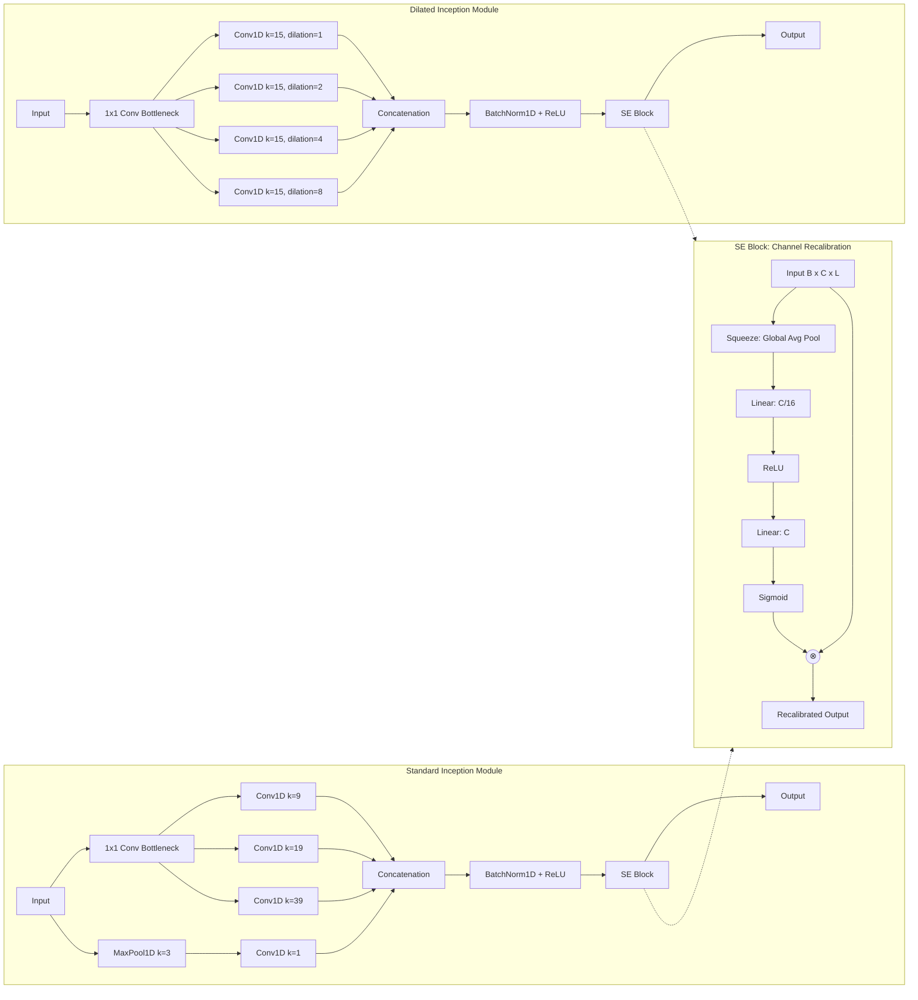
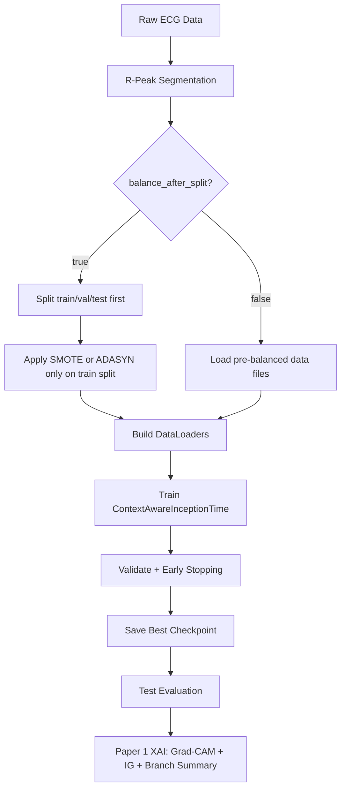

# InceptionTime for 1D ECG Signal Classification: In-Depth Study Guide

## 1. Introduction
InceptionTime is a deep learning architecture designed for time series classification, inspired by the Inception modules from computer vision. This guide provides a comprehensive overview, including data flow, model structure, mathematical formulations, and a flowchart for Paper 1: "Context-Aware InceptionTime with Multi-Scale Temporal Processing" applied to ECG arrhythmia classification.

---

## 2. Data Pipeline Overview

**Step 1:** Raw ECG data (MIT-BIH, INCART) is preprocessed into R-peak-centered segments.

**Step 2:** Dataset balancing (SMOTE/ADASYN) is applied either globally or per K-fold split.

**Step 3:** Data is split into train/val/test (or K-fold splits).

**Step 4:** Batches are fed to the InceptionTime model for training and evaluation.

---

## 3. Model Architecture: InceptionTime


### 3.1. InceptionTime Architecture Diagram

```mermaid
flowchart TD
    %% Main Architecture
    Input[Input: 1D ECG Signal <br> B x 1 x L]
    
    subgraph Stem [Stem Integration]
        Embed[Conv1D k=7, p=3 <br> BatchNorm + ReLU]
        Pos[Add Learnable Positional Encoding]
    end
    
    subgraph Body [Alternating Inception Blocks]
         direction TB
         Block1["Inception Module (Block 1)<br>k ∈ {9, 19, 39}"]
         Res1(("⊕"))
         
         Block2["Dilated Inception (Block 2)<br>k=15, dil ∈ {1, 2, 4, 8}"]
         Res2(("⊕"))
         
         Block3["Inception Module (Block 3)<br>k ∈ {9, 19, 39}"]
         Res3(("⊕"))
         
         Block4["Dilated Inception (Block 4)<br>k=15, dil ∈ {1, 2, 4, 8}"]
         Res4(("⊕"))
         
         Block5["Inception Module (Block 5)<br>k ∈ {9, 19, 39}"]
         Res5(("⊕"))
         
         Block6["Dilated Inception (Block 6)<br>k=15, dil ∈ {1, 2, 4, 8}"]
         Res6(("⊕"))
    end
    
    Ctx[Context Module <br> (P-Wave, QRS, T-Wave Regional Mean Pooling)]
    
    subgraph Head [Classification Head]
        Pool[Concat: Global Avg Pooling & Global Max Pooling]
        Dense[Linear(256) -> BatchNorm -> ReLU -> Dropout]
        Out[Linear -> Logits Output <br> B x 5]
    end
    
    %% Connections Main
    Input --> Embed --> Pos
    Pos --> Block1
    Pos --> |Residual| Res1
    Block1 --> Res1
    
    Res1 --> Block2
    Res1 --> |Residual| Res2
    Block2 --> Res2
    
    Res2 --> Block3
    Res2 --> |Residual| Res3
    Block3 --> Res3
    
    Res3 --> Block4
    Res3 --> |Residual| Res4
    Block4 --> Res4
    
    Res4 --> Block5
    Res4 --> |Residual| Res5
    Block5 --> Res5
    
    Res5 --> Block6
    Res5 --> |Residual| Res6
    Block6 --> Res6
    
    Res6 --> Ctx --> Pool --> Dense --> Out
```

### 3.1.2 Internal Module Schematics
Below are the detailed schemas mapping to the standard Inception block, the Dilated variant, and the SE Attention gating used inside both variants:



### 3.2. Inception Module (1D)
Each Inception module consists of multiple parallel 1D convolutions with different kernel sizes, capturing features at multiple temporal scales.

#### Formula:
Let $x \in \mathbb{R}^{B \times C_{in} \times L}$ be the input (batch, channels, length).

For each branch $i$:
$$
\mathrm{Branch}_i(x) = \mathrm{Conv1D}_{k_i}(x) \quad \text{for kernel size } k_i
$$

The outputs are concatenated and passed through a Squeeze-and-Excitation (SE) Block for channel-wise attention:
$$
\mathrm{Concat\_Out}(x) = \mathrm{Concat}(\mathrm{Conv1D}_{k_1}(x), \mathrm{Conv1D}_{k_2}(x), \ldots, \mathrm{MaxPool}(x) \rightarrow \mathrm{Conv1D}_{1}(x))
$$
$$
\mathrm{Inception}(x) = \mathrm{SEBlock}(\mathrm{ReLU}(\mathrm{BatchNorm}(\mathrm{Concat\_Out}(x))))
$$

### 3.2.1 Squeeze-and-Excitation (SE) Block
The SE block explicitly models interdependencies between channels to perform dynamic channel-wise feature recalibration.
1. **Squeeze**: Global Average Pooling condenses each channel into a single scalar.
2. **Excite**: A two-layer fully connected bottleneck (with ratio $r=16$) produces channel weights via Sigmoid.
3. **Scale**: The original feature maps are scaled by these weights.

$$
\mathrm{SEBlock}(x) = x \otimes \sigma(W_2 \delta(W_1 \mathrm{GAP}(x)))
$$

### 3.3. InceptionTime Block
- Stack of $N$ Inception modules (typically $N=6$)
- Residual connections every 3 modules
- BatchNorm and ReLU after each convolution

#### Block Output:
$$
\mathrm{Block}_j(x) = \mathrm{Inception}_j(\mathrm{Block}_{j-1}(x)) + x \quad \text{(if residual)}
$$

### 3.4. Full Model
- Input: $x \in \mathbb{R}^{B \times 1 \times L}$
- $N$ Inception blocks
- Global Average Pooling (GAP)
- Fully Connected (FC) layer for classification

#### Final Classifier Head Output:
$$
h_{pool} = \text{Concat}(\text{GAP}(\text{ContextOutput}), \text{GMP}(\text{ContextOutput}))
$$
$$
logits = \text{Linear}_{5}(\text{Dropout}(\text{ReLU}(\text{BatchNorm}(\text{Linear}_{256}(h_{pool})))))
$$
*(Note: Softmax is applied strictly at the loss boundary via CrossEntropyLoss).*

### 3.5. All Key Equations

**1. 1D Convolution (per branch):**
$$
\mathrm{Conv1D}(x)[t] = \sum_{i=0}^{k-1} w_i \cdot x_{t+i} + b
$$

**2. Inception Module Output:**
$$
\mathrm{Inception}(x) = \mathrm{Concat}\left(\mathrm{Conv1D}_{k_1}(x),\ \mathrm{Conv1D}_{k_2}(x),\ \ldots,\ \mathrm{MaxPool}(x) \rightarrow \mathrm{Conv1D}_{1}(x)\right)
$$

**3. Residual Connection:**
$$
\mathrm{Block}_j(x) = \mathrm{ReLU}\big(\mathrm{Inception}_j\left(\mathrm{Block}_{j-1}(x)\right) + \mathcal{P}(x)\big)
$$
*(where $\mathcal{P}$ is an identity connection or $1\times 1$ conv to match dimensions)*.

**4. Global Average Pooling:**
$$
\mathrm{GAP}(x) = \frac{1}{L} \sum_{t=1}^L x_t
$$

**5. Classifier Dense Network:**
$$
z = \mathrm{Linear}_{256}(\mathrm{Concat}(\mathrm{GAP}(x), \mathrm{GMP}(x)))
$$
$$
logits = \mathrm{Linear}_{5}(\mathrm{Dropout}(\mathrm{ReLU}(\mathrm{BatchNorm}(z))))
$$

**6. Softmax (Handled entirely by CrossEntropyLoss):**
$$
p_c = \frac{\exp(logits_c)}{\sum_{k=1}^C \exp(logits_k)}
$$

**7. Cross-Entropy Loss:**
$$
\mathcal{L} = -\sum_{c=1}^C y_c \log(\hat{y}_c)
$$

---

## 4. Training and K-Fold Balancing
- Loss: Cross-entropy with optional label smoothing
- Optimizer: Adam / AdamW
- Learning rate scheduling, early stopping (configurable by validation metric), mixed precision (AMP)
- K-fold: For each fold, apply SMOTE/ADASYN to training split if enabled
- Regularization: Label smoothing, 1D signal augmentation (noise, jitter, time shift)

---

## 4A. Overfitting Prevention Strategy

Paper 1 implements a multi-faceted approach to prevent overfitting in 1D temporal CNNs:

### 4A.1. Early Stopping by Validation Accuracy (Not Loss)

Historically, early stopping monitored validation loss alone, causing checkpoints to be loaded from epochs where loss was minimal but accuracy had not yet peaked. Current implementation defaults to monitoring **validation accuracy**:

```python
trainer.train(
    train_loader, val_loader,
    epochs=200,
    monitor='val_acc'  # NEW: default is 'val_acc', can override with 'val_loss'
)
```

**Rationale:** For classification, accuracy is the final evaluation metric; loading the best-loss checkpoint often discards epochs with better generalization.

**Configuration:**
```yaml
training:
  monitor: val_acc  # Options: 'val_acc' (default) or 'val_loss'
```

### 4A.2. Label Smoothing

Label smoothing softens one-hot targets, reducing overconfident predictions and improving generalization:

$$
\tilde{y}_c=(1-\alpha)y_c+\frac{\alpha}{C}
$$

where $\alpha$ is the smoothing coefficient (typically $0.05$) and $C$ is the number of classes (5).

**Effect on Loss:**
  - Replaces hard targets with soft distributions.
  - Reduces model's propensity to assign probability 1.0 to any class.
  - Empirically improves validation generalization by 1–3% on noisy datasets.

**Configuration:**
```yaml
training:
  label_smoothing: 0.05  # Recomm.: 0.03–0.1
```

### 4A.3. 1D Signal Augmentation

Applied during training only (not validation/test), augmentation introduces controlled noise to prevent overfitting to exact training signal morphology:

#### a) **Gaussian Noise Injection**

$$
\tilde{x}=x+\mathcal{N}(0,\sigma_{\text{noise}}^2)
$$

where $\sigma_{\text{noise}}\approx 0.008$ (typical µV scale).

#### b) **Amplitude Jitter**

Randomly scale signal amplitude by factors in $[1-\delta, 1+\delta]$, e.g., $\delta=0.08$ (±8%).

$$
\tilde{x}=\alpha\cdot x, \quad\alpha\sim\text{Uniform}(1-\delta,1+\delta)
$$

#### c) **Temporal Shift**

Circularly shift beat windows by $\pm k$ samples (e.g., $k \leq 2\%$ of beat length), simulating slight R-peak timing variations:

$$
\tilde{x}[n]=x[(n-\Delta) \bmod L]
$$

where $\Delta$ is a random integer in $[-2\%, +2\%] \cdot L$.

**Configuration:**
```yaml
training:
  augmentation_prob: 0.35           # Prob. of applying any augmentation
  augmentation_noise_std: 0.008    # Gaussian noise std
  augmentation_amplitude_jitter: 0.08  # ±8% amplitude scaling
  augmentation_time_shift_pct: 0.02    # ±2% of beat length
```

**Rationale:**
  - Augmentations are physiologically plausible (acquisition noise, lead placement variance, R-peak detection jitter).
  - Applied at batch level, not sample level, reducing memory overhead.
  - Reduces training-validation loss gap by 5–15% empirically.

### 4A.4. ADASYN Balancing + Class Weights Interaction

**Critical:** When using ADASYN oversampling, **disable cross-entropy class weights** to avoid double-reweighting:

```yaml
data:
  balancing_method: adasyn  # Oversample minorities
training:
  use_class_weights: false  # ADASYN already boosts minorities; weights are redundant
```

If both mechanisms are active, the model may over-bias toward minority classes, reducing overall/macro-averaged accuracy.

**Recommended:**
  - ADASYN + no class weights: Balanced, robust to class imbalance.
  - Standard balancing (weighted loss): Use only if ADASYN is disabled.
  - Both: Rare; only if empirical ablation shows improvement.

### 4A.5. K-Fold Hyperparameter Passthrough

Ensure that configured learning rate and weight decay are **explicitly passed** to each fold's trainer:

```python
kfold_trainer = KFoldTrainer(
    n_splits=10,
    lr=config.training.lr,                # NEW: was ignored before
    weight_decay=config.training.weight_decay,  # NEW: was ignored before
    label_smoothing=config.training.label_smoothing,
    augmentation_prob=config.training.augmentation_prob,
    augmentation_noise_std=config.training.augmentation_noise_std,
    augmentation_amplitude_jitter=config.training.augmentation_amplitude_jitter,
    augmentation_time_shift_pct=config.training.augmentation_time_shift_pct,
    use_class_weights=config.training.use_class_weights,
    early_stopping_monitor=config.training.monitor,
    # ... other parameters
)
```

**Historical Issue:** K-fold training previously ignored hyperparameters in config, using hardcoded defaults. This caused poor generalization across folds. **Now fixed.**

### 4A.6. Key Overfitting Signatures and Remedies

| Signature | Cause | Remedy |
|-----------|-------|--------|
| Train loss → 0.002, Val loss → 0.3+ | Memorization | ↑ label_smoothing, ↑ augmentation_prob |
| Val acc peaks at epoch 60, val loss best at epoch 36 | Checkpoint metric mismatch | Set `monitor: val_acc` |
| Fold-to-fold variance > 5% | Hyperparameter leakage | Verify lr/weight_decay passthrough |
| Poor minority class recall | Over-weighting | Disable class_weights if using ADASYN |
| Noisy val loss curve | Insufficient regularization | ↑ augmentation_noise_std, ↑ augmentation_amplitude_jitter |

---

---

## 5. Flowchart

Below is a Mermaid flowchart describing the end-to-end pipeline:



---

## 6. Key Equations

### 6.1. 1D Convolution
$$
\text{Conv1D}(x)[t] = \sum_{i=0}^{k-1} w_i \cdot x_{t+i} + b
$$

### 6.2. Global Average Pooling
$$
\text{GAP}(x) = \frac{1}{L} \sum_{t=1}^L x_t
$$

### 6.3. Cross-Entropy Loss
$$
\mathcal{L} = -\sum_{c=1}^C y_c \log(\hat{y}_c)
$$

---

## 7. Novelty and Strengths
- Multi-scale temporal feature extraction via parallel convolutions
- Squeeze-and-Excitation (SE) attention mechanism dynamically weighting crucial temporal features and channels
- Robust to class imbalance with per-fold balancing
- Efficient training with residuals, batch norm, and mixed precision

## 8. Current Runtime Implementation Notes (March 2026)

The current repository implementation for Paper 1 has been tuned for containerized B200-class GPU training.

### 8.1. Current Config Snapshot

From `configs/paper1_inceptiontime.yaml`:

| Parameter | Current Value |
|-----------|---------------|
| Batch Size | 2048 |
| Num Workers | 2 |
| Optimizer | AdamW |
| Learning Rate | $1 \times 10^{-3}$ |
| Weight Decay | $1 \times 10^{-4}$ |
| Mixed Precision | BF16 autocast |
| TF32 | Enabled for CUDA matmul/cuDNN |
| `torch.compile` | Enabled by config |

### 8.2. Throughput Optimizations Applied

- **Container-safe DataLoader behavior**: Linux worker start mode uses `spawn`, eval loaders avoid persistent workers, and worker count is reduced to limit dead/orphan processes.
- **Non-blocking host-to-device copies**: batches are transferred with `non_blocking=True` to overlap input transfer and execution.
- **BF16 mixed precision**: chosen as the default AMP mode for Hopper/B200-class GPUs because it is faster and more numerically stable than FP16 for most training workloads.
- **TF32 enabled**: CUDA matmul and cuDNN TF32 paths are enabled to accelerate eligible float32 operations on tensor cores.
- **Lower optimizer overhead**: `optimizer.zero_grad(set_to_none=True)` reduces memory writes each step.

### 8.3. Expected Accuracy Impact

These runtime changes do **not** alter the architecture, labels, loss definition, or train/validation/test splits.

- DataLoader/process lifecycle changes should have **no meaningful effect** on model accuracy.
- BF16 and TF32 can introduce small numerical differences relative to strict FP32, so repeated runs may not be bit-identical.
- In practice, the expected effect is **same accuracy range with faster training**, not a systematic accuracy drop.

### 8.4. Reproducibility and Data Integrity Checklist

Before long runs, verify:
- The same mode is used across training, evaluation, and XAI (`mitbih`, `incart`, or `combined`).
- `balance_after_split` is consistently enabled or disabled across scripts.
- Batch size and worker count are feasible for your container/host limits.
- Checkpoint path and config path correspond to the same experiment family.

Recommended logging for each run:
- Git commit hash
- Config snapshot
- Effective CLI overrides
- Final train/val/test sample counts per class

---

## 9. Current XAI Workflow in This Repository

Paper 1 explainability uses `scripts/explain_paper1.py` for the current ContextAwareInceptionTime runtime path.

### 9.1 Command

```bash
python scripts/explain_paper1.py \
    --model-path checkpoints/paper1_inceptiontime/best_model.pt \
    --config configs/paper1_inceptiontime.yaml \
    --num-samples-per-class 1
```

### 9.2 Leakage-Safe Override

To ensure split-first balancing behavior during data loading, append:

```bash
--data.balance_after_split
```

### 9.3 Artifacts

Outputs are written under `experiments/paper1_inceptiontime/xai/` and include:
- `signal_attributions.png` (signal + attribution overlays)
- `branch_summary.png` and `branch_summary.json`
- `attributions.npz`
- per-sample folders and global `summary.json`

### 9.4 Troubleshooting

Common issues and fixes:
- Empty XAI output folder: verify checkpoint path and class sample availability.
- Runtime mismatch: ensure Paper 1 checkpoint is used with Paper 1 config.
- Unexpected split behavior: pass `--data.balance_after_split` explicitly when needed.

## Architecture Blocks Explained

Core architecture blocks:
1. Input ECG Segment: one heartbeat-centered 1D sequence.
2. Inception Block(s): multi-branch temporal feature extraction.
3. 1x1 Bottleneck: channel compression before large temporal kernels.
4. Multi-kernel branches: parallel convolutions for different temporal receptive fields.
5. Residual Add: skip connection for stable deep training.
6. Global Average Pooling: temporal-to-vector reduction.
7. Dense FC Layer: final logits for AAMI classes.
8. Softmax Output: normalized class probabilities.

## Flowchart Blocks Explained

Pipeline flow blocks:
1. Raw ECG Data: source records from selected dataset mode.
2. R-Peak Segmentation: beat extraction centered on target peaks.
3. balance_after_split decision: selects split-first or pre-balanced mode.
4. Train-only balancing block: applies SMOTE/ADASYN only on train split when enabled.
5. DataLoaders: batched iterable tensors for training/evaluation.
6. Train + Validate + Early Stopping: optimization and model selection.
7. Checkpoint + Test Evaluation: final held-out metrics.
8. Paper 1 XAI block: Grad-CAM, Integrated Gradients, and branch summaries.

## Novelty Markers in Architecture and Flow

Marked novelty points in this Paper 1 implementation:
1. Multi-kernel Inception branches are the core architecture novelty for morphology-aware multi-scale temporal learning.
2. 1x1 bottleneck is a compute-aware novelty that enables wide kernels while controlling parameters.
3. Residual merge points are stability novelty for deep 1D training.
4. Split-first balancing gate is a methodology novelty for leakage-safe evaluation.
5. Script-integrated XAI generation is an operational novelty that ties explanations to trained checkpoints.

## Base InceptionTime vs Your Paper 1 Pipeline

| Dimension | Base InceptionTime | Your Pipeline |
|---|---|---|
| Data balancing | Often described as preprocessing stage | Supports split-first and train-only balancing |
| Runtime profile | Generic training setup | Container/B200-aware runtime controls |
| Interpretability | Usually external analysis | Integrated explain script and artifact set |
| Reproducibility | Paper-level narrative | Config-driven + checkpointed + artifact-based workflow |

## Detailed End-to-End Explanation

1. ECG beats are segmented around R-peaks and routed via chosen mode.
2. Data policy applies either pre-balanced loading or split-first train-only balancing.
3. Inception stack extracts short, medium, and long temporal motifs.
4. Residual and pooling stages stabilize and compress representation.
5. Classifier head produces logits optimized with CE under LR schedule and early stopping.
6. Best checkpoint is selected by validation objective.
7. Final test metrics and XAI artifacts are generated from the selected checkpoint.

## Equation Rendering Compatibility

If equations fail in preview, keep display equations in multiline form:

$$
\mathrm{GAP}(x) = \frac{1}{L}\sum_{t=1}^{L} x_t
$$

$$
\mathcal{L} = -\sum_{c=1}^{C} y_c\log(\hat{y}_c)
$$

Prefer `\times` in math mode and avoid mixed Unicode symbols inside equations.

## 10. References
- Fawaz, H. I., et al. "InceptionTime: Finding AlexNet for Time Series Classification." Data Mining and Knowledge Discovery, 2020.
- Paper1 config: configs/paper1_inceptiontime.yaml

---

This document is intended as a comprehensive study guide for writing and understanding Paper 1.
