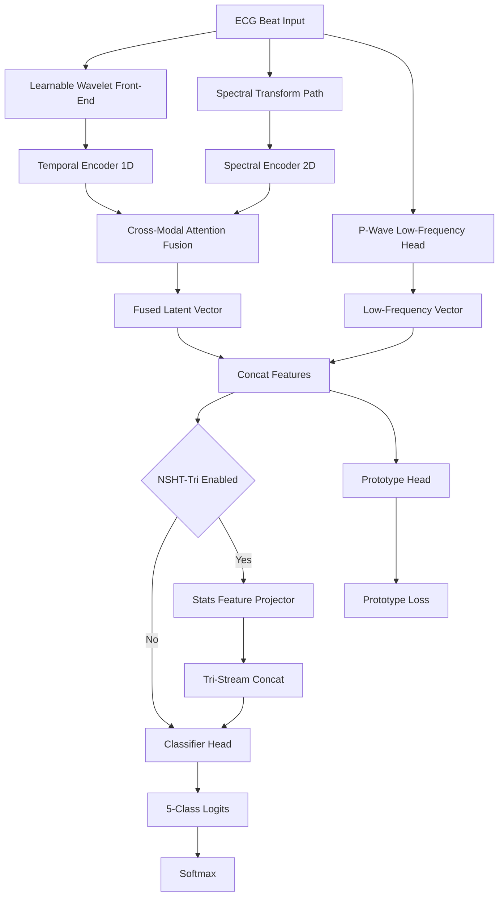
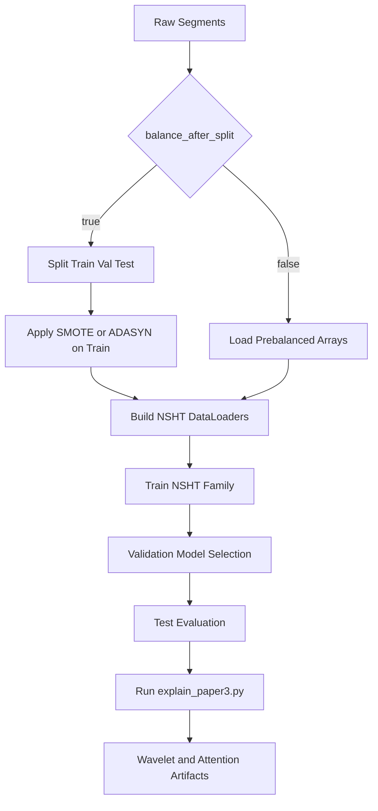

# NSHT_Dual_Evo Technical Monograph

## 1. Scope and Contribution Framing

This document is a paper-grade architecture specification for **NSHT_Dual_Evo**, the Paper 3 dual-stream ECG classifier implementation. It formalizes:

1. NSHT_Dual_Evo dual-stream architecture (active codebase: `src/models/nsht_dual_evo.py`).
2. Learnable wavelet preprocessing and cross-modal attention fusion.
3. Training, balancing, explainability, and reproducibility protocol.
4. Historical note: NSHT-Tri extension (tri-stream variant with statistical features)—available for extension but not active in current deployment.

The focus is to ensure method claims are scientifically precise, implementation-accurate, and publication-ready.

---

## 2. Problem Setup and Mathematical Notation

Define heartbeat dataset:

$$
\mathcal{D}=\{(x_i,y_i)\}_{i=1}^{N},\quad x_i\in\mathbb{R}^{L},\ y_i\in\{0,1,2,3,4\}
$$

where:

- $L=216$ samples per R-peak segment.
- Classes $\{0,1,2,3,4\}$ correspond to AAMI types $\{N,S,V,F,Q\}$.

**NSHT_Dual_Evo** (primary implementation) learns a dual-stream mapping:

$$
f_\theta: \mathbb{R}^{216}\times\mathbb{R}^{H\times W\times3}\rightarrow\Delta^{5}
$$

where the first input is the 1D temporal signal and the second is a 2D spectral image.

**Historical note:** NSHT-Tri extension (unused in current deployment) would add a statistical feature vector $s_i\in\mathbb{R}^{d_s}$:

$$
f^{\mathrm{tri}}_\theta: \mathbb{R}^{216}\times\mathbb{R}^{H\times W\times3}\times\mathbb{R}^{d_s}\rightarrow\Delta^{5}
$$

---

## 3. Why NSHT Exists

Paper 3 addresses three bottlenecks in prior ECG systems:

1. Fixed preprocessing limits adaptation to noise/domain changes.
2. Unimodal encoders fail to jointly reason over time morphology and spectral texture.
3. CE-only objectives can under-structure latent class geometry.

NSHT targets these with:

1. Learnable wavelet front-end.
2. Cross-modal temporal-spectral fusion.
3. Prototype-consistency regularization.

---

## 3.1 Standard Hybrid ECG vs NSHT_Dual_Evo Baseline Comparison

| Aspect | Conventional Hybrid Baseline | NSHT_Dual_Evo (Current Implementation) |
|--------|------------------------------|----------------------------------------|
| Preprocessing | Fixed/hand-tuned wavelets | **Learnable Morlet parameters** |
| Temporal encoder | RNN or basic 1D CNN | **Inception multi-scale + residuals** |
| Spectral encoder | Standard 2D CNN | **Lightweight CWT + optimized blocks** |
| Modal fusion | Static concatenation | **Cross-modal attention (1D queries 2D)** |
| Objective | CE loss only | **CE + prototype consistency joint loss** |
| Low-frequency path | Implicit in shared layers | **Explicit P-wave specialized head** |
| Runtime class | N/A | `src/models/nsht_dual_evo.py` |
| Config reference | N/A | `configs/paper3_nsht.yaml` |
| Training stability | Standard AMP | **BF16 mixed precision + TF32** |
| Evaluation policy | Often global balancing | **Split-first option (leakage-safe)** |
| Explainability | Post-hoc only | **Structured XAI outputs (wavelet, attention, streams)** |
| XAI runtime | N/A | `scripts/explain_paper3.py` |

**Key Novelty:** NSHT_Dual_Evo combines learnable preprocessing, cross-modal fusion, prototype learning, and structured explainability into an end-to-end-optimized framework with only 706K parameters.

**Codebase Reference:** See [MODULAR_CODEBASE_README.md](MODULAR_CODEBASE_README.md#project-structure) for project structure and runtime setup.

---

## 4. High-Level Architecture

### 4.1 NSHT (Dual Stream)

Input beat drives two synchronized representations:

1. Temporal branch: learnable-wavelet-enhanced 1D encoder.
2. Spectral branch: 2D encoder over time-frequency transform.

Fusion module aligns both branches into a shared latent vector for classification.

### 4.2 NSHT-Tri (Tri Stream)

Adds a third branch with explicit handcrafted/clinical-statistical descriptors projected by MLP before late fusion.

---

## 5. Learnable Wavelet Front-End

### 5.1 Parametric Morlet Kernel

A simplified learnable real-valued Morlet-style atom:

$$
\psi(t;\sigma,\omega_0)=\exp\!\left(-\frac{t^2}{2\sigma^2}\right)\cos\!\left(\omega_0\frac{t}{\sigma}\right)
$$

Each filter has trainable $(\sigma,\omega_0)$ parameters.

### 5.2 Filter-Bank Convolution

For input signal $x$ and filter bank $\{\psi_k\}_{k=1}^{K}$:

$$
z_k = x * \psi_k
$$

$$
Z=[z_1,\dots,z_K]\in\mathbb{R}^{K\times L}
$$

This creates adaptive denoising and frequency-selective responses learned end-to-end.

### 5.3 Practical Benefit

Compared to fixed wavelet transforms, this front-end can retune to dataset-specific morphology and noise profiles during optimization.

---

## 6. Temporal Encoder (1D Stream)

The temporal stream uses multi-scale 1D feature extraction blocks (Inception-like variants in the model family) to preserve timing-sensitive morphology:

- QRS width and slope dynamics.
- P-wave and PR-pattern cues.
- Beat-level phase relationships around R-peak anchors.

Output sequence feature map:

$$
T\in\mathbb{R}^{B\times C_t\times L_t}
$$

---

## 7. Spectral Encoder (2D Stream)

### 7.1 Spectral Representation

A beat-derived time-frequency image is generated (scalogram/spectral map path depending on configured implementation), then passed through a compact 2D CNN stack:

$$
S\in\mathbb{R}^{B\times C_s\times H_s\times W_s}
$$

Flattened or pooled spectral tokens/features become key-value context for fusion.

### 7.2 Low-Frequency Emphasis Hooks

The architecture family includes dedicated low-frequency feature capture pathways to preserve atrial and slow-wave morphology signals linked to difficult class boundaries.

---

## 8. P-Wave and Low-Frequency Specialized Heads

Dedicated low-frequency modules are included to improve discrimination in classes where subtle atrial timing and morphology differ (especially N/S boundaries).

A generic specialized convolutional head can be represented as:

$$
P=\phi_{\mathrm{pw}}(x),\quad P\in\mathbb{R}^{B\times C_p\times L_p}
$$

and injected into final fusion vector after pooling/projection.

---

## 9. Cross-Modal Attention Fusion

### 9.1 Core Operation

Let temporal features be query source and spectral features be key/value source:

$$
Q=W_Q T,\ K=W_K S',\ V=W_V S'
$$

$$
A=\mathrm{softmax}\!\left(\frac{QK^\top}{\sqrt{d_k}}\right)
$$

$$
F_{\mathrm{cm}}=AV
$$

where $S'$ is reshaped spectral context.

### 9.2 Why Attention Instead of Concatenation

1. Dynamic relevance weighting per temporal position.
2. Better alignment of morphology events with spectral signatures.
3. Greater interpretability via attention maps.

---

## 10. Prototype Consistency Objective

### 10.1 Prototype Definition

Each class $c$ has learnable prototype $p_c\in\mathbb{R}^{d}$.

For sample embedding $h_i$ with label $y_i$:

$$
\mathcal{L}_{\mathrm{proto}}=\frac{1}{N}\sum_{i=1}^{N}\|h_i-p_{y_i}\|_2^2
$$

### 10.2 Joint Loss

$$
\mathcal{L}_{\mathrm{total}}=\mathcal{L}_{\mathrm{CE}}+\lambda\mathcal{L}_{\mathrm{proto}}
$$

with schedule $\lambda(t)$ typically increasing through training to avoid early over-constraining.

### 10.3 Effect

- Tightens intra-class compactness.
- Improves latent-space interpretability.
- Supports prototype-space visualization and diagnostics.

---

## 11. NSHT-Tri Statistical Stream (Optional Extension)

**Note:** NSHT-Tri is a historical extension variant and is **not active** in the current NSHT_Dual_Evo codebase deployment. This section documents the design for reference only.

If enabled, NSHT-Tri would add handcrafted/statistical descriptors (e.g., moments, entropy-family, rhythm descriptors):

Let stats vector be $s\in\mathbb{R}^{d_s}$ projected to latent dimension $d$:

$$
h_s = \phi_s(s)\in\mathbb{R}^{d}
$$

Tri-stream fusion:

$$
h_{\mathrm{tri}}=[h_{\mathrm{cm}}\,\|\,h_{\mathrm{pw}}\,\|\,h_s]
$$

This would then feed to classification head and optional prototype objective. **Current deployment uses dual-stream only.**

---

## 12. Shape Trace and Branch Interfaces

Representative flow (batch size $B$):

1. Raw beat: $B\times1\times216$.
2. Wavelet front-end output: $B\times K\times216$.
3. Temporal encoded map: $B\times C_t\times L_t$.
4. Spectral encoded map: $B\times C_s\times H_s\times W_s$.
5. Cross-modal fused representation: $B\times d$.
6. Optional P-wave/low-frequency vector: $B\times d_p$.
7. Optional stats vector (tri): $B\times d_s'$.
8. Logits: $B\times5$.

All branch projections must be dimensionally aligned before concatenation/attention.

---

## 13. Training Protocol and Data Integrity

### 13.1 Split-First Balancing Policy

The repository supports leakage-safe strategy:

1. Split train/val/test first.
2. Apply SMOTE/ADASYN only on training split if enabled.
3. Keep validation/test untouched.

This should be the default for claims of generalization validity.

### 13.2 Optimization Components

Common Paper 3 runtime ingredients:

- AdamW or equivalent adaptive optimizer.
- AMP mixed precision where supported.
- Early stopping and LR scheduling.
- Gradient clipping/accumulation depending on memory budget.

### 13.3 Evaluation

Always report:

- Overall accuracy.
- Macro F1 and per-class precision/recall/F1.
- Confusion matrix.
- Optional prototype-space diagnostics.

---

## 14. Complexity, Throughput, and Memory

### 14.1 Time Complexity Drivers

Total cost combines three terms:

$$
\mathcal{C}_{\mathrm{total}}\approx \mathcal{C}_{1D}+\mathcal{C}_{2D}+\mathcal{C}_{\mathrm{fusion}}
$$

with attention term scaling approximately with sequence/context lengths.

### 14.2 Parameter Efficiency

NSHT family remains relatively compact for a multi-branch system while adding interpretability hooks unavailable in many single-stream baselines.

### 14.3 Practical Runtime Notes

- Spectral path can dominate memory if resolution is high.
- Mixed precision significantly improves feasibility on constrained GPUs.
- Branch-level profiling is recommended to detect bottlenecks.

---

## 15. Novelty Matrix

Explicit novelty points for manuscript use:

1. Learnable wavelet denoising front-end.
2. Temporal-spectral cross-modal attention fusion.
3. Dedicated low-frequency/P-wave enhancement pathways.
4. Prototype-consistency regularization in latent space.
5. Leakage-safe split-first balancing support.
6. Multi-view Paper 3 XAI artifact suite.

---

## 16. Novelty Summary: NSHT_Dual_Evo

Key innovations in **NSHT_Dual_Evo** (current deployment):

1. **Learnable wavelet denoising** — Replaces fixed preprocessing with gradient-optimizable filter banks.
2. **Temporal-spectral cross-modal attention** — Dynamically aligns 1D morphology with 2D spectral features.
3. **Dedicated low-frequency/P-wave pathway** — Explicit modeling of subtle atrial patterns.
4. **Prototype-consistency regularization** — Combines CE loss with latent-space geometry regularization.
5. **Leakage-safe split-first balancing** — Enforces methodological integrity for robust claims.
6. **Structured XAI artifact suite** — Wavelet visualization, attention heatmaps, component energy metrics.

**Historical Note:** NSHT-Tri (tri-stream variant with statistical features) was explored but is not deployed in the active codebase.
| Statistical domain priors | Rare | Optional external | Native third-stream integration |
| Explainability | Usually single-view | Multi-artifact | Multi-artifact + stats context |

---

## 17. Explainability and Artifact Protocol

Active script:

- `scripts/explain_paper3.py`

Command:

```bash
python scripts/explain_paper3.py \
  --model-path checkpoints/paper3_nsht/best_model.pt \
  --config configs/paper3_nsht.yaml \
  --num-samples-per-class 1
```

Optional split-first override:

```bash
python scripts/explain_paper3.py \
  --model-path checkpoints/paper3_nsht/best_model.pt \
  --config configs/paper3_nsht.yaml \
  --num-samples-per-class 1 \
  --data.balance_after_split
```

Typical artifact set under `experiments/paper3_nsht/xai/`:

- `wavelet_params.png`.
- `cross_attention.png`.
- `stream_contributions.png`.
- `arrays.npz`.
- per-sample and global `summary.json`.
- optional prototype visualization exports.

Prototype extraction utility:

```bash
python scripts/extract_nsht_prototypes.py \
  --model-path checkpoints/paper3_nsht/best_model.pt \
  --config configs/paper3_nsht.yaml
```

---

## 18. Failure Modes and Diagnostic Strategy

### 18.1 Common Failure Modes

1. N/S boundary ambiguity under low P-wave visibility.
2. V/F overlap in ventricular morphology variants.
3. Prototype collapse or poor separation if $\lambda$ scheduling is misconfigured.
4. Misaligned branch preprocessing causing unstable fusion.

### 18.2 Diagnostics

1. Inspect attention maps for mode collapse.
2. Inspect learned wavelet parameter distributions.
3. Evaluate class-wise embedding distances to prototypes.
4. Verify balancing policy and split integrity before interpreting metrics.

---

## 19. Ablation Blueprint

Minimum publication-quality ablations:

1. Remove learnable wavelet front-end (replace with fixed transform).
2. Remove cross-modal attention (use naive concatenation).
3. Remove prototype loss ($\lambda=0$).
4. Remove low-frequency/P-wave branch.
5. Disable stats branch (NSHT-Tri to NSHT comparison).
6. Balance policy comparison (split-first vs pre-balanced).

All ablations should include repeated seeds and confidence intervals.

---

## 20. Reproducibility Standard

1. Persist random seeds and split indices.
2. Persist exact config snapshots for every run.
3. Persist checkpoint hashes and training logs.
4. Record software stack versions and GPU runtime settings.
5. Bundle metrics with linked artifact IDs.

This supports exact reruns and auditability.

---

## 21. Architecture and Runtime Flowcharts

### 21.1 NSHT Dual/Tri Core Architecture



### 21.2 Data Integrity and Evaluation Flow



---

## 22. Manuscript Claim Guardrails

For scientific correctness:

1. Distinguish NSHT dual-stream results from NSHT-Tri results.
2. Separate architecture gains from balancing-policy gains.
3. Attribute prototype-space interpretability claims only when prototype head/loss is active.
4. Avoid claiming fixed-wavelet behavior when learnable front-end is used.

---

## 23. Equation Rendering Compatibility

Use standalone display blocks for robust markdown rendering:

$$
\psi(t;\sigma,\omega_0)=\exp\!\left(-\frac{t^2}{2\sigma^2}\right)\cos\!\left(\omega_0\frac{t}{\sigma}\right)
$$

$$
\mathcal{L}_{\mathrm{proto}}=\frac{1}{N}\sum_{i=1}^{N}\|h_i-p_{y_i}\|_2^2
$$

$$
\mathcal{L}_{\mathrm{total}}=\mathcal{L}_{\mathrm{CE}}+\lambda\mathcal{L}_{\mathrm{proto}}
$$

Prefer explicit LaTeX operators and one equation per display block.

---

## 24. Reference Pointers

Core conceptual references:

- Wavelet theory and medical signal processing foundations.
- Attention mechanisms for cross-modal fusion.
- Prototype learning and metric-regularized classification.
- ECG benchmark literature for MIT-BIH and INCART contexts.

---

## 24. Reference Pointers

Core conceptual references and codebase entry points:

- **Architecture implementation**: `src/models/nsht_dual_evo.py`
- **Configuration template**: `configs/paper3_nsht.yaml`
- **Training entrypoint**: `scripts/train.py`
- **Evaluation**: `scripts/evaluate.py`
- **XAI/explainability**: `scripts/explain_paper3.py`
- **Prototype export**: `scripts/extract_nsht_prototypes.py`
- **Project overview**: [MODULAR_CODEBASE_README.md](MODULAR_CODEBASE_README.md)

This monograph is the canonical architecture specification for Paper 3 in this repository.
