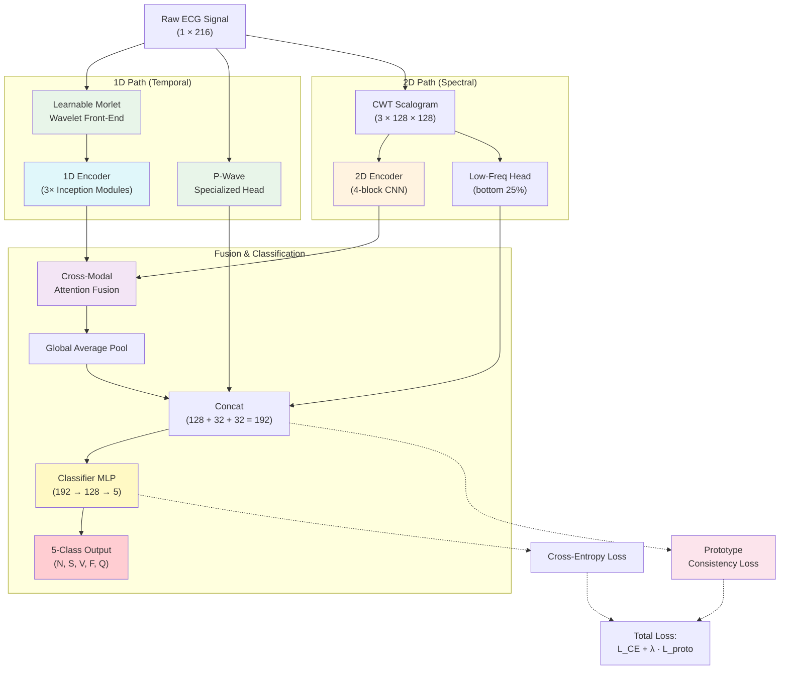
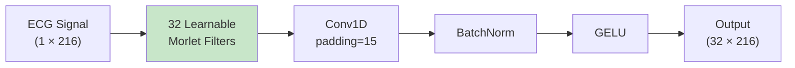
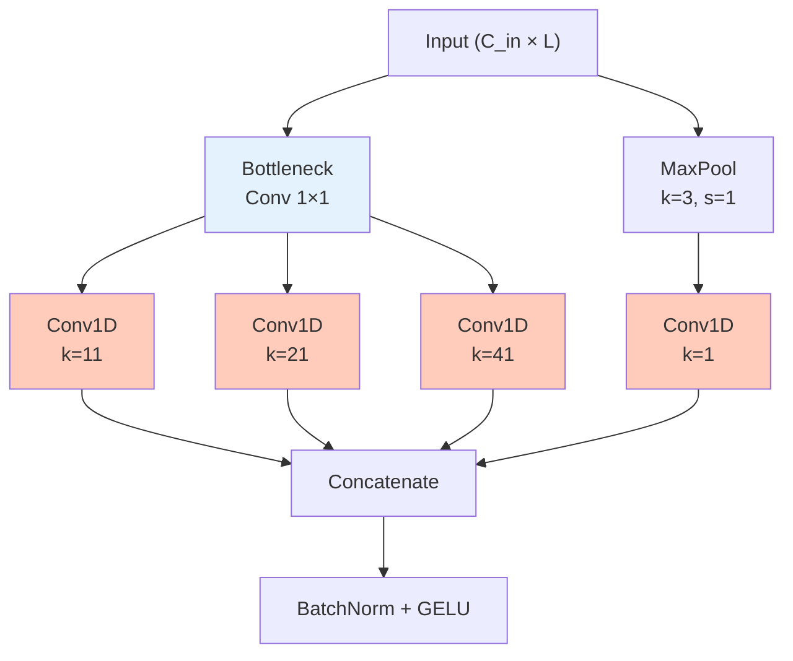
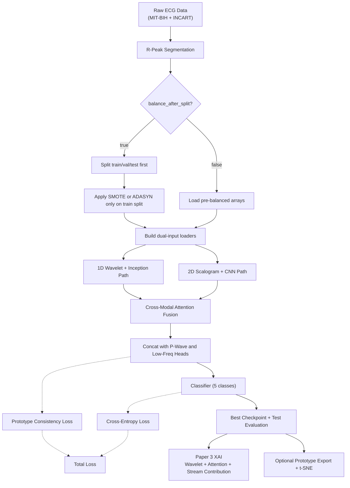

# Neuro-Spectral Hybrid Transformer (NSHT) for ECG Classification: In-Depth Study Guide

## 1. Introduction
The **Neuro-Spectral Hybrid Transformer (NSHT)** is a novel end-to-end deep learning architecture for ECG arrhythmia classification that addresses three fundamental limitations of existing methods: **static denoising**, **unimodal blindness**, and **lack of latent structure**. NSHT combines a learnable wavelet front-end, dual-path encoding (1D temporal + 2D spectral), cross-modal attention fusion, and prototype consistency loss into a single differentiable architecture with only 706K parameters.

This guide provides a comprehensive overview including data flow, model structure, mathematical formulations, and flowcharts for Paper 3: "Neuro-Spectral Hybrid Transformer with Learnable Wavelets for ECG Arrhythmia Classification."

---

## 2. Problem Statement & Motivation

### 2.1. The "99.5% Barrier"

The three main sources of confusion in ECG classification:

| Confusion Pair | Root Cause |
|----------------|-----------|
| **N ↔ S** (Normal vs. Supraventricular) | Differ only by subtle P-wave timing |
| **V ↔ F** (Ventricular vs. Fusion) | Both involve ventricular activation |
| **Patient variability** | Normal beats vary significantly between individuals |

### 2.2. Pain Points in Existing Methods

| Pain Point | Current Approach | NSHT Solution |
|------------|-----------------|---------------|
| **Static denoising** | Fixed Morlet/db4 wavelets with hand-tuned thresholds | **Learnable wavelet parameters** ($\sigma$, $f_0$) optimized end-to-end |
| **Unimodal blindness** | Either 1D signals OR 2D scalograms, never both | **Cross-modal attention** fusing temporal and spectral features |
| **Lack of structure** | Cross-entropy loss only → overlapping clusters | **Prototype consistency loss** with learnable class centroids |
| **N ↔ S confusion** | Same processing for all frequencies | **P-Wave Specialized Head** focusing on low-frequency patterns |

---

## 3. Data Pipeline Overview

**Step 1:** Raw ECG data (MIT-BIH, INCART) is preprocessed into R-peak-centered segments (216 samples).

**Step 2:** Dataset balancing (SMOTE/ADASYN) is applied.

**Step 3:** Each sample produces **two inputs**: the raw 1D signal and a 2D CWT scalogram.

**Step 4:** Both modalities are fed simultaneously into the NSHT model.

---

## 4. Model Architecture: NSHT

### 4.1. High-Level Architecture Diagram



### 4.2. Architecture Summary Table

| Component | Input | Output | Parameters |
|-----------|-------|--------|------------|
| Learnable Morlet Wavelet | (B, 1, 216) | (B, 32, 216) | ~1K |
| P-Wave Head | (B, 1, 216) | (B, 32) | ~3K |
| 1D Encoder (3× Inception) | (B, 32, 216) | (B, 128, 54) | ~150K |
| 2D Encoder (4-block CNN) | (B, 3, 128, 128) | (B, 128, 8, 8) | ~200K |
| Low-Freq Head | (B, 3, 32, 128) | (B, 32) | ~30K |
| Cross-Modal Attention | 1D: (B, 128, 54), 2D: (B, 128, 8, 8) | (B, 128, 54) | ~130K |
| Classifier | (B, 192) | (B, 5) | ~25K |
| Prototype Loss | (B, 192) | scalar | ~1K |
| **Total** | | | **~706K** |

---

## 5. Technical Components

### 5.1. Learnable Morlet Wavelet Front-End

#### Motivation
Traditional pipelines use fixed wavelet transforms (Morlet, db4) with hand-tuned thresholds. If noise characteristics change (different device, patient movement), the fixed denoising fails. NSHT replaces this with **trainable** wavelet parameters.

#### Mathematical Formulation

The Morlet wavelet kernel for filter $i$ is:

$$\psi_i(t) = \exp\!\left(-\frac{t^2}{2\sigma_i^2}\right) \cdot \cos\!\left(\frac{2\pi f_{0,i} \cdot t}{\sigma_i}\right)$$

Where:
- $\sigma_i$ = learnable **scale** parameter (controls envelope width)
- $f_{0,i}$ = learnable **frequency** parameter (controls oscillation rate)
- Both are optimized via backpropagation

#### Initialization (Warm Start):
$$\sigma_i \sim \text{LogSpace}(0, 2, 32) \times 0.5 \quad \Rightarrow \quad [0.5, \ldots, 50]$$
$$f_{0,i} \sim \text{LinSpace}(0.5, 10.0, 32)$$

#### L2-Normalized Convolution:
$$\hat{\psi}_i = \frac{\psi_i}{\|\psi_i\|_2 + \epsilon}$$
$$\text{Wavelet}(x) = \text{GELU}\!\left(\text{BN}\!\left(\sum_{i=1}^{32} \hat{\psi}_i * x\right)\right)$$

| Parameter | Value |
|-----------|-------|
| Output Channels | 32 |
| Kernel Size | 31 |
| Scale ($\sigma$) | Learnable, init [0.5, 50] |
| Frequency ($f_0$) | Learnable, init [0.5, 10.0] Hz |
| Scale clamp | $\min = 0.1$ (prevents collapse) |

#### Diagram:



---

### 5.2. P-Wave Specialized Head

#### Motivation
The P-wave (0.5–5 Hz) is critical for **N vs. S discrimination** but is easily lost in noise. Standard encoders use small kernels that miss this slow morphology.

#### Architecture:
$$\text{PWave}(x) = \text{Pool}\!\left(\text{GELU}\!\left(\text{BN}\!\left(\text{Conv}_{k=21}\!\left(\text{GELU}\!\left(\text{BN}\!\left(\text{Conv}_{k=41}(x)\right)\right)\right)\right)\right)\right)$$

| Layer | Specification |
|-------|---------------|
| Conv1d #1 | kernel=41, padding=20, 1→32 channels |
| Conv1d #2 | kernel=21, padding=10, 32→32 channels |
| Pooling | AdaptiveAvgPool1d(1) |
| Output | 32-dimensional vector |

**Why Large Kernels?** P-waves span 40+ samples; receptive fields must cover the full morphology.

---

### 5.3. 1D Encoder (InceptionTime-Style)

Three stacked **InceptionModule1D** blocks with a residual shortcut:

#### Inception Module Structure:



#### Formulas:

For input $x \in \mathbb{R}^{B \times C_{\text{in}} \times L}$:

$$x_b = \text{Conv}_{1\times1}(x) \quad \text{(bottleneck)}$$

$$\text{Inception}(x) = \text{GELU}\!\left(\text{BN}\!\left(\text{Concat}\!\left(\text{Conv}_{11}(x_b),\, \text{Conv}_{21}(x_b),\, \text{Conv}_{41}(x_b),\, \text{Conv}_{1}(\text{MaxPool}(x))\right)\right)\right)$$

#### Encoder with Residual:

$$\text{Enc}_{1D}(x) = \text{Pool}_{54}\!\left(\text{Proj}\!\left(\text{GELU}\!\left(\text{Inc}_3(\text{Inc}_2(\text{Inc}_1(x))) + \text{Shortcut}(x)\right)\right)\right)$$

| Parameter | Value |
|-----------|-------|
| Inception modules | 3 |
| Kernel sizes | 11, 21, 41 |
| Filters per branch | 32 (→ 128 total after concat) |
| Output | (B, 128, 54) |

---

### 5.4. 2D Encoder (Lightweight CNN)

Processes the CWT scalogram (128×128) through 4 convolutional blocks:

#### Architecture:

| Block | Operation | Output Shape |
|-------|-----------|--------------|
| Input | Scalogram | (B, 3, 128, 128) |
| Block 1 | Conv2d(3→32, k=3) + BN + GELU + MaxPool(2) | (B, 32, 64, 64) |
| Block 2 | Conv2d(32→64, k=3) + BN + GELU + MaxPool(2) | (B, 64, 32, 32) |
| Block 3 | Conv2d(64→128, k=3) + BN + GELU + MaxPool(2) | (B, 128, 16, 16) |
| Block 4 | Conv2d(128→128, k=3) + BN + GELU + MaxPool(2) | (B, 128, 8, 8) |

#### Low-Frequency Head (P-Wave Spectral Signature):
The **bottom 25%** of the scalogram (rows 0–31) contains low-frequency content. A separate pathway extracts this:

$$x_{\text{low}} = x[:, :, :32, :] \quad \text{(crop low frequencies)}$$
$$\text{LowFreq}(x_{\text{low}}) = \text{FC}\!\left(\text{Flatten}\!\left(\text{Pool}\!\left(\text{GELU}\!\left(\text{BN}\!\left(\text{Conv}_{5\times5}(x_{\text{low}})\right)\right)\right)\right)\right) \in \mathbb{R}^{32}$$

---

### 5.5. Cross-Modal Attention Fusion

#### Motivation
The core innovation of NSHT: allow 1D temporal features to **query** 2D spectral features dynamically.

- **1D knows "when"**: precise R-peak timing, waveform morphology
- **2D knows "what frequency"**: spectral content, harmonic patterns
- **Attention learns correlation**: which 2D regions are relevant for each 1D timestep

#### Mathematical Formulation

Given:
- $Q = W^Q \cdot x_{1D}^T \in \mathbb{R}^{B \times L \times d}$ (from 1D temporal features)
- $K = W^K \cdot x_{2D}^T \in \mathbb{R}^{B \times HW \times d}$ (from 2D spectral features)
- $V = W^V \cdot x_{2D}^T \in \mathbb{R}^{B \times HW \times d}$ (from 2D spectral features)

Multi-head cross-modal attention:

$$\text{CrossAttn}(Q_{1D}, K_{2D}, V_{2D}) = \text{softmax}\!\left(\frac{Q_{1D} \cdot K_{2D}^T}{\sqrt{d_k}}\right) \cdot V_{2D}$$

With residual connection and FFN:

$$x' = \text{LN}(x_{1D} + \text{CrossAttn}(Q_{1D}, K_{2D}, V_{2D}))$$
$$\text{Output} = \text{LN}(x' + \text{FFN}(x'))$$

| Parameter | Value |
|-----------|-------|
| Query (from 1D) | (B, 54, 128) |
| Key/Value (from 2D) | (B, 64, 128) |
| Attention heads | 4 |
| Per-head dimension | 32 |
| FFN hidden dim | 256 |
| Dropout | 0.1 |

#### Why Cross-Modal Attention > Simple Concatenation?

| Aspect | Simple Concatenation | Cross-Modal Attention |
|--------|---------------------|----------------------|
| Feature alignment | Static | **Dynamic** (learned per sample) |
| Parameter efficiency | High redundancy | **Selective focus** |
| Interpretability | Opaque | **Attention maps available** |

---

### 5.6. Feature Aggregation and Classification

After fusion, three feature streams are concatenated:

$$z = \text{Concat}\!\left(\text{GAP}(\text{Fused}),\, \text{PWave},\, \text{LowFreq}\right) \in \mathbb{R}^{128 + 32 + 32 = 192}$$

Classifier:
$$\hat{y} = W_2\!\left(\text{GELU}\!\left(W_1 \cdot z + b_1\right)\right) + b_2$$

```
Combined Features (192)
    → Linear(192, 128) → GELU → Dropout(0.3)
    → Linear(128, 5)
    → Softmax
```

---

### 5.7. Prototype Consistency Loss

#### Motivation
Standard cross-entropy doesn't enforce structure in the latent space — clusters may overlap, and the model relies on arbitrary decision boundaries.

#### Formulation

Each class $c$ has a **learnable prototype** (centroid) $p_c \in \mathbb{R}^{192}$, initialized as orthogonal unit vectors scaled by 5.0.

$$\mathcal{L}_{\text{proto}} = \frac{1}{N}\sum_{i=1}^{N} \|z_i - p_{y_i}\|^2$$

Where:
- $z_i$ = 192-dim feature embedding of sample $i$
- $p_{y_i}$ = learnable prototype of class $y_i$
- Prototypes are updated via backpropagation

#### Dynamic $\lambda$ Schedule

The prototype loss weight increases linearly during training:

$$\lambda_t = 0.01 + \frac{0.09 \cdot t}{T} \quad \Rightarrow \quad \lambda \in [0.01, 0.10]$$

| Epoch | $\lambda$ | Effect |
|-------|-----------|--------|
| 1 | 0.01 | Let model learn features freely |
| 50 | 0.05 | Moderate clustering pressure |
| 100 | 0.10 | Strong clustering enforcement |

#### Total Loss

$$\mathcal{L}_{\text{total}} = \mathcal{L}_{\text{CE}} + \lambda_t \cdot \mathcal{L}_{\text{proto}}$$

Where $\mathcal{L}_{\text{CE}}$ uses label smoothing ($\alpha = 0.1$):

$$\mathcal{L}_{\text{CE}} = -\sum_{c=1}^{C} \tilde{y}_c \log(\hat{y}_c), \quad \tilde{y}_c = (1 - \alpha)\, y_c + \frac{\alpha}{C}$$

---

## 6. All Key Equations

### 6.1. Learnable Morlet Wavelet
$$\psi_i(t) = \exp\!\left(-\frac{t^2}{2\sigma_i^2}\right) \cdot \cos\!\left(\frac{2\pi f_{0,i} \cdot t}{\sigma_i}\right)$$

### 6.2. L2-Normalized Kernel
$$\hat{\psi}_i = \frac{\psi_i}{\|\psi_i\|_2 + \epsilon}$$

### 6.3. 1D Convolution (Wavelet Application)
$$\text{WaveletConv}(x)[t] = \sum_{i=0}^{k-1} \hat{\psi}_i \cdot x_{t+i}$$

### 6.4. Inception Module (Multi-Scale)
$$\text{Inc}(x) = \text{Concat}\!\left(\text{Conv}_{11}(x_b),\, \text{Conv}_{21}(x_b),\, \text{Conv}_{41}(x_b),\, \text{Conv}_{1}(\text{MaxPool}(x))\right)$$

### 6.5. Scaled Dot-Product Cross-Modal Attention
$$\text{CrossAttn}(Q, K, V) = \text{softmax}\!\left(\frac{QK^T}{\sqrt{d_k}}\right) V$$

### 6.6. Prototype Consistency Loss
$$\mathcal{L}_{\text{proto}} = \frac{1}{N}\sum_{i=1}^{N} \|z_i - p_{y_i}\|^2$$

### 6.7. Dynamic Lambda Schedule
$$\lambda_t = 0.01 + 0.09 \cdot \frac{t}{T}$$

### 6.8. Total Loss
$$\mathcal{L}_{\text{total}} = \mathcal{L}_{\text{CE}} + \lambda_t \cdot \mathcal{L}_{\text{proto}}$$

### 6.9. Global Average Pooling
$$\text{GAP}(x) = \frac{1}{L}\sum_{t=1}^{L} x_t$$

### 6.10. Cross-Entropy with Label Smoothing
$$\mathcal{L}_{\text{CE}} = -\sum_{c=1}^{C} \left[(1 - \alpha) y_c + \frac{\alpha}{C}\right] \log(\hat{y}_c)$$

### 6.11. Softmax
$$\hat{y}_c = \frac{\exp(z_c)}{\sum_{k=1}^C \exp(z_k)}$$

---

## 7. Training Configuration

| Parameter | Value | Rationale |
|-----------|-------|-----------|
| Batch Size | 1024 | Balanced for the current hybrid implementation on high-memory GPUs |
| Gradient Accumulation | Not used in default config | Large-memory accelerator makes it unnecessary |
| Optimizer | AdamW | Weight decay for regularization |
| Learning Rate | $8 \times 10^{-4}$ | Current tuned default |
| Weight Decay | $1 \times 10^{-4}$ | Moderate regularization |
| Scheduler | Early stopping + LR reduction | Matches current trainer |
| Epochs | 120 | Current default for NSHT |
| Loss | CE + prototype consistency loss | Matches prototype-enabled training path |
| Mixed Precision | BF16 autocast | Preferred on Hopper/B200 |
| Gradient Clipping | max_norm = 1.0 | Stable training |
| Num Workers | 2 | Lower worker pressure in containers |

### Memory Optimization Strategy

```
Forward pass → autocast(BF16) → loss computation
    → backward()
    → clip gradients
    → optimizer.step()
```

### 7.1. Current Runtime Notes (March 2026)

The live NSHT training path in this repository has been updated for containerized B200-class GPU execution:

- **Spawn-based worker startup** on Linux reduces CUDA + fork issues.
- **Persistent workers are avoided in container-sensitive paths** to reduce dead-process accumulation across repeated runs.
- **Non-blocking batch transfer** is used for CPU-to-GPU copies.
- **BF16 AMP + TF32** are enabled for better tensor-core utilization.
- **Prototype training path is unchanged semantically**; only runtime execution is faster and more stable.

### 7.2. Expected Accuracy Impact

- Process-handling and DataLoader changes should have **no meaningful effect** on accuracy.
- BF16/TF32 can slightly change floating-point rounding, so runs may differ marginally at the fourth decimal place.
- The expected result is **same accuracy regime with higher throughput and fewer stalled jobs**.

### 7.3. Reproducibility and Consistency Checklist

Before long NSHT training runs:
- Confirm prototype-enabled/disabled mode is intentional.
- Keep `balance_after_split` consistent between train, evaluate, and explain scripts.
- Verify wavelet/scalogram preprocessing parameters are unchanged across experiments.
- Log run metadata including config, seed, and checkpoint lineage.

Recommended experiment artifacts:
- Per-epoch train/val metrics
- Confusion matrix snapshots
- Prototype loss trend when prototypes are enabled

---

## 8. Flowchart: End-to-End Pipeline



---

## 9. Results Summary

### 9.1. Overall Performance

| Metric | Value |
|--------|-------|
| **Best Validation Accuracy** | **99.28%** |
| **Test Accuracy** | **98.72%** |
| Macro Precision | 98.72% |
| Macro Recall | 98.72% |
| Macro F1-Score | 98.72% |
| Total Parameters | **706,821 (~0.7M)** |
| Training Time | ~50 minutes (100 epochs) |
| VRAM Usage | < 4 GB |

### 9.2. Per-Class Performance

| Class | Description | Precision | Recall | F1-Score | Support |
|-------|-------------|-----------|--------|----------|---------|
| **N** | Normal | 98.40% | 97.67% | 98.03% | 1,200 |
| **S** | Supraventricular | 98.18% | 98.75% | 98.46% | 1,200 |
| **V** | Ventricular | 98.74% | 97.83% | 98.28% | 1,200 |
| **F** | Fusion | 98.68% | 99.67% | 99.17% | 1,200 |
| **Q** | Unknown/Paced | 99.58% | 99.67% | 99.63% | 1,200 |

### 9.3. Confusion Matrix

```
              Predicted
              N      S      V      F      Q
Actual  N  [1172    17      6      3      2]
        S  [  11  1185      3      1      0]
        V  [   6     5   1174     12      3]
        F  [   2     0      2   1196      0]
        Q  [   0     0      4      0   1196]
```

### 9.4. Training Progression

| Epoch | Train Acc | Val Acc | $\lambda$ |
|-------|-----------|---------|-----------|
| 1 | 85.90% | 93.40% | 0.010 |
| 10 | 97.58% | 97.14% | 0.018 |
| 20 | 98.89% | 98.06% | 0.027 |
| 40 | 99.64% | 98.96% | 0.045 |
| 70 | 99.99% | 99.21% | 0.073 |
| 89 | 100.00% | **99.28%** | 0.090 |
| 100 | 100.00% | 99.23% | 0.100 |

---

## 10. Ablation Study Design

| Experiment | Removed Component | Expected Impact |
|------------|-------------------|-----------------|
| Ablation 1 | Learnable Wavelets → Fixed Morlet CWT | ~1% accuracy drop |
| Ablation 2 | Cross-Modal Attention → Simple Concatenation | ~0.5% accuracy drop |
| Ablation 3 | Prototype Loss → CE-only ($\lambda = 0$) | ~0.3% accuracy drop |
| Ablation 4 | P-Wave Head removed | Increased N ↔ S confusion |

### Component-Level Comparisons

| Aspect | Fixed Wavelet | Learnable Wavelet (NSHT) |
|--------|--------------|--------------------------|
| Adaptation | None | End-to-end optimized |
| Noise handling | Generic | Dataset-specific |
| Feature extraction | Predefined bands | **Learned bands** |
| Gradient flow | Blocked | **Differentiable** |

| Aspect | CE Loss Only | CE + Prototype (NSHT) |
|--------|-------------|----------------------|
| Cluster separation | Implicit | **Explicit** |
| Decision boundary | Arbitrary | **Centered on prototypes** |
| Overfitting risk | Higher | **Regularized** |

---

## 11. Novelty and Strengths

### 11.1. Three Key Innovations

1. **Learnable Wavelet Front-End**: First ECG architecture where wavelet scale ($\sigma$) and frequency ($f_0$) are trainable parameters, replacing fixed hand-tuned preprocessing with end-to-end optimization.

2. **Cross-Modal Attention Fusion**: Novel mechanism where 1D temporal features query 2D spectral features, dynamically learning which frequency patterns correspond to which temporal events.

3. **Prototype Consistency Loss**: Learnable class centroids enforce structured latent space, creating interpretable clusters with tight intra-class and large inter-class distances.

### 11.2. Paradigm Shift

```
Traditional: Fixed Preprocessing → Feature Extraction → Classification
                ↑                        ↑                   ↑
            Not learnable          Not connected         Only CE loss

NSHT:       Learnable Preprocessing ↔ Feature Extraction ↔ Classification
                ↑                        ↑                     ↑
            All jointly optimized via backpropagation + Prototype Loss
```

### 11.3. Strengths

| Strength | Detail |
|----------|--------|
| **Smallest model** | 706K params (10–30× smaller than alternatives) |
| **End-to-end** | No hand-tuned preprocessing steps |
| **Interpretable** | Prototype loss creates meaningful clusters; attention maps available |
| **Hardware efficient** | Runs on 4GB VRAM consumer GPU |
| **Dual-modal** | Combines temporal precision with spectral richness |

### 11.4. Limitations

| Limitation | Impact |
|------------|--------|
| Accuracy gap vs. meta-learners | 0.45% below Multi-Meta-Learner |
| Scalogram overhead | 2D path adds preprocessing time |
| Overfitting tendency | 99.28% val vs. 98.72% test |
| Single-dataset validation | Not yet tested on other ECG databases |

---

## 12. Comparison with State-of-the-Art

| Method | Type | Accuracy | Parameters | Learnable Denoising |
|--------|------|----------|------------|---------------------|
| DWTFrTV-DEAL (2024) | Wavelet + ML | 99.7% | N/A | No |
| FG-HSWIN-CFA (2024) | Swin Transformer | 98.96% | ~25M | No |
| InceptionTime Ensemble | 1D CNN | 98.88% | ~8.5M | No |
| Multi-Meta-Learner | Stacking | 99.17% | ~15M | No |
| InceptionTime (Paper 1) | 1D CNN | 98.72% | 426K | No |
| EfficientNet+Trans (Paper 2) | 2D Hybrid | 98.12% | 7.7M | No |
| **NSHT (Paper 3)** | **Dual-Stream** | **98.72%** | **706K** | **Yes** |

**NSHT achieves competitive accuracy with 10–30× fewer parameters** and is the only method with fully differentiable, learnable preprocessing.

---

## 13. Current XAI Workflow in This Repository

Paper 3 explainability uses `scripts/explain_paper3.py` for the current NSHT dual-stream runtime path.

### 13.1 Command

```bash
python scripts/explain_paper3.py \
    --model-path checkpoints/paper3_nsht/best_model.pt \
    --config configs/paper3_nsht.yaml \
    --num-samples-per-class 1
```

### 13.2 Leakage-Safe Override

To ensure split-first balancing behavior during data loading, append:

```bash
--data.balance_after_split
```

### 13.3 Artifacts

Outputs are written under `experiments/paper3_nsht/xai/` and include:
- learned wavelet parameter plots (`wavelet_params.png`)
- per-sample cross-modal attention visualizations (`cross_attention.png`)
- per-sample stream contribution charts (`stream_contributions.png`)
- raw arrays (`arrays.npz`) and JSON summaries
- optional prototype-space t-SNE (`prototype_tsne.png`)

### 13.4 Prototype Export

For standalone prototype export and t-SNE with learned centroids:

```bash
python scripts/extract_nsht_prototypes.py \
    --model-path checkpoints/paper3_nsht/best_model.pt \
    --config configs/paper3_nsht.yaml
```

### 13.5 Troubleshooting

Common issues and fixes:
- Missing prototype plots: ensure the checkpoint was trained with prototype support enabled.
- Empty attention maps: confirm valid evaluation samples are being selected per class.
- Runtime OOM during XAI: reduce samples per class or disable t-SNE with `--no-tsne`.

## Architecture Blocks Explained

Architecture blocks:
1. Raw ECG Signal: heartbeat segment input.
2. Learnable Morlet Front-End: adaptive denoising/filtering.
3. P-Wave Head: low-frequency morphology emphasis.
4. CWT Scalogram Path: spectral view generation.
5. 1D Inception Encoder: temporal multi-scale feature extraction.
6. 2D CNN Encoder: spectral feature extraction from scalograms.
7. Low-Frequency Head: dedicated low-band spectral descriptor.
8. Cross-Modal Attention: temporal queries over spectral keys/values.
9. Global Pool + Concat: feature fusion to 192-dim representation.
10. Classifier MLP: logits for 5 AAMI classes.
11. Prototype Loss path: latent clustering regularization.
12. Total Loss node: CE plus weighted prototype term.

## Flowchart Blocks Explained

Flow blocks:
1. Raw ECG and segmentation block: creates beat-level inputs.
2. Split strategy gate: split-first vs pre-balanced route.
3. Train-only balancing block: SMOTE/ADASYN on training split only.
4. Dual-input loader block: synchronized 1D and 2D tensors.
5. Dual-stream model block: wavelet-temporal and spectral branches.
6. Fusion + classifier block: prediction logits.
7. Checkpoint/test block: model selection and evaluation.
8. XAI block: wavelet, attention, and stream contribution plots.
9. Prototype export block: optional embedding and t-SNE outputs.

## Equation Rendering Compatibility

Use multiline KaTeX blocks for reliable preview:

$$
\mathcal{L}_{\mathrm{proto}}=\frac{1}{N}\sum_{i=1}^{N}\lVert z_i-p_{y_i}\rVert_2^2
$$

$$
\lambda_t=0.01+0.09\,\frac{t}{T}
$$

$$
\mathcal{L}_{\mathrm{total}}=\mathcal{L}_{\mathrm{CE}}+\lambda_t\,\mathcal{L}_{\mathrm{proto}}
$$

Prefer `\lVert\cdot\rVert` and avoid mixed Unicode symbols inside equation blocks.

## 14. References

- Fawaz, H. I. et al., "InceptionTime: Finding AlexNet for Time Series Classification." Data Mining and Knowledge Discovery, 2020.
- Tan, M. & Le, Q. V., "EfficientNet: Rethinking Model Scaling for Convolutional Neural Networks." ICML 2019.
- Snell, J. et al., "Prototypical Networks for Few-shot Learning." NeurIPS 2017.
- Lu, J. et al., "ViLBERT: Pretraining Task-Agnostic Visiolinguistic Representations for Vision-and-Language Tasks." NeurIPS 2019.
- Moody, G. B. & Mark, R. G., "The Impact of the MIT-BIH Arrhythmia Database." IEEE EiMBM, 2001.
- Paper 3 config: `configs/paper3_nsht.yaml`

---

This document is intended as a comprehensive study guide for writing and understanding Paper 3.
