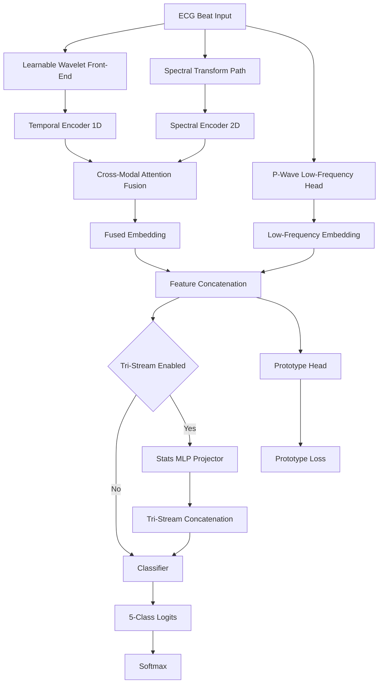
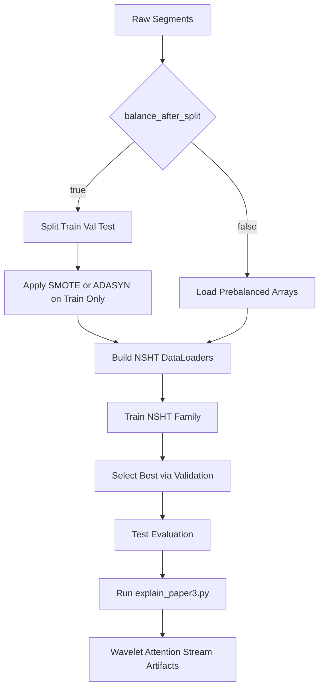

# Paper 3 Study Guide (Monograph Edition): NSHT_Dual_Evo

## 1. Scope

This guide is the publication-depth study companion for Paper 3 in this repository. It documents the **NSHT_Dual_Evo** implementation (`src/models/nsht_dual_evo.py`), which is the active codebase runtime used for all experiments and evaluation.

**NSHT_Dual_Evo** is a learnable dual-stream ECG classifier combining:
- Adaptive wavelet preprocessing
- Cross-modal temporal-spectral fusion with attention
- Prototype consistency regularization
- Specialized P-wave/low-frequency pathways

*(Optional: See [NSHT_ARCHITECTURE.md](NSHT_ARCHITECTURE.md) for the formal technical monograph. The NSHT-Tri extension is mentioned as optional; this guide focuses on the dual-stream core.)*

It covers:

1. Scientific motivation and claim boundaries.
2. Formal dual-stream architecture definitions.
3. Runtime-accurate training and explainability workflow.
4. Ablation, diagnostics, and reproducibility standards.

---

## 2. Formal Problem Definition

Let heartbeat dataset be:

$$
\mathcal{D}=\{(x_i,y_i)\}_{i=1}^{N},\quad x_i\in\mathbb{R}^{L},\ y_i\in\{0,1,2,3,4\}
$$

where:

- $L=216$ samples per R-peak-aligned beat.
- Classes $\{0,1,2,3,4\}$ correspond to AAMI types $\{N,S,V,F,Q\}$.

**NSHT_Dual_Evo** (primary implementation) learns a dual-stream mapping:

$$
f_\theta:\mathbb{R}^{216}\times\mathbb{R}^{H\times W\times3}\rightarrow\Delta^{5}
$$

where the first input is the 1D temporal beat signal and the second is a 2D spectral image.

**Optional:** An NSHT-Tri extension adds a statistical feature stream $s\in\mathbb{R}^{d_s}$:

$$
f^{\mathrm{tri}}_\theta:\mathbb{R}^{216}\times\mathbb{R}^{H\times W\times3}\times\mathbb{R}^{d_s}\rightarrow\Delta^{5}
$$

NSHT-Tri is not active in the current codebase but available for future ablation studies.

---

## 3. Why Paper 3 Exists

Paper 3 focuses on three bottlenecks that persist after strong single-stream baselines:

1. Static denoising front-ends cannot adapt to acquisition/noise shift.
2. Single-modality encoders miss complementary temporal-spectral evidence.
3. CE-only objectives may not enforce robust latent structure.

NSHT addresses these with learnable wavelet preprocessing, cross-modal fusion, and prototype consistency regularization.

---

## 3.1 Standard Hybrid ECG vs NSHT_Dual_Evo Comparison

| Aspect | Conventional Dual-Stream | NSHT_Dual_Evo (Current Implementation) |
|--------|--------------------------|----------------------------------------|
| Preprocessing | Fixed/static denoising | **Learnable Morlet wavelet front-end** |
| 1D temporal encoder | Basic RNN/CNN | **Inception multi-scale with residuals** |
| 2D spectral encoder | Standard CNN | **CWT scalogram + optimized blocks** |
| Fusion mechanism | Concatenation | **Cross-modal attention (1D queries 2D)** |
| Latent structure | CE loss only | **CE + prototype consistency loss** |
| P-wave specialization | Implicit in shared path | **Explicit low-frequency head** |
| Training stability | Standard | **BF16 AMP + gradient clipping** |
| Balancing policy | Often global | **Split-first option (leakage-safe)** |
| Explainability | Post-hoc only | **Structured XAI (wavelet, attention, stream energy)** |
| Runtime class | N/A | `src/models/nsht_dual_evo.py` |
| Config | N/A | `configs/paper3_nsht.yaml` |
| XAI script | N/A | `scripts/explain_paper3.py` |

**Reference Implementation:** See [MODULAR_CODEBASE_README.md](MODULAR_CODEBASE_README.md#project-structure) for project structure and [NSHT_ARCHITECTURE.md](NSHT_ARCHITECTURE.md) for technical details.

---

## 4. Data and Methodology Pipeline

### 4.1 Beat Preparation

1. ECG records are segmented into beat-level windows around R peaks.
2. Class labels are mapped to repository 5-class targets.
3. Splits are generated with fixed seeds for reproducibility.

### 4.2 Leakage-Safe Balancing Policy

Repository runtime policy enforces split-first balancing:

1. If `balance_after_split=true`: Split train/val/test first, then apply SMOTE/ADASYN **only to training split**.
2. If `balance_after_split=false`: Load pre-balanced arrays (legacy pipeline).

The split-first path is preferred for unbiased validation/test estimates and is essential for scientific integrity.

### 4.3 Dual-Input Construction

For each beat:

1. Keep 1D temporal signal for temporal branch.
2. Build spectral representation for 2D branch.
3. Optionally compute statistical descriptors for NSHT-Tri.

---

## 5. NSHT Architecture Overview

### 5.1 Core Modules

1. Learnable wavelet front-end.
2. Temporal encoder (1D multi-scale).
3. Spectral encoder (2D CNN path).
4. P-wave and low-frequency specialization hooks.
5. Cross-modal attention fusion.
6. Classification head and prototype objective.

### 5.2 Conceptual Dataflow

$$
(x_{1D},x_{2D})\xrightarrow{\text{encoders}}(h_t,h_s)\xrightarrow{\text{cross-modal fusion}}h_f\xrightarrow{\text{classifier}}\hat{y}
$$

with optional prototype head and optional stats stream in NSHT-Tri.

---

## 6. Learnable Wavelet Front-End

### 6.1 Parametric Kernel

$$
\psi(t;\sigma,\omega_0)=\exp\!\left(-\frac{t^2}{2\sigma^2}\right)\cos\!\left(\omega_0\frac{t}{\sigma}\right)
$$

Trainable parameters per filter:

- $\sigma$: scale width.
- $\omega_0$: center frequency surrogate.

### 6.2 Feature Generation

For filter bank $\{\psi_k\}_{k=1}^{K}$:

$$
z_k=x*\psi_k,\quad Z=[z_1,\dots,z_K]\in\mathbb{R}^{K\times L}
$$

This moves denoising from fixed preprocessing into gradient-updatable model parameters.

---

## 7. Temporal Branch (1D)

The temporal encoder captures morphology and timing-sensitive cues:

1. QRS shape and slope changes.
2. Beat onset/offset timing behavior.
3. P-wave-related patterns via dedicated low-frequency support.

Representative output:

$$
T\in\mathbb{R}^{B\times C_t\times L_t}
$$

---

## 8. Spectral Branch (2D)

The spectral path encodes time-frequency texture and harmonic distribution cues from beat-derived spectral images.

Representative output:

$$
S\in\mathbb{R}^{B\times C_s\times H_s\times W_s}
$$

Low-frequency-specific hooks can preserve informative atrial-domain structure for hard class boundaries.

---

## 9. Cross-Modal Attention Fusion

Temporal features query spectral context:

$$
Q=W_QT,\ K=W_KS',\ V=W_VS'
$$

$$
A=\mathrm{softmax}\!\left(\frac{QK^\top}{\sqrt{d_k}}\right),\quad F=AV
$$

This alignment is preferable to static concatenation because relevance is learned per sample and per position.

---

## 10. Prototype Consistency Learning

### 10.1 Prototype Loss

For embedding $h_i$ and class prototype $p_{y_i}$:

$$
\mathcal{L}_{\mathrm{proto}}=\frac{1}{N}\sum_{i=1}^{N}\|h_i-p_{y_i}\|_2^2
$$

### 10.2 Joint Objective

$$
\mathcal{L}_{\mathrm{total}}=\mathcal{L}_{\mathrm{CE}}+\lambda\mathcal{L}_{\mathrm{proto}}
$$

with schedule $\lambda(t)$ typically increased over epochs to avoid early over-constraint.

### 10.3 Practical Interpretation

- CE optimizes discrimination.
- Prototype term regularizes latent geometry.
- Together they improve separation and interpretability.

---

## 11. Optional Tri-Stream Extension (NOT ACTIVE)

**Historical Note:** NSHT-Tri is a tri-stream variant that would add statistical features. It is **not deployed** in the current NSHT_Dual_Evo codebase.

For completeness, if tri-stream were enabled, statistical vector $s\in\mathbb{R}^{d_s}$ would project to $h_s=\phi_s(s)$ and concatenate:

$$
h_{\mathrm{tri}}=[h_f\,\|\,h_{\mathrm{lf}}\,\|\,h_s]
$$

This would improve boundary handling in subtle morphology cases if engineered descriptors contained complementary cues. **Current implementation uses dual-stream architecture only.**

---

## 12. Shape and Interface Contracts

Representative tensor contracts:

1. Input 1D: $B\times1\times216$.
2. Wavelet output: $B\times K\times216$.
3. Temporal output: $B\times C_t\times L_t$.
4. Spectral output: $B\times C_s\times H_s\times W_s$.
5. Fused embedding: $B\times d$.
6. Final logits: $B\times5$.

Contract invariants:

1. Label index mapping must remain global-consistent.
2. Branch preprocessing normalization must match training-time assumptions.
3. Checkpoint and config must be paired correctly.

---

## 13. Training Protocol (Runtime-Accurate)

### 13.1 Typical Configuration Pattern

Runtime defaults in this repository family include:

- Adaptive optimizer (AdamW style).
- Mixed precision (BF16 where supported).
- Learning-rate scheduling with validation-based controls.
- Gradient clipping for stability.

### 13.2 Data Integrity Rule

For robust claims:

1. Split first.
2. Balance train only if balancing is enabled.
3. Keep validation/test untouched.

### 13.3 Reporting Set

Minimum report package:

- Accuracy, macro F1.
- Per-class precision/recall/F1.
- Confusion matrix.
- Optional prototype/embedding diagnostics.

---

## 14. Explainability Workflow (Paper 3)

Primary script:

- `scripts/explain_paper3.py`

Canonical command:

```bash
python scripts/explain_paper3.py \
  --model-path checkpoints/paper3_nsht/best_model.pt \
  --config configs/paper3_nsht.yaml \
  --num-samples-per-class 1
```

Leakage-safe override:

```bash
python scripts/explain_paper3.py \
  --model-path checkpoints/paper3_nsht/best_model.pt \
  --config configs/paper3_nsht.yaml \
  --num-samples-per-class 1 \
  --data.balance_after_split
```

Expected artifacts under `experiments/paper3_nsht/xai/`:

1. `wavelet_params.png`.
2. `cross_attention.png`.
3. `stream_contributions.png`.
4. `arrays.npz`.
5. per-sample and run-level `summary.json`.
6. optional prototype-space visual outputs.

Prototype export utility:

```bash
python scripts/extract_nsht_prototypes.py \
  --model-path checkpoints/paper3_nsht/best_model.pt \
  --config configs/paper3_nsht.yaml
```

---

## 15. Novelty Matrix (Paper 3: NSHT_Dual_Evo)

1. **Learnable wavelet front-end** — Adaptive denoising replacing fixed preprocessing.
2. **Temporal-spectral cross-modal attention** — Dynamic relevance-weighted fusion of 1D and 2D features.
3. **Explicit P-wave/low-frequency specialization** — Enhanced modeling of subtle atrial patterns for N/S boundaries.
4. **Prototype consistency objective** — Joint CE + prototype loss for structured latent geometry.
5. **Split-first balancing policy** — Leakage-safe methodology for robust generalization claims.
6. **Structured XAI suite** — Wavelet parameter visualization, cross-attention heatmaps, stream contribution metrics.

*(Historical: NSHT-Tri tri-stream variant with statistical features was explored but is not part of current deployment.)*
6. Structured multi-artifact explainability output.

---

## 16. Baseline Comparisons

| Dimension | Conventional Hybrid ECG | NSHT Dual | NSHT-Tri |
|---|---|---|---|
| Preprocessing | Fixed | Learnable wavelets | Learnable wavelets |
| Modal fusion | Static concat | Cross-modal attention | Cross-modal attention + stats stream |
| Objective | CE only | CE + prototype | CE + prototype |
| Low-frequency path | Often implicit | Explicit | Explicit |
| Statistical priors | Rare | Optional external | Native third stream |
| Explainability | Limited | Multi-artifact | Multi-artifact + stats context |

---

## 17. Failure Modes and Diagnostics

### 17.1 Expected Difficult Cases

1. N/S boundaries with weak P-wave visibility.
2. V/F overlap in ventricular morphology variability.
3. Prototype instability if $\lambda$ schedule is poorly tuned.

### 17.2 Diagnostic Checklist

1. Validate split and balancing policy first.
2. Inspect attention maps for collapse.
3. Inspect prototype separation and cluster overlap.
4. Inspect learned wavelet parameter ranges for degeneration.

---

## 18. Ablation Blueprint

Minimum ablations for publication:

1. Remove learnable wavelet front-end.
2. Replace cross-modal attention with static fusion.
3. Set prototype weight to zero.
4. Remove low-frequency/P-wave specialization.
5. Disable tri-stream stats branch.
6. Compare split-first vs pre-balanced methodology.

Run with repeated seeds and include confidence intervals.

---

## 19. Reproducibility Protocol

1. Store seeds and split indices.
2. Archive exact configs per run.
3. Store checkpoint hashes and run metadata.
4. Track package and runtime environment versions.
5. Link metrics to exact checkpoint and artifact bundle.

---

## 20. Diagram Set

### 20.1 Core Architecture



### 20.2 Training and XAI Runtime Flow



---

## 21. Claim Guardrails

To keep paper claims accurate:

1. Distinguish NSHT vs NSHT-Tri result tables.
2. Separate architecture gains from balancing-policy gains.
3. Attribute prototype interpretability only when prototype training is active.
4. Keep runtime references aligned with active scripts/configs.

---

## 22. Equation Reference Block

$$
\psi(t;\sigma,\omega_0)=\exp\!\left(-\frac{t^2}{2\sigma^2}\right)\cos\!\left(\omega_0\frac{t}{\sigma}\right)
$$

$$
\mathrm{Attn}(Q,K,V)=\mathrm{softmax}\!\left(\frac{QK^\top}{\sqrt{d_k}}\right)V
$$

$$
\mathcal{L}_{\mathrm{proto}}=\frac{1}{N}\sum_{i=1}^{N}\|h_i-p_{y_i}\|_2^2
$$

$$
\mathcal{L}_{\mathrm{total}}=\mathcal{L}_{\mathrm{CE}}+\lambda\mathcal{L}_{\mathrm{proto}}
$$

Use one expression per display block for stable rendering.

---

## 23. Suggested Manuscript Section Mapping

1. Method section: Sections 5 to 11.
2. Training protocol section: Sections 13 and 19.
3. Explainability section: Section 14.
4. Ablation section: Section 18.
5. Limitations and diagnostics: Section 17.

---

## 24. Quick Reference Commands

**Training NSHT_Dual_Evo (Paper 3):**

```bash
# Standard training with pre-balanced data
python scripts/train.py --config configs/paper3_nsht.yaml

# Training with split-first, train-only balancing (leakage-safe)
python scripts/train.py --config configs/paper3_nsht.yaml --data.balance_after_split
```

**Explainability and Prototype Extraction:**

```bash
# Generate XAI artifacts (wavelet, attention, stream contributions)
python scripts/explain_paper3.py \
  --model-path checkpoints/paper3_nsht/best_model.pt \
  --config configs/paper3_nsht.yaml \
  --num-samples-per-class 1

# Extract prototype embeddings and t-SNE
python scripts/extract_nsht_prototypes.py \
  --model-path checkpoints/paper3_nsht/best_model.pt \
  --config configs/paper3_nsht.yaml
```

**Code Reference:**
- Model implementation: `src/models/nsht_dual_evo.py`
- Configuration template: `configs/paper3_nsht.yaml`
- Training entrypoint: `scripts/train.py`
- Evaluation: `scripts/evaluate.py`

See [MODULAR_CODEBASE_README.md](MODULAR_CODEBASE_README.md) for detailed setup and additional options.

This monograph is the canonical heavy study guide for Paper 3 in the current repository state.
