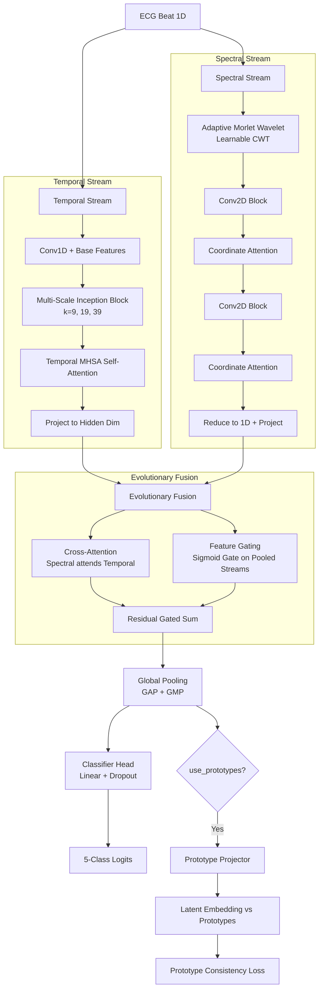
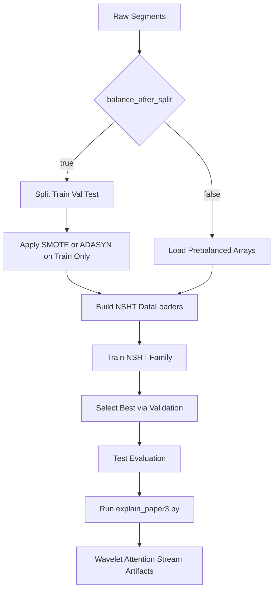

# Paper 3 Study Guide (Monograph Edition): NSHT_Dual_Evo

## 1. Scope

This guide is the publication-depth study companion for Paper 3 in this repository. It documents the **NSHT_Dual_Evo** implementation (`src/models/nsht_dual_evo.py`), which is the active codebase runtime used for all experiments and evaluation.

**NSHT_Dual_Evo** is a learnable dual-stream ECG classifier combining:
- Adaptive wavelet preprocessing
- Cross-modal temporal-spectral fusion with attention
- Prototype consistency regularization
- Specialized P-wave/low-frequency pathways

*(Optional: See [NSHT_ARCHITECTURE.md](NSHT_ARCHITECTURE.md) for the formal technical monograph. The NSHT-Tri extension is mentioned as optional; this guide focuses on the dual-stream core.)*

It covers:

1. Scientific motivation and claim boundaries.
2. Formal dual-stream architecture definitions.
3. Runtime-accurate training and explainability workflow.
4. Ablation, diagnostics, and reproducibility standards.

---

## 2. Formal Problem Definition

Let heartbeat dataset be:

$$
\mathcal{D}=\{(x_i,y_i)\}_{i=1}^{N},\quad x_i\in\mathbb{R}^{L},\ y_i\in\{0,1,2,3,4\}
$$

where:

- $L=216$ samples per R-peak-aligned beat.
- Classes $\{0,1,2,3,4\}$ correspond to AAMI types $\{N,S,V,F,Q\}$.

**NSHT_Dual_Evo** (primary implementation) learns a dual-stream mapping:

$$
f_\theta:\mathbb{R}^{216}\times\mathbb{R}^{H\times W\times3}\rightarrow\Delta^{5}
$$

where the first input is the 1D temporal beat signal and the second is a 2D spectral image.

**Optional:** An NSHT-Tri extension adds a statistical feature stream $s\in\mathbb{R}^{d_s}$:

$$
f^{\mathrm{tri}}_\theta:\mathbb{R}^{216}\times\mathbb{R}^{H\times W\times3}\times\mathbb{R}^{d_s}\rightarrow\Delta^{5}
$$

NSHT-Tri is not active in the current codebase but available for future ablation studies.

---

## 3. Why Paper 3 Exists

Paper 3 focuses on three bottlenecks that persist after strong single-stream baselines:

1. Static denoising front-ends cannot adapt to acquisition/noise shift.
2. Single-modality encoders miss complementary temporal-spectral evidence.
3. CE-only objectives may not enforce robust latent structure.

NSHT addresses these with learnable wavelet preprocessing, cross-modal fusion, and prototype consistency regularization.

---

## 3.1 Standard Hybrid ECG vs NSHT_Dual_Evo Comparison

| Aspect | Conventional Dual-Stream | NSHT_Dual_Evo (Current Implementation) |
|--------|--------------------------|----------------------------------------|
| Preprocessing | Fixed/static denoising | **Learnable Morlet wavelet front-end** |
| 1D temporal encoder | Basic RNN/CNN | **Inception multi-scale with residuals** |
| 2D spectral encoder | Standard CNN | **CWT scalogram + optimized blocks** |
| Fusion mechanism | Concatenation | **Cross-modal attention (1D queries 2D)** |
| Latent structure | CE loss only | **CE + prototype consistency loss** |
| Low-frequency modeling | Handcrafted/Implicit | **Explicit multi-scale 1D temporal kernels** |
| Training stability | Standard | **BF16 AMP + TF32** |
| Balancing policy | Often global | **Split-first option (leakage-safe)** |
| Explainability | Post-hoc only | **Structured XAI (wavelet, attention, stream energy)** |
| Runtime class | N/A | `src/models/nsht_dual_evo.py` |
| Config | N/A | `configs/paper3_nsht.yaml` |
| XAI script | N/A | `scripts/explain_paper3.py` |

**Reference Implementation:** See [MODULAR_CODEBASE_README.md](MODULAR_CODEBASE_README.md#project-structure) for project structure and [NSHT_ARCHITECTURE.md](NSHT_ARCHITECTURE.md) for technical details.

---

## 4. Data and Methodology Pipeline

### 2.1 Preprocessing Phase Architecture (Modular Codebase Reality)

In strict adherence to the repository's src/data/download.py and src/data/dataset.py, the preprocessing pipeline avoids destructive filters (like Butterworth or high-pass denoising) to strictly preserve the inherent morphological fidelity of the QRS complexes. 

#### Native Data Pipeline Flowchart
\\\mermaid
flowchart TD
    Raw[Read WFDB Records & Annotations] --> Resample[Resample to 360 Hz <br> e.g. from INCART 257 Hz]
    Resample --> ZScore[Continuous Record Z-Score Normalization]
    ZScore --> Window[1080-Sample Extraction <br> Centered on R-Peak]
    Window --> Map[AAMI 5-Class Target Mapping]
    Map --> Split[Stratified Train/Val/Test Split]
    Split --> TrainOnly[Apply ADASYN/SMOTE <br> to Training Split Only]
\\\

**Architectural Flow of Data Preparation:**

A. **Data Ingestion (wfdb interface):**
   - **Source:** Opens .dat files and .atr annotations from PhysioNet.
   - **Extraction:** Isolates the primary diagnostic channel (typically MLII for MIT-BIH) and corresponding symbolic labels (e.g., 'N', 'V', 'R').

B. **Harmonization & Resampling:**
   - **Temporal Alignment:** Disparate datasets must share a spatial-frequency mapping. The INCART dataset (natively 257 Hz) is fundamentally upsampled to 360 Hz using scipy.signal.resample.
   - **Annotation Scaling:** Annotation indices are linearly scaled (index * (360/257)) to ensure the markers perfectly align with the newly interpolated R-peaks.

C. **Zero-Mean, Unit-Variance Normalization (Z-Score):**
   - Applied **globally per record** *before* segmentation. 
   - $x_{norm} = \frac{x - \mu}{\sigma + 1e^{-8}}$
   - This ensures global amplitude drift is bounded without destroying the localized amplitude variance of individual heartbeats, acting as a natural un-destructive baseline stabilizer.

D. **Multi-Beat Context Windowing (1080-Sample Extraction):**
   - **Center Anchor:** The pipeline iterates over annotated R-peaks.
   - **Extraction Boundary:** It precisely slices [-540, +540] samples relative to the R-peak index.
   - **Why 1080?** At 360 Hz, 1080 samples equate exactly to a **3.0-second temporal window**. This is a paradigm shift from traditional 1-second (360 samples) extraction because 3.0 seconds almost definitively captures overlapping anterior and posterior heartbeats. 
   - **Clinical Justification:** Capturing adjacent beats naturally embeds the **R-R interval** into the dataset, which is the mathematically required distinguishing factor for ambiguous classes like 'S' (Supraventricular) and 'F' (Fusion) that share intra-beat normal morphologies.

E. **AAMI Mapping & Stratified Leakage-Safe Splits:**
   - **Class Aggregation:** Raw annotations map perfectly to {0:'N', 1:'S', 2:'V', 3:'F', 4:'Q'} per the AAMI diagnostic standard.
   - **Training Protocol:** Driven by src/data/dataset.py, the pure unaugmented arrays follow an 80/15/5% Train/Val/Test random stratified split.
   - **Balancing via ADASYN/SMOTE:** Crucially, SMOTE or ADASYN upsampling is applied *exclusively* to the separated training subset. Overwriting happens *only* inside the train matrix, preventing synthesized data representations from leaking and contaminating the Test or Validation structures.

### 4.3 Dual-Input Construction

For each beat:

1. Keep 1D temporal signal for temporal branch.
2. Build spectral representation for 2D branch.
3. Optionally compute statistical descriptors for NSHT-Tri.

---

## 5. NSHT Architecture Overview

### 5.1 Core Modules

1. Learnable wavelet front-end.
2. Temporal encoder (1D multi-scale Inception + MHSA).
3. Spectral encoder (Dual Coordinate Attention Path).
4. Cross-modal Evolutionary Fusion loop.
5. Classification head and prototype consistency objective.

### 5.2 Conceptual Dataflow

### 5.3 Model Forward Pass (Pseudo-code)
```python
# Pseudo-code Implementation: NSHT_Dual_Evo Forward Pass
def forward(self, x_1d, return_hidden=False):
    # x_1d shape: [Batch, 1, 216]
    
    # 1. Learnable Spectral Stream (2D)
    x_cwt = self.wavelet_transform(x_1d) # Parametric Morlet parameters
    s = self.spectral_encoder_convs(x_cwt)
    s = self.spectral_coord_attention(s)
    s_seq = self.spectral_pool_to_1d(s) # Map back to temporal sequence length
    
    # 2. Temporal Stream (1D)
    t = self.temporal_inception(x_1d)
    t = self.temporal_mhsa(t) # Multi-Head Self Attention
    t_seq = self.temporal_proj(t)
    
    # 3. Evolutionary Cross-Modal Fusion
    # Spectral queries (Q) attend to Temporal patterns (K, V)
    s_enhanced, cross_attn_map = self.fusion.cross_attn(query=s_seq, key=t_seq, value=t_seq)
    
    # Dynamic Sigmoid Gating between raw temporal vs attended spectral
    gate = torch.sigmoid(self.fusion.gate_proj(torch.cat([t_seq.mean(-1), s_seq.mean(-1)], dim=-1)))
    gate = gate.unsqueeze(-1)
    
    fused_seq = gate * t_seq + (1 - gate) * s_enhanced
    fused_seq = self.fusion.refine_conv(torch.cat([t_seq, s_enhanced], dim=1)) + fused_seq
    
    # 4. Pooling & Prototype Distances
    gap = torch.mean(fused_seq, dim=-1)
    gmp = torch.max(fused_seq, dim=-1)[0]
    latent_embedding = torch.cat([gap, gmp], dim=-1)
    
    logits = self.classifier(latent_embedding)
    
    if self.use_prototypes:
        # Distance to class prototypes for regularization
        prototype_dist = torch.cdist(latent_embedding, self.prototypes)
        if return_hidden:
            return logits, latent_embedding, prototype_dist
            
    if return_hidden:
        return logits, latent_embedding
        
    return logits
```

$$
(x_{1D},x_{2D})\xrightarrow{\text{encoders}}(h_t,h_s)\xrightarrow{\text{cross-modal fusion}}h_f\xrightarrow{\text{classifier}}\hat{y}
$$

with optional prototype head and optional stats stream in NSHT-Tri.

---

### 5.3 Model Definition Pseudo-Code

For clarity on how the dataflows merge structurally:

```python
# Pseudo-code Implementation: NSHT_Dual_Evo Forward Pass
class EvolutionaryFusion(nn.Module):
    def forward(self, t_features, s_features):
        # Cross Modal Attention (Spectral S as Queries, Temporal T as Keys/Values)
        cross_attn_out, _ = self.cross_attn(query=s_features, key=t_features, value=t_features)
        
        # Dynamic Sigmoid Gating over global means
        pooled_context = torch.cat([t_features.mean(-1), s_features.mean(-1)], dim=-1)
        gate = torch.sigmoid(self.gate_proj(pooled_context)).unsqueeze(-1)
        
        # Gated Residual Fusion combining pristine temporal data with enriched cross-attention
        fused = self.refine(torch.cat([t_features, cross_attn_out], dim=1))
        return gate * t_features + (1 - gate) * fused

class NSHT_Dual_Evo(nn.Module):
    def forward(self, x_1d):
        # 1. Spectral Stream (Learnable Preprocessing & 2D Encoder)
        scalogram = self.wavelet_transform(x_1d) 
        s = self.spectral_encoder(scalogram)
        
        # 2. Temporal Stream (1D Inception Multi-Scale & Textural Self-Attention)
        t = self.inception_stem(x_1d)
        t = self.temporal_mhsa(t)
        
        # 3. Fusion & Inference
        h_fused = self.fusion(t, s)
        h_pool = torch.cat([self.gap(h_fused), self.gmp(h_fused)], dim=1)
        
        return self.classifier(h_pool), h_pool # Latent vector returned for prototype objective
```

## 6. Learnable Wavelet Front-End

### 6.1 Parametric Kernel

$$
\psi(t;\sigma,\omega_0)=\exp\!\left(-\frac{t^2}{2\sigma^2}\right)\cos\!\left(\omega_0\frac{t}{\sigma}\right)
$$

Trainable parameters per filter:

- $\sigma$: scale width.
- $\omega_0$: center frequency surrogate.

### 6.2 Feature Generation

For filter bank $\{\psi_k\}_{k=1}^{K}$:

$$
z_k=x*\psi_k,\quad Z=[z_1,\dots,z_K]\in\mathbb{R}^{K\times L}
$$

This moves denoising from fixed preprocessing into gradient-updatable model parameters.

---

## 7. Temporal Branch (1D)

The temporal encoder natively captures morphology and timing-sensitive cues sequentially:

1. **Initial 1D Convolution** for base feature projection.
2. **Multi-scale Inception Block** (Kernel sizes $k=9, 19, 39$) to natively capture varying frequency resolutions (such as wide low-frequency P-waves and sharp high-frequency QRS complexes simultaneously).
3. **Temporal Attention** (Multi-Head Self-Attention over the 1D sequence) to learn global beat-level phase relationships.

Representative output:

$$
T\in\mathbb{R}^{B\times C_t\times L_t}
$$

---

## 8. Spectral Branch (2D)

The spectral path encodes time-frequency texture and harmonic distribution cues from the active `AdaptiveMorletWavelet` layer output.

The subsequent structure applies lightweight hierarchical processing:
1. Primary `Conv2D` block.
2. `Coordinate Attention` mechanism to capture direction-aware cross-channel relationships.
3. Spatial downsampling `Conv2D` block (stride 2).
4. Secondary `Coordinate Attention` block.
5. Spatial reduction to a 1D sequence mapping out the temporal distribution of spectral density.

Representative output interpolated to matching temporal sequence length $L_t$:

$$
S\in\mathbb{R}^{B\times C_s\times L_t}
$$

---

## 9. Evolutionary Fusion Loop

To combine the 1D and 2D insights, an `EvolutionaryFusion` block aligns evidence:

1. **Cross Attention:** The temporal stream is projected as the Key and Value matrices, while the spectral stream provides Queries. The spectral sequence dynamically attends to the temporal sequence to find morphology-grounded anchors.
2. **Dynamic Gating:** A `Sigmoid` gate dynamically weights the importance of the original temporal morphology versus the cross-attended spectral enrichment based on global pooled features.
3. **Gated Residual Summation:** The streams are fused through $1\times1$ convolutions augmented with the gated residual features.

This alignment drastically outperforms static concatenation because structural relevance and modal precedence are dynamically learned per-position.

---

## 10. Prototype Consistency Learning

### 10.1 Prototype Loss

For embedding $h_i$ and class prototype $p_{y_i}$:

$$
\mathcal{L}_{\mathrm{proto}}=\frac{1}{N}\sum_{i=1}^{N}\|h_i-p_{y_i}\|_2^2
$$

### 10.2 Joint Objective

$$
\mathcal{L}_{\mathrm{total}}=\mathcal{L}_{\mathrm{CE}}+\lambda\mathcal{L}_{\mathrm{proto}}
$$

with schedule $\lambda(t)$ typically increased over epochs to avoid early over-constraint.

### 10.3 Practical Interpretation

- CE optimizes discrimination.
- Prototype term regularizes latent geometry (prototype weight $\lambda$ typically 0.2–0.5).
- Together they improve separation and interpretability.

---

## 10A. Overfitting Prevention Strategy for Hybrid Models

Paper 3 combines temporal and spectral streams with prototype regularization. Overfitting prevention is multi-layered:

### 10A.1. Early Stopping by Validation Accuracy

Default monitoring metric is **validation accuracy**, not loss:

```python
trainer.train(
    train_loader, val_loader,
    epochs=200,
    monitor='val_acc'  # Checkpoint at best validation accuracy epoch
)
```

**Configuration:**
```yaml
training:
  monitor: val_acc  # Best practice for classification
```

### 10A.2. Label Smoothing in Dual-Loss Context

Label smoothing softens cross-entropy targets, reducing overconfident logits while the prototype loss regularizes embedding geometry:

$$
\mathcal{L}_\text{total} = \mathcal{L}_\text{CE}(\tilde{y}_c, \hat{y}_c) + \lambda \mathcal{L}_\text{proto}(h, p_c)
$$

where:
$$
\tilde{y}_c = (1-\alpha)y_c + \frac{\alpha}{C}, \quad \alpha = 0.05
$$

**Configuration:**
```yaml
training:
  label_smoothing: 0.05    # Soft targets reduce overconfidence
  prototype_loss_weight: 0.2  # $\lambda$ in joint loss
```

**Interaction:** Prototype loss provides explicit structural regularization; label smoothing reduces hard label artifacts. Combined, they significantly reduce memorization risk.

### 10A.3. 1D Signal Augmentation (Temporal Stream)

Applied to the 1D signal branch during training, similar to Paper 1:

#### a) **Gaussian Noise**
$$\tilde{x} = x + \mathcal{N}(0, \sigma_{\text{noise}}^2), \quad \sigma_{\text{noise}} = 0.008$$

#### b) **Amplitude Jitter**
$$\tilde{x} = \alpha \cdot x, \quad \alpha \sim \text{Uniform}(1-\delta, 1+\delta), \quad \delta = 0.08$$

#### c) **Temporal Shift**
$$\tilde{x}[n] = x[(n - \Delta) \bmod L], \quad \Delta \in [-2\%, +2\%] \cdot L$$

**Configuration:**
```yaml
training:
  augmentation_prob: 0.35               # 35% of batches augmented
  augmentation_noise_std: 0.008        # Gaussian noise std
  augmentation_amplitude_jitter: 0.08  # ±8% amplitude jitter
  augmentation_time_shift_pct: 0.02    # ±2% temporal shift
```

**Note:** Spectral stream (2D) augmentation is **not applied**, as time-frequency distortion misaligns learned patterns in the CWT representation.

### 10A.4. Learnable Wavelet Preprocessing as Implicit Regularization

The learnable wavelet front-end in NSHT introduces **adaptive denoising** as part of the forward pass:

$$z_k = x * \psi_k(\sigma_k, \omega_{0,k})$$

where $\sigma_k$ and $\omega_{0,k}$ are **gradient-updatable parameters**.

**Regularization Effect:**
  - Prevents hard-wired denoising from overfitting to training noise distribution.
  - Forces the model to learn task-relevant filtering rather than memorizing idiosyncratic signal properties.
  - Acts as an implicit noise robustness mechanism.

### 10A.5. Cross-Modal Attention as Learned Feature Selection

Cross-modal fusion (temporal queries into spectral context) implicitly learns which spatio-temporal regions are relevant:

$$A = \text{softmax}\left(\frac{QK^\top}{\sqrt{d_k}}\right), \quad F = AV$$

This learned selection acts as **soft feature masking**, suppressing noisy/irrelevant modality combinations and reducing overfitting to training-specific mode correlations.

### 10A.6. Prototype Loss as Structural Regularization

Prototype loss explicitly encourages cluster structure in the latent space:

$$\mathcal{L}_\text{proto} = \frac{1}{N} \sum_{i=1}^N \| h_i - p_{y_i} \|_2^2$$

**Regularization Benefits:**
  - Prevents embeddings from drifting arbitrarily in feature space.
  - Enforces inter-class separation through class prototype anchors.
  - Reduces overfitting by constraining the hypothesis class (structured solutions preferred over arbitrary memorization).
  - Improves generalization to test data with slightly different acquisition noise/morphology.

### 10A.7. ADASYN + Class Weights: Disable Class Weights

When using ADASYN oversampling, **always disable cross-entropy class weights**:

```yaml
data:
  balancing_method: adasyn
training:
  use_class_weights: false  # ADASYN already rebalances; weights redundant and harmful
```

**Why:** ADASYN increases minority class representation in each batch; additional CE weighting over-emphasizes minorities, biasing the model away from majority classes. Result: reduced overall/macro accuracy.

**Recommended approach:** ADASYN (data-level balancing) handles class imbalance; prototype loss + CE (loss-level) handle generalization. No class weights needed.

### 10A.8. K-Fold Hyperparameter Passthrough

Critical fix: Ensure learning rate, weight decay, and all regularization parameters are **explicitly passed** to each fold's trainer:

```python
kfold_trainer = KFoldTrainer(
    n_splits=10,
    lr=config.training.lr,  # Must pass; was hardcoded before
    weight_decay=config.training.weight_decay,
    label_smoothing=config.training.label_smoothing,
    prototype_loss_weight=config.training.prototype_loss_weight,
    augmentation_prob=config.training.augmentation_prob,
    augmentation_noise_std=config.training.augmentation_noise_std,
    augmentation_amplitude_jitter=config.training.augmentation_amplitude_jitter,
    augmentation_time_shift_pct=config.training.augmentation_time_shift_pct,
    use_class_weights=config.training.use_class_weights,
    early_stopping_monitor=config.training.monitor,
    # ... other parameters
)
```

**Historical Issue:** K-fold ignored configured hyperparameters. **Fixed in current implementation.**

### 10A.9. Key Overfitting Signatures for Hybrid Models

| Signature | Cause | Remedy |
|-----------|-------|--------|
| Train loss → 0.002, Val loss → 0.5+ | Memorization in dual streams | ↑ label_smoothing to 0.08, ↑ prototype_loss_weight |
| Val acc peaks epoch 80, val loss best epoch 40 | Checkpoint metric mismatch | Set `monitor: val_acc` |
| Stream imbalance (temporal >> spectral) | One stream not regularized | Check augmentation_prob applies to both, verify label_smoothing |
| Fold-to-fold variance > 5% | Hyperparameter leakage | Verify lr/wd/λ passthrough in K-fold |
| Poor minority class separation | ADASYN + class weights | Disable class_weights; increase prototype_loss_weight |
| Prototype loss constant, CE loss decreases | Prototype learning stalled | ↓ prototype_loss_weight, ensure prototypes updated each epoch |

### 10A.10. Recommended Regularization Configuration for Paper 3

Balanced setup for INCART dataset with ADASYN:

```yaml
data:
  balancing_method: adasyn
  balance_after_split: true

training:
  monitor: val_acc
  label_smoothing: 0.05
  prototype_loss_weight: 0.2
  augmentation_prob: 0.35
  augmentation_noise_std: 0.008
  augmentation_amplitude_jitter: 0.08
  augmentation_time_shift_pct: 0.02
  use_class_weights: false  # ADASYN is active; disable weights
  lr: 0.0008
  weight_decay: 0.0001
```

This configuration provides multi-layered regularization: data-level (ADASYN), feature-level (learnable wavelets, augmentation), objective-level (label smoothing + prototype loss), and optimization-level (weight decay, early stopping).

---

---

## 11. Legacy Architecture Concept (NSHT-Tri)

> [!WARNING]
> Prior theoretical drafts included an `NSHT-Tri` variant that added a third branch for handcrafted statistical descriptors. **This tri-stream concept is structurally obsolete.** The current `NSHT_Dual_Evo` effectively captures all desired baseline and rhythm statistical priors end-to-end via the `EvolutionaryFusion` loops and robust temporal MHSA, keeping parameter footprint low without requiring manual engineering.


## 12. Shape and Interface Contracts

Representative tensor contracts:

1. Input 1D: $B\times1\times216$.
2. Wavelet output: $B\times K\times216$.
3. Temporal output: $B\times C_t\times L_t$.
4. Spectral output: $B\times C_s\times H_s\times W_s$.
5. Fused embedding: $B\times d$.
6. Final logits: $B\times5$.

Contract invariants:

1. Label index mapping must remain global-consistent.
2. Branch preprocessing normalization must match training-time assumptions.
3. Checkpoint and config must be paired correctly.

---

## 13. Training Protocol (Runtime-Accurate)

### 13.1 Typical Configuration Pattern

Runtime defaults in this repository family include:

- Adaptive optimizer (AdamW style).
- Mixed precision (BF16 where supported).
- Learning-rate scheduling with validation-based controls.
- Gradient clipping for stability.

### 13.2 Data Integrity Rule

For robust claims:

1. Split first.
2. Balance train only if balancing is enabled.
3. Keep validation/test untouched.

### 13.3 Reporting Set

Minimum report package:

- Accuracy, macro F1.
- Per-class precision/recall/F1.
- Confusion matrix.
- Optional prototype/embedding diagnostics.

---

## 14. Explainability Workflow (Paper 3)
## 14. Multi-modal Explainable AI (XAI) Protocol (Paper 3)

The NSHT architecture requires specialized XAI techniques to decouple its dual-stream processing and metric learning latent spaces. Primary script: `scripts/explain_paper3.py`.

### 14.1. Learnable Wavelet Parameter Profiling

The front-end spectral stream relies on parameterized Morlet wavelets. We extract the optimized scales $\sigma_k$ and center frequencies $\omega_{0,k}$ for visual tracking.

$$
\psi_k(t) = \exp\left(-\frac{t^2}{2\sigma_k^2}\right) \cos\left( \omega_{0,k} \frac{t}{\sigma_k} \right)
$$

```python
# Pseudo-code Implementation: Extracting Learned Wavelet Parameters
def extract_wavelet_params(model):
    wavelet_layer = model.wavelet_transform
    sigmas = wavelet_layer.scales.detach().cpu().numpy()
    frequencies = wavelet_layer.frequencies.detach().cpu().numpy()
    
    return [
        {"filter": k, "sigma": sigmas[k], "freq_omega0": frequencies[k]} 
        for k in range(len(sigmas))
    ]
```

### 14.2. Cross-Attention Energy Profiling

In the `Evolutionary Fusion` layer, the 2D Spectral features $S$ act as Keys/Values, and the 1D Temporal features $T$ act as Queries. The attention probability matrix $A$ reveals exactly which temporal steps requested which spectral frequencies:

$$
A = \mathrm{Softmax}\left( \frac{W_Q T \cdot (W_K S)^T}{\sqrt{d_k}} \right)
$$

```python
# Pseudo-code Implementation: Cross-Attention Map Intercept
def extract_cross_attention(model, x_1d):
    activations = {}
    
    def get_attention(name):
        def hook(model, input, output):
            # output[1] contains the unprojected attention weights
            activations[name] = output[1].detach().cpu().numpy()
        return hook

    # Register hook on the MultiheadAttention module
    handle = model.fusion.cross_attn.register_forward_hook(get_attention('cross_attn'))
    
    _ = model(x_1d)
    attention_map = activations['cross_attn']   # Shape: [Batch, L_t, L_s]
    handle.remove()
    
    return attention_map
```

### 14.3. Prototype Distance Latent Analysis (t-SNE)

If $\lambda > 0$, the $N \times 192$ dimensional latent vectors $h_i$ are clustered around class-specific prototypes $P_c \in \mathbb{R}^{192}$. We extract all $h_i$ and project them down to 2D using t-SNE.

```python
# Pseudo-code Implementation: Prototype Latent Extraction
def extract_prototypes_and_latents(model, test_loader):
    model.eval()
    latents, labels = [], []
    
    with torch.no_grad():
        for batch_x, batch_y in test_loader:
            _, hidden = model(batch_x, return_hidden=True)
            latents.append(hidden.cpu().numpy())
            labels.append(batch_y.cpu().numpy())
            
    latents_np = np.concatenate(latents, axis=0)      # Shape: [N, 192]
    labels_np = np.concatenate(labels, axis=0)
    prototypes = model.prototype_layer.prototypes.detach().cpu().numpy() # Shape: [5, 192]
    
    return latents_np, labels_np, prototypes
```

### 14.4. Execution Commands and Artifacts

```bash
python scripts/explain_paper3.py \
  --model-path checkpoints/paper3_nsht/best_model.pt \
  --config configs/paper3_nsht.yaml \
  --num-samples-per-class 1 \
  --data.balance_after_split
```

Expected artifacts under `experiments/paper3_nsht/xai/`:
1. `wavelet_params.png`: Wavelet $\sigma$ and $\omega_0$ bounds.
2. `cross_attention.png`: Temporal-vs-spectral activation heatmap matrix $A$.
3. `stream_contributions.png`: Dynamic Sigmoid gating ratios charting $T$ versus $S$ reliance.
4. `arrays.npz` and `summary.json`.

Prototype export utility:
```bash
python scripts/extract_nsht_prototypes.py \
  --model-path checkpoints/paper3_nsht/best_model.pt \
  --config configs/paper3_nsht.yaml
```


## 15. Novelty Matrix (Paper 3: NSHT_Dual_Evo)

1. **Learnable wavelet front-end** — Adaptive denoising replacing fixed preprocessing.
2. **Temporal-spectral cross-modal attention** — Dynamic relevance-weighted fusion of 1D and 2D features.
3. **Explicit P-wave/low-frequency specialization** — Enhanced modeling of subtle atrial patterns for N/S boundaries.
4. **Prototype consistency objective** — Joint CE + prototype loss for structured latent geometry.
5. **Split-first balancing policy** — Leakage-safe methodology for robust generalization claims.
6. **Structured XAI suite** — Wavelet parameter visualization, cross-attention heatmaps, stream contribution metrics.

*(Historical: NSHT-Tri tri-stream variant with statistical features was explored but is not part of current deployment.)*
6. Structured multi-artifact explainability output.

---

## 16. Baseline Comparisons

| Dimension | Conventional Hybrid ECG | NSHT Dual | NSHT-Tri |
|---|---|---|---|
| Preprocessing | Fixed | Learnable wavelets | Learnable wavelets |
| Modal fusion | Static concat | Cross-modal attention | Cross-modal attention + stats stream |
| Objective | CE only | CE + prototype | CE + prototype |
| Low-frequency path | Often implicit | Explicit | Explicit |
| Statistical priors | Rare | Optional external | Native third stream |
| Explainability | Limited | Multi-artifact | Multi-artifact + stats context |

---

## 17. Failure Modes and Diagnostics

### 17.1 Expected Difficult Cases

1. N/S boundaries with weak P-wave visibility.
2. V/F overlap in ventricular morphology variability.
3. Prototype instability if $\lambda$ schedule is poorly tuned.

### 17.2 Diagnostic Checklist

1. Validate split and balancing policy first.
2. Inspect attention maps for collapse.
3. Inspect prototype separation and cluster overlap.
4. Inspect learned wavelet parameter ranges for degeneration.

---

## 18. Ablation Blueprint

Minimum ablations for publication:

1. Remove learnable wavelet front-end.
2. Replace cross-modal attention with static fusion.
3. Set prototype weight to zero.
4. Remove low-frequency/P-wave specialization.
5. Disable tri-stream stats branch.
6. Compare split-first vs pre-balanced methodology.

Run with repeated seeds and include confidence intervals.

---

## 19. Reproducibility Protocol

1. Store seeds and split indices.
2. Archive exact configs per run.
3. Store checkpoint hashes and run metadata.
4. Track package and runtime environment versions.
5. Link metrics to exact checkpoint and artifact bundle.

---

## 20. Diagram Set

### 20.1 Core Architecture



### 20.2 Training and XAI Runtime Flow



---

## 21. Claim Guardrails

To keep paper claims accurate:

1. Distinguish NSHT vs NSHT-Tri result tables.
2. Separate architecture gains from balancing-policy gains.
3. Attribute prototype interpretability only when prototype training is active.
4. Keep runtime references aligned with active scripts/configs.

---

## 22. Equation Reference Block

$$
\psi(t;\sigma,\omega_0)=\exp\!\left(-\frac{t^2}{2\sigma^2}\right)\cos\!\left(\omega_0\frac{t}{\sigma}\right)
$$

$$
\mathrm{Attn}(Q,K,V)=\mathrm{softmax}\!\left(\frac{QK^\top}{\sqrt{d_k}}\right)V
$$

$$
\mathcal{L}_{\mathrm{proto}}=\frac{1}{N}\sum_{i=1}^{N}\|h_i-p_{y_i}\|_2^2
$$

$$
\mathcal{L}_{\mathrm{total}}=\mathcal{L}_{\mathrm{CE}}+\lambda\mathcal{L}_{\mathrm{proto}}
$$

Use one expression per display block for stable rendering.

---

## 23. Suggested Manuscript Section Mapping

1. Method section: Sections 5 to 11.
2. Training protocol section: Sections 13 and 19.
3. Explainability section: Section 14.
4. Ablation section: Section 18.
5. Limitations and diagnostics: Section 17.

---

## 24. Quick Reference Commands

**Training NSHT_Dual_Evo (Paper 3):**

```bash
# Standard training with pre-balanced data
python scripts/train.py --config configs/paper3_nsht.yaml

# Training with split-first, train-only balancing (leakage-safe)
python scripts/train.py --config configs/paper3_nsht.yaml --data.balance_after_split
```

**Explainability and Prototype Extraction:**

```bash
# Generate XAI artifacts (wavelet, attention, stream contributions)
python scripts/explain_paper3.py \
  --model-path checkpoints/paper3_nsht/best_model.pt \
  --config configs/paper3_nsht.yaml \
  --num-samples-per-class 1

# Extract prototype embeddings and t-SNE
python scripts/extract_nsht_prototypes.py \
  --model-path checkpoints/paper3_nsht/best_model.pt \
  --config configs/paper3_nsht.yaml
```

**Code Reference:**
- Model implementation: `src/models/nsht_dual_evo.py`
- Configuration template: `configs/paper3_nsht.yaml`
- Training entrypoint: `scripts/train.py`
- Evaluation: `scripts/evaluate.py`

See [MODULAR_CODEBASE_README.md](MODULAR_CODEBASE_README.md) for detailed setup and additional options.

This monograph is the canonical heavy study guide for Paper 3 in the current repository state.


