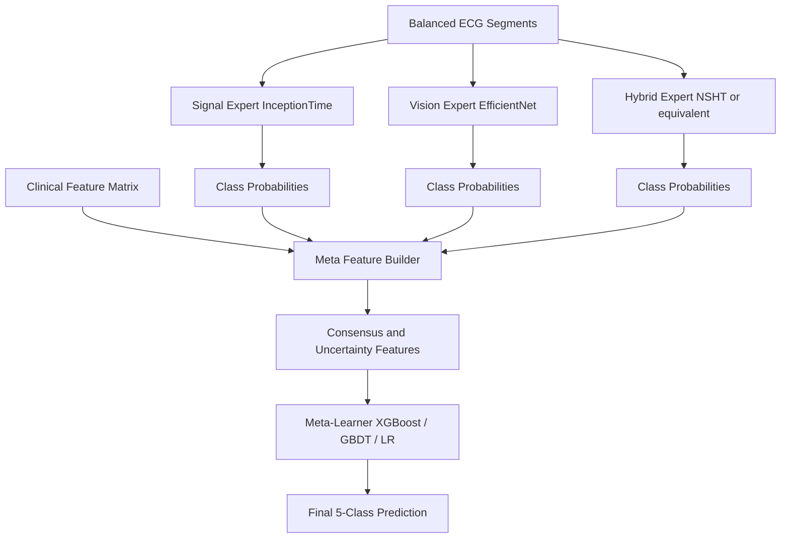
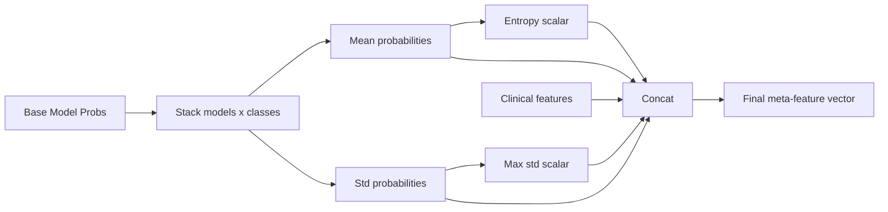
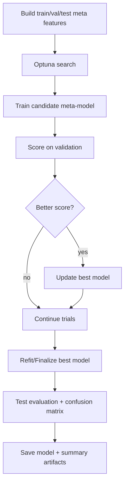

# Ultimate Meta-Learner Architecture

## 1. Overview
This document describes the repository's ultimate ensemble pipeline that combines specialist model probabilities, uncertainty features, and clinical features into a final meta-classifier.

The implementation entry point is ecg_ultimate_meta_learner.py.

---

## 2. System-Level Architecture



---

## 3. Data and Split Strategy

- Input ECG segments come from balanced_data npy files in the classic workflow.
- Clinical features are loaded from the corresponding clinical feature matrix.
- Train/validation/test split is applied consistently across all feature sources.

Recommended improvement path:
- Migrate this script to the split-first balancing approach for strict leakage safety.

---

## 4. Meta-Feature Construction

The meta-feature vector includes:
1. Specialist class probabilities from each base model.
2. Cross-model consensus probabilities (mean).
3. Cross-model uncertainty (std).
4. Max disagreement and entropy.
5. Clinical features.



---

## 5. Training and Selection Pipeline



---

## 6. Model Card Style Summary

| Property | Value |
|---|---|
| Task | 5-class ECG arrhythmia classification |
| Final learner type | Tree-based and linear candidates with selection |
| Input dimensionality | Specialist probs + uncertainty + clinical features |
| Strength | Leverages complementary experts |
| Risk | Data-leakage sensitivity if pre-balancing done globally |

---

## 7. Operational Commands

Train/evaluate via script:

```bash
python ecg_ultimate_meta_learner.py
```

Expected artifacts:
- trained meta-learner pickle/joblib file
- evaluation metrics and classification report
- confusion matrix and summary statistics

---

## 8. Failure Modes and Hardening Checklist

| Area | Risk | Hardening Action |
|---|---|---|
| Data alignment | mismatched sample order across sources | enforce identical split indices for all modalities |
| Feature drift | stale specialist checkpoints | regenerate probabilities with same checkpoint set |
| Calibration | overconfident specialist outputs | add probability calibration before stacking |
| Reproducibility | trial variance | lock seeds and record search space |

---

## 9. Architecture Blocks Explained

System-level blocks:
1. Balanced ECG Segments: common base input for specialist models.
2. Signal Expert: InceptionTime probability outputs.
3. Vision Expert: EfficientNet probability outputs.
4. Hybrid Expert: NSHT-style probability outputs.
5. Clinical Feature Matrix: handcrafted/domain feature stream.
6. Meta Feature Builder: concatenates model outputs and engineered statistics.
7. Consensus and Uncertainty Features: mean, std, disagreement, entropy.
8. Meta-Learner: final classifier over fused meta-features.
9. Final Prediction: 5-class arrhythmia output.

## 10. Flowchart Blocks Explained

Training/selection pipeline blocks:
1. Build train/val/test meta-features: synchronized feature matrix construction.
2. Optuna search: hyperparameter optimization over meta-model candidates.
3. Train candidate model: fit with sampled hyperparameters.
4. Validation scoring: evaluate candidate quality.
5. Better-score decision gate: update best checkpoint conditionally.
6. Refit/finalize best model: produce final selected model.
7. Test evaluation + confusion matrix: held-out performance report.
8. Save artifacts: persist model and metrics outputs.

## Novelty Markers in Architecture and Flow

Marked novelty points in the ultimate meta architecture:
1. Multi-expert probability fusion is the ensemble novelty.
2. Explicit uncertainty features (std, disagreement, entropy) are confidence-modeling novelty.
3. Clinical feature injection into meta-space is domain-knowledge novelty.
4. Hyperparameter search loop (Optuna) is the optimization novelty for meta-level selection.

## Base Stacking Ensemble vs Your Meta Architecture

| Dimension | Standard Stacking Baseline | Your Meta Architecture |
|---|---|---|
| Inputs | Base model logits/probabilities | Base probabilities + uncertainty + clinical features |
| Selection | Fixed meta model/hyperparams | Optuna-based candidate search |
| Clinical context | Often omitted | Explicit clinical feature branch |
| Robustness signals | Limited | Mean/std/disagreement/entropy feature set |
| Reporting | Basic score output | Artifact-oriented pipeline (metrics + confusion outputs) |

## Detailed End-to-End Explanation

1. Specialist model predictions are generated on aligned splits.
2. Clinical features are aligned with identical sample indices.
3. Meta-feature vector is built from probabilities, uncertainty, and clinical descriptors.
4. Candidate meta-models are searched and validated.
5. Best model is finalized and evaluated on held-out test data.
6. Final artifacts are exported for reporting and reproducibility.

## 11. Equation Rendering Compatibility

This guide is mostly architectural and feature-flow oriented. For consistency in Markdown preview, use multiline math blocks when adding equations:

$$
\hat{y}=f_{\mathrm{meta}}\!\left([p_{\mathrm{signal}},p_{\mathrm{vision}},p_{\mathrm{hybrid}},u,\phi_{\mathrm{clinical}}]\right)
$$

Prefer ASCII text around equations and keep one expression per display block.

---

## 12. Future Architecture Upgrades

1. Replace static script flow with modular src-based data module.
2. Add split-first balancing directly in meta pipeline.
3. Add stacked calibration layer before meta learner.
4. Add explainability for meta features (SHAP).
5. Add per-class threshold tuning for clinical deployment.
