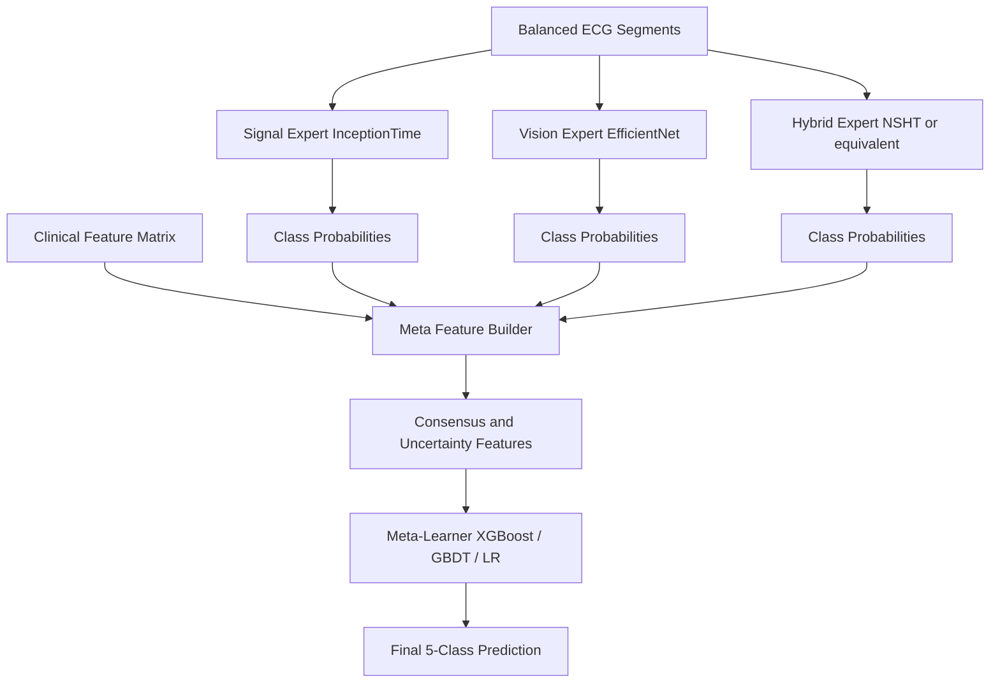
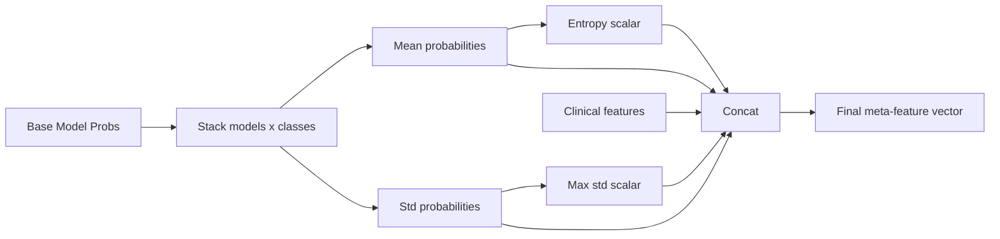
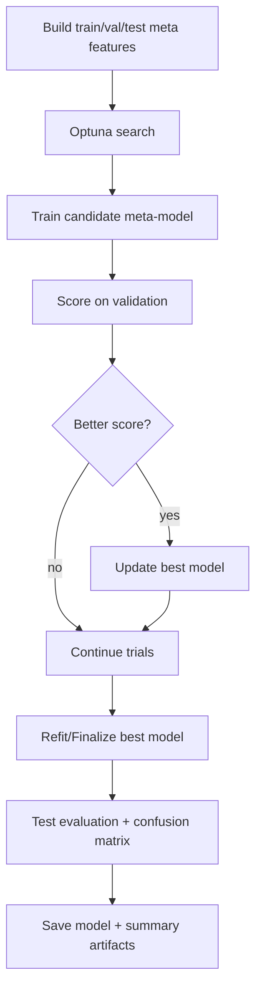

# Ultimate Meta-Learner Architecture

## 1. Overview
This document describes the repository's ultimate ensemble pipeline that combines specialist model probabilities, uncertainty features, and clinical features into a final meta-classifier.

The implementation entry point is ecg_ultimate_meta_learner.py.

---

## 2. System-Level Architecture



---

## 3. Data and Split Strategy

- Input ECG segments come from balanced_data npy files in the classic workflow.
- Clinical features are loaded from the corresponding clinical feature matrix.
- Train/validation/test split is applied consistently across all feature sources.

Recommended improvement path:
- Migrate this script to the split-first balancing approach for strict leakage safety.

---

## 4. Meta-Feature Construction

The meta-feature vector includes:
1. Specialist class probabilities from each base model.
2. Cross-model consensus probabilities (mean).
3. Cross-model uncertainty (std).
4. Max disagreement and entropy.
5. Clinical features.



---

## 5. Training and Selection Pipeline



---

## 6. Model Card Style Summary

| Property | Value |
|---|---|
| Task | 5-class ECG arrhythmia classification |
| Final learner type | Tree-based and linear candidates with selection |
| Input dimensionality | Specialist probs + uncertainty + clinical features |
| Strength | Leverages complementary experts |
| Risk | Data-leakage sensitivity if pre-balancing done globally |

---

## 7. Operational Commands

Train/evaluate via script:

```bash
python ecg_ultimate_meta_learner.py
```

Expected artifacts:
- trained meta-learner pickle/joblib file
- evaluation metrics and classification report
- confusion matrix and summary statistics

---

## 8. Failure Modes and Hardening Checklist

| Area | Risk | Hardening Action |
|---|---|---|
| Data alignment | mismatched sample order across sources | enforce identical split indices for all modalities |
| Feature drift | stale specialist checkpoints | regenerate probabilities with same checkpoint set |
| Calibration | overconfident specialist outputs | add probability calibration before stacking |
| Reproducibility | trial variance | lock seeds and record search space |

---

## 9. Future Architecture Upgrades

1. Replace static script flow with modular src-based data module.
2. Add split-first balancing directly in meta pipeline.
3. Add stacked calibration layer before meta learner.
4. Add explainability for meta features (SHAP).
5. Add per-class threshold tuning for clinical deployment.
